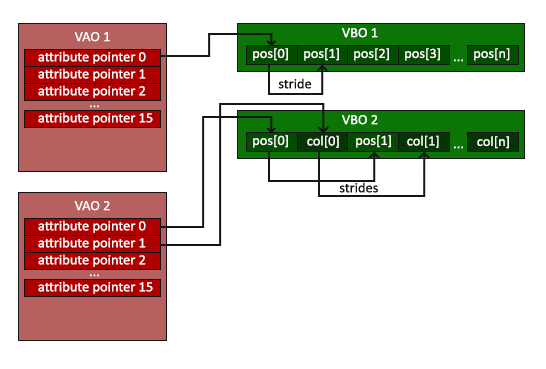

# Notes OpenGL — VoxPlace

Version ciblée : OpenGL 3.3 (compatible Emscripten / WebGL2)

Ce document contient des notions essentielles à retenir pour débuter avec OpenGL et l'usage courant (buffers, pipeline de rendu, VBO/VAO/EBO). C'est un mémo destiné à garder une trace et à s'y référer rapidement.

## Sommaire
- [Principes de base](#principes-de-base)
- [Double buffering](#double-buffering)
- [Pipeline de rendu (étapes)](#pipeline-de-rendu-étapes)
- [Objets OpenGL importants](#objets-opengl-importants)
- [Liens utiles](#liens-utiles)
- [À retenir / Bonnes pratiques](#à-retenir--bonnes-pratiques)

---

## Principes de base
- OpenGL fonctionne en mode état-machine : on configure des états (ex : blend, cull, depth test), on lie des buffers et on envoie des commandes de dessin.
- Cibler OpenGL 3.3 (ou WebGL2 côté Emscripten) offre un ensemble moderne d'APIs (Programmable Pipeline — shaders obligatoires).

## Double buffering
- Le double buffering évite le flickering en dessinant sur un back buffer (off-screen) puis en swapant les buffers pour afficher l'image complète.
- `glfwSwapBuffers(window)` effectue le swap (GLFW), tu dois dessiner sur le back buffer avant de l'appeler.

## Pipeline de rendu (étapes)
Le pipeline graphique (simplifié) :
1. Vertex Shader (programmation par sommet — transform positions, calcule UV/normales)
2. Shape Assembly (assembly des primitives à partir des sommets)
3. Geometry Shader (optionnel : génère/transforme primitives)
4. Tests & blending (depth test, stencil test, blending)
5. Fragment Shader (programmation par fragment — calcule couleur, lighting)
6. Rasterisation (conversion des primitives en fragments/pixels)

> Remarque : Les étapes critiques pour la plupart des applications sont le vertex shader et le fragment shader : on y met la logique de transformation et d’éclairement.

## Objets OpenGL importants
- **VBO (Vertex Buffer Object)** — buffer mémoire sur GPU contenant les attributs (positions, normales, UV).
- **VAO (Vertex Array Object)** — décrit comment sont liés les VBO pour un objet : layout d'attributs, quel VBO lié à quel attribut.
- **EBO (Element Buffer Object)** — indices pour dessiner des primitives via `glDrawElements`.

```cpp
float vertices[] = {
     0.5f,  0.5f, 0.0f,  // top right           0
     0.5f, -0.5f, 0.0f,  // bottom right        1
    -0.5f, -0.5f, 0.0f,  // bottom left         2
    -0.5f,  0.5f, 0.0f   // top left            3
};
unsigned int indices[] = {  // Notons que l’on commence à 0!
    0, 1, 3,   // premier triangle
    1, 2, 3    // second triangle
};
```


*Figure : Schéma montrant l’organisation d’un VAO (Vertex Array Object) et ses VBO/EBO associés.*

Code minimal pour configurer VBO/VAO :
```cpp
float vertices[] = {
    -0.5f, -0.5f, 0.0f,
     0.5f, -0.5f, 0.0f,
     0.0f,  0.5f, 0.0f
};
unsigned int VBO, VAO;
glGenVertexArrays(1, &VAO);
glGenBuffers(1, &VBO);
glBindVertexArray(VAO);
glBindBuffer(GL_ARRAY_BUFFER, VBO);
glBufferData(GL_ARRAY_BUFFER, sizeof(vertices), vertices, GL_STATIC_DRAW);
glVertexAttribPointer(0, 3, GL_FLOAT, GL_FALSE, 3 * sizeof(float), (void*)0);
glEnableVertexAttribArray(0);
glBindBuffer(GL_ARRAY_BUFFER, 0);
glBindVertexArray(0);
```

## Variable uniformes
Permettent de passer des données constantes aux shaders (ex : matrices de transformation, couleurs globales).

Du programme -> Shader 

```cpp
unsigned int shaderProgram = ...; // Programme shader compilé
glUseProgram(shaderProgram);
int uniformLocation = glGetUniformLocation(shaderProgram, "myUniform");
glUniform1f(uniformLocation, 0.5f); // Exemple pour float
```

## Liens utiles
- Tutoriels & diagrammes : https://opengl.developpez.com/tutoriels/apprendre-opengl/
- Pipeline diagram : https://opengl.developpez.com/tutoriels/apprendre-opengl/images/pipeline.png
- Cheat sheet : https://stackoverflow.com/questions/2772570/opengl-cheat-sheet
- Cheat sheet (repo) : https://github.com/henkeldi/opengl_cheatsheet
- Shadertoy (exemples shader) : https://www.shadertoy.com/

## À retenir / Bonnes pratiques
- Toujours vérifier l’init : `glfwInit()` puis `gladLoadGLLoader()` (ou loader adapté).
- Utiliser `glfwWindowHint` pour demander une version de contexte compatible (e.g., 3.3)
- Exclure `glad.c` pour les builds WebAssembly si le loader est fourni par la chaîne Emscripten.
- Pour WASM : préférer WebGL2 et utiliser `emscripten_set_main_loop` au lieu d’une boucle `while` classique.
- Toujours vérifier erreurs de compilation/linkage des shaders (`glGetShaderiv`/`glGetProgramiv`) et récupérer `glGetShaderInfoLog`/`glGetProgramInfoLog` en cas d’échec.

---

Dernière mise à jour : (mettre la date) *8 décembre 2025*

