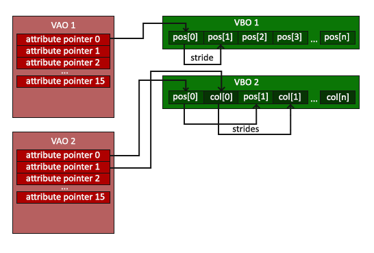

# Notes Techniques — VoxPlace

> **Version ciblée :** OpenGL 4.6 Core (`#version 460 core`)
> Ce document rassemble toutes les notions essentielles du projet : bases OpenGL, pipeline de rendu voxel, optimisations GPU/CPU, architecture réseau, et décisions de design.

**Commande Valgrind :**
```bash
valgrind -s --leak-check=full --show-leak-kinds=all --track-origins=yes ./build/VoxPlace > valgrind.txt 2>&1
```

---

## Sommaire

1. [Bases OpenGL](#1-bases-opengl)
2. [Pipeline Technique : Vertex Pulling & SSBO](#2-pipeline-technique--vertex-pulling--ssbo)
3. [État Actuel de l'Implémentation](#3-état-actuel-de-limplémentation)
4. [Optimisations GPU (Pipeline de Rendu)](#4-optimisations-gpu-pipeline-de-rendu)
5. [Optimisations CPU (Types, Cache & Mémoire)](#5-optimisations-cpu-types-cache--mémoire)
6. [Multithreading (CPU)](#6-multithreading-cpu)
7. [Architecture Serveur & Réseau](#7-architecture-serveur--réseau)
8. [Architecture VoxPlace : Lazy Generation](#8-architecture-voxplace--lazy-generation)
9. [Rendu Dynamique & UX des Bordures](#9-rendu-dynamique--ux-des-bordures)
10. [Les "Fausses" Bonnes Idées (À Éviter)](#10-les-fausses-bonnes-idées-à-éviter)
11. [To-Do](#11-to-do)
12. [Liens Utiles](#12-liens-utiles)
13. [Bonnes Pratiques OpenGL](#13-bonnes-pratiques-opengl)

---

## 1. Bases OpenGL

### Principes de base
- OpenGL fonctionne en mode **état-machine** : on configure des états (blend, cull, depth test), on lie des buffers et on envoie des commandes de dessin.
- Le **Programmable Pipeline** (shaders obligatoires) est le standard depuis OpenGL 3.3+.
- VoxPlace cible **OpenGL 4.6 Core** (requis pour les SSBO, `#version 460 core` dans les shaders).

### Double Buffering
- Évite le flickering en dessinant sur un **back buffer** (off-screen), puis en swapant les buffers pour afficher l'image complète.
- `glfwSwapBuffers(window)` effectue le swap.

### Pipeline de Rendu (Simplifié)

| Étape | Rôle |
|-------|------|
| 1. **Vertex Shader** | Transforme les positions, calcule UV/normales |
| 2. **Shape Assembly** | Assemble les primitives à partir des sommets |
| 3. **Geometry Shader** | *(Optionnel)* Génère/transforme des primitives |
| 4. **Rasterisation** | Convertit les primitives en fragments/pixels |
| 5. **Fragment Shader** | Calcule la couleur finale, lighting |
| 6. **Tests & Blending** | Depth test, stencil test, blending |

> Les deux étapes critiques sont le **Vertex Shader** et le **Fragment Shader**.

### Objets OpenGL

| Objet | Rôle |
|-------|------|
| **VBO** (Vertex Buffer Object) | Buffer mémoire GPU contenant les attributs (positions, normales, UV) |
| **VAO** (Vertex Array Object) | Décrit le layout des attributs et lie les VBO |
| **EBO** (Element Buffer Object) | Indices pour dessiner via `glDrawElements` |
| **SSBO** (Shader Storage Buffer) | Buffer flexible, accessible comme un tableau C++ dans le shader *(OpenGL 4.3+)* — **utilisé par VoxPlace** |

```cpp
// Exemple : VBO + VAO minimal
float vertices[] = {
    -0.5f, -0.5f, 0.0f,
     0.5f, -0.5f, 0.0f,
     0.0f,  0.5f, 0.0f
};
unsigned int VBO, VAO;
glGenVertexArrays(1, &VAO);
glGenBuffers(1, &VBO);
glBindVertexArray(VAO);
glBindBuffer(GL_ARRAY_BUFFER, VBO);
glBufferData(GL_ARRAY_BUFFER, sizeof(vertices), vertices, GL_STATIC_DRAW);
glVertexAttribPointer(0, 3, GL_FLOAT, GL_FALSE, 3 * sizeof(float), (void*)0);
glEnableVertexAttribArray(0);
glBindBuffer(GL_ARRAY_BUFFER, 0);
glBindVertexArray(0);
```

```cpp
// Exemple : EBO (Index Buffer)
float vertices[] = {
     0.5f,  0.5f, 0.0f,   // 0 : top right
     0.5f, -0.5f, 0.0f,   // 1 : bottom right
    -0.5f, -0.5f, 0.0f,   // 2 : bottom left
    -0.5f,  0.5f, 0.0f    // 3 : top left
};
unsigned int indices[] = {
    0, 1, 3,   // premier triangle
    1, 2, 3    // second triangle
};
```


*Figure : Organisation d'un VAO et ses VBO/EBO associés.*

### Variables Uniformes

Passage de données constantes du programme C++ vers les shaders.

```cpp
unsigned int shaderProgram = ...; // Programme shader compilé
glUseProgram(shaderProgram);
int uniformLocation = glGetUniformLocation(shaderProgram, "myUniform");
glUniform1f(uniformLocation, 0.5f);
```

---

## 2. Pipeline Technique : Vertex Pulling & SSBO

### Concept : Inversion du Contrôle

Le **Vertex Pulling** lit directement le SSBO via `gl_VertexID`. On ne passe pas de VBO, pas de Vertex Attributes. Le shader **"tire" (pull)** les données du SSBO lui-même.

| | Pipeline Classique (`Chunk.h`) | Vertex Pulling (`Chunk2.h`) |
|---|---|---|
| **Données envoyées** | 4 sommets/face → ~104 octets | 1 `uint32_t`/face → **4 octets** |
| **Réduction mémoire** | — | **×25** |
| **Qui génère les sommets ?** | Le CPU | Le GPU (Vertex Shader) |

> **Note :** VoxPlace conserve `Chunk.h` (ancienne implémentation avec VBO classique) et `Chunk2.h` (implémentation actuelle avec Vertex Pulling + SSBO). Le pipeline actif est `Chunk2`.

### Côté CPU : Bit Packing (Layout réel de `Chunk2.h`)

On compresse toutes les infos d'une face + AO dans un seul `uint32_t` :

| Champ | Bits | Masque | Plage | Shift |
|-------|------|--------|-------|-------|
| X local | `[0–3]` — 4 bits | `0xF` | 0–15 | `<< 0` |
| Y local | `[4–11]` — 8 bits | `0xFF` | 0–255 | `<< 4` |
| Z local | `[12–15]` — 4 bits | `0xF` | 0–15 | `<< 12` |
| Face Direction | `[16–18]` — 3 bits | `0x7` | 0–5 | `<< 16` |
| Color Index | `[19–23]` — 5 bits | `0x1F` | 0–31 | `<< 19` |
| AO vertex 0 | `[24–25]` — 2 bits | `0x3` | 0–3 | `<< 24` |
| AO vertex 1 | `[26–27]` — 2 bits | `0x3` | 0–3 | `<< 26` |
| AO vertex 2 | `[28–29]` — 2 bits | `0x3` | 0–3 | `<< 28` |
| AO vertex 3 | `[30–31]` — 2 bits | `0x3` | 0–3 | `<< 30` |

**Total utilisé : 32/32 bits** — Color est packé comme `color-1` (air = 0, jamais rendu, donc offset de 1 est safe)

```cpp
// Bit packing réel (Chunk2.h, meshGenerate)
uint32_t packed = x | (y << 4) | (z << 12) | (faceDir << 16) 
    | ((color - 1) << 19) | (ao0 << 24) | (ao1 << 26) | (ao2 << 28) | (ao3 << 30);
```

> **Performance `std::vector`** : Sans `.reserve()`, chaque `push_back` qui dépasse la capacité déclenche une réallocation : `malloc()` → `memcpy()` → `free()`. Toujours appeler `.reserve(estimatedSize)` avant de remplir le vecteur. La ligne `packedFaces.reserve(...)` est actuellement **commentée** dans le code.

### Côté CPU : Envoi & Dessin (extrait de `Chunk2.h`)

```cpp
// uploadMesh() — Crée/recrée le SSBO
glGenBuffers(1, &ssbo);
glBindBuffer(GL_SHADER_STORAGE_BUFFER, ssbo);
glBufferData(GL_SHADER_STORAGE_BUFFER,
             faces.size() * sizeof(uint32_t),
             faces.data(), GL_STATIC_DRAW);

// render() — Dessin chaque frame
glBindBufferBase(GL_SHADER_STORAGE_BUFFER, 0, ssbo); // Binding = 0
glBindVertexArray(vao);  // VAO dummy (obligatoire mais vide)
glDrawArrays(GL_TRIANGLES, 0, faceCount * 6);  // 1 face = 6 sommets (2 triangles)
```

### Côté GPU : Vertex Shader (`chunk2.vs`)

```glsl
#version 460 core

layout(std430, binding = 0) readonly buffer ChunkData {
    uint faces[];
};

uniform mat4 view;
uniform mat4 projection;
uniform vec3 chunkPos;

out flat int vColorIndex;
out flat int vFaceDir;
out vec3 vFragPos;

// Lookup tables (pas de if/else)
const int QUAD_INDICES[6] = int[6](0, 1, 2, 0, 2, 3);

const vec3 FACE_OFFSETS[24] = vec3[24](
    // Face 0: TOP (+Y)
    vec3(0, 1, 0), vec3(1, 1, 0), vec3(1, 1, 1), vec3(0, 1, 1),
    // Face 1: BOTTOM (-Y)
    vec3(0, 0, 1), vec3(1, 0, 1), vec3(1, 0, 0), vec3(0, 0, 0),
    // Face 2: NORTH (+Z)
    vec3(0, 0, 1), vec3(0, 1, 1), vec3(1, 1, 1), vec3(1, 0, 1),
    // Face 3: SOUTH (-Z)
    vec3(1, 0, 0), vec3(1, 1, 0), vec3(0, 1, 0), vec3(0, 0, 0),
    // Face 4: EAST (+X)
    vec3(1, 0, 1), vec3(1, 1, 1), vec3(1, 1, 0), vec3(1, 0, 0),
    // Face 5: WEST (-X)
    vec3(0, 0, 0), vec3(0, 1, 0), vec3(0, 1, 1), vec3(0, 0, 1)
);

void main() {
    int faceID = gl_VertexID / 6;
    int vertID = gl_VertexID % 6;

    uint data = faces[faceID];

    int x        = int(data & 0xFu);           // Bits [0-3]
    int y        = int((data >> 4u) & 0xFFu);   // Bits [4-11]
    int z        = int((data >> 12u) & 0xFu);   // Bits [12-15]
    int faceDir  = int((data >> 16u) & 0x7u);   // Bits [16-18]
    int colorIdx = int((data >> 19u) & 0x3Fu);  // Bits [19-24]

    int cornerIdx = QUAD_INDICES[vertID];
    vec3 offset = FACE_OFFSETS[faceDir * 4 + cornerIdx];
    vec3 localPos = vec3(float(x), float(y), float(z)) + offset;
    vec3 worldPos = chunkPos + localPos;

    gl_Position = projection * view * vec4(worldPos, 1.0);
    vColorIndex = colorIdx;
    vFaceDir = faceDir;
    vFragPos = worldPos;
}
```

### Côté GPU : Fragment Shader (`chunk2.fs`)

Le fragment shader utilise :
- **Palette r/place 2023** : 33 couleurs (index 0 = air, jamais rendu ; 1–32 = couleurs).
- **Face Brightness** : Luminosité par direction de face pour donner du volume sans vrai calcul d'éclairage.
- **Distance Fog** : Uniforms présents (`fogStart`, `fogEnd`, `fogColor`, `cameraPos`) mais **actuellement désactivés** (commentés).

```glsl
// Face shading — luminosité différente par direction
const float FACE_BRIGHTNESS[6] = float[6](
    1.00,  // 0: TOP     — plein soleil
    0.50,  // 1: BOTTOM  — très sombre
    0.80,  // 2: NORTH   — éclairé
    0.70,  // 3: SOUTH   — un peu sombre
    0.60,  // 4: EAST    — ombre
    0.65   // 5: WEST    — ombre légère
);

void main() {
    vec3 color = PALETTE[vColorIndex];
    color *= FACE_BRIGHTNESS[vFaceDir];
    // fog désactivé pour l'instant
    FragColor = vec4(color, 1.0);
}
```

### Vertex Pulling vs MDI : Clarification

Ces deux concepts sont complémentaires mais distincts :

| Concept | Rôle |
|---------|------|
| **Vertex Pulling** | *Comment* le shader lit les données (depuis le SSBO via `gl_VertexID`) |
| **MDI** (Multi-Draw Indirect) | *Comment* le CPU dit au GPU de dessiner (1 appel au lieu de N) |

#### Sans MDI — État actuel (`main3.cpp`)
```
CPU (render loop)                          GPU
┌─────────────────────────────┐
│ for (auto& [key, chunk] :   │
│           chunkMap)         │
│   setVec3("chunkPos", ...)  │──→ draw chunk 0
│   chunk->render()           │──→ draw chunk 1
│   ...                       │──→ draw chunk 399
└─────────────────────────────┘

= 400 × glBindBufferBase + 400 × glDrawArrays
= le CPU parle au GPU 800 fois par frame
```

#### Avec MDI (objectif futur)
```
CPU (render loop)                          GPU
┌─────────────────────────────┐
│ 1 seul SSBO géant avec      │
│ TOUTES les faces            │
│                             │
│ glMultiDrawArraysIndirect() │──→ draw TOUT en 1 appel
└─────────────────────────────┘

= 1 appel par frame
```

---

## 3. État Actuel de l'Implémentation

### Fichiers Clés

| Fichier | Rôle |
|---------|------|
| `include/Chunk2.h` | Classe chunk active : stockage `uint8_t blocks[16][256][16]`, SSBO, Vertex Pulling, face culling inter-chunk |
| `include/Chunk.h` | Ancienne classe chunk (VBO classique, palette 16 couleurs, ~104 octets/face). **Non utilisée.** |
| `include/TerrainGenerator.h` | Génération procédurale : 2 couches Simplex Noise (continent + détail) via FastNoiseLite |
| `include/LowResRenderer.h` | Pipeline de rendu rétro/PS1 : FBO 640×360 → upscale `GL_NEAREST` → 1920×1080 |
| `include/TextureAtlas.h` | Atlas de textures (non utilisé pour l'instant, palette couleurs uniquement) |
| `src/main3.cpp` | Point d'entrée : init GLFW/GLAD, boucle de rendu, hashmap de chunks |
| `src/shader/chunk2.vs` | Vertex Shader : Vertex Pulling + unpacking bits |
| `src/shader/chunk2.fs` | Fragment Shader : palette 33 couleurs r/place + face shading |

### Constantes du Chunk (`Chunk2.h`)

```cpp
constexpr uint8_t  CHUNK_SIZE_X = 16;   // Largeur
constexpr uint16_t CHUNK_SIZE_Y = 256;  // Hauteur (0 = bedrock couche)
constexpr uint8_t  CHUNK_SIZE_Z = 16;   // Profondeur
constexpr uint8_t  BEDROCK_LAYER = 0;   // Y = 0 incassable
```

- **Taille mémoire RAM** : `16 × 256 × 16 × 1 octet = 65 536 octets = 64 Ko` par chunk
- **Taille mémoire VRAM** : `faceCount × 4 octets` (1 `uint32_t` par face dans le SSBO)
- Constructeur initialise `blocks` à 0 (air) + couche bedrock (couleur 29, gris foncé) en `y = 0`

### Hashmap de Chunks (`main3.cpp`)

Le monde utilise une `unordered_map<int64_t, Chunk2*>` avec une clé calculée par bit shift :

```cpp
// Clé unique : les 32 bits hauts = cx, les 32 bits bas = cz
inline int64_t chunkKey(int cx, int cz) {
    return ((int64_t)cx << 32) | ((int64_t)cz & 0xFFFFFFFF);
}

// Recherche O(1)
inline Chunk2* getChunkAt(int cx, int cz) {
    auto it = chunkMap.find(chunkKey(cx, cz));
    return (it != chunkMap.end()) ? it->second : nullptr;
}
```

> **Note :** C'est plus simple qu'un `ChunkCoord` struct + hash custom (décrit dans la section Architecture). L'implémentation actuelle est un hash implicite par bit shift.

### Grille de Chunks

Le code actuel génère une grille fixe de **20×20 = 400 chunks** (`cx` de -10 à 9, `cz` de -10 à 9). La génération se fait en deux passes :
1. **Création + terrain** : Tous les chunks sont créés et remplis via `TerrainGenerator::fillChunk()`.
2. **Mesh** : Les meshes sont générés APRÈS, pour que les voisins existent et que le face culling inter-chunk fonctionne.

### Terrain Generator (`TerrainGenerator.h`)

Deux couches de bruit Simplex combinées :

```
Hauteur(x,z) = baseHeight + continent(x,z) × continentAmp + detail(x,z) × detailAmp
```

| Paramètre | Valeur | Rôle |
|-----------|--------|------|
| `baseHeight` | 20 | Hauteur de base du sol |
| `continentAmp` | 15.0f | Amplitude grandes collines (±15 blocs) |
| `detailAmp` | 4.0f | Amplitude micro-variations (±4 blocs) |
| continent freq | 0.005 | Basse fréquence = formes larges |
| detail freq | 0.02 | Haute fréquence = détails fins |

**Couches de blocs** (de bas en haut) :
| Y | Bloc | Couleur |
|---|------|---------|
| 0 | Bedrock | 28 (noir) ou 29 (gris foncé, constructeur) |
| 1 à height-3 | Pierre | 29 (gris foncé) |
| height-2 à height-1 | Terre | 26 (marron) |
| height | Herbe (surface) | Random 1–32 (sauf 28) |

> **Benchmark** : `fillChunkBench()` génère un **damier 3D** (chaque bloc alterne entre solide et air selon `(x+y+z) % 2 == 0`). Utile pour tester le pire cas de face count (toutes les faces visibles).

### LowRes Renderer (Pipeline PS1/Rétro)

Le projet utilise un **framebuffer basse résolution** pour un style pixelisé :

```
Scène 3D → Rendu dans FBO 640×360 → Upscale GL_NEAREST → Écran 1920×1080
```

| Paramètre | Valeur |
|-----------|--------|
| `RENDER_WIDTH` | 640 |
| `RENDER_HEIGHT` | 360 |
| Upscale filter | `GL_NEAREST` (pas d'antialiasing, pixels nets) |
| Écran cible | 1920×1080 |

Le shader d'upscale est un simple quad fullscreen avec `texture(screenTexture, TexCoords)`.

### Face Culling Inter-Chunks

`Chunk2::getBlockOrNeighbor()` vérifie les blocs aux bordures en interrogeant le chunk voisin :

```
Chunk West     This Chunk      Chunk East
┌────────┐   ┌────────────┐   ┌────────┐
│        │   │ x=0 ... 15 │   │        │
│  [15]  │←──│  getBlock   │──→│  [0]   │
│        │   │  (-1,y,z)   │   │(16,y,z)│
└────────┘   └────────────┘   └────────┘
```

Si aucun voisin n'existe (`nullptr`) → retourne 0 (air) → la face est créée (le bord du monde est visible).

### Distance Fog ✅ Implémenté

Le fog masque la frontière du monde en fondant les blocs distants dans la couleur du ciel. Implémenté dans `chunk2.fs` avec contrôle live via ImGui.

#### Formule : Fog Linéaire

```glsl
// chunk2.fs — fog linéaire
float dist = length(vFragPos - cameraPos);                        // distance caméra → fragment
float fogFactor = clamp((dist - fogStart) / (fogEnd - fogStart), 0.0, 1.0);  // 0 = clair, 1 = fog total
color = mix(color, fogColor, fogFactor);                           // interpolation linéaire
```

```
  fogFactor
  1.0 ─────────────────────────╱──────────  ← 100% fog (fogColor)
                              ╱
                             ╱
                            ╱
  0.0 ──────────────────────╱              ← 0% fog (couleur du bloc)
       0     fogStart    fogEnd      distance
              80          200        (en unités monde)
```

**Comment ça marche :**

| Distance | fogFactor | Résultat |
|----------|-----------|----------|
| `dist < fogStart` | 0.0 | Couleur du bloc pure (pas de fog) |
| `fogStart < dist < fogEnd` | 0.0 – 1.0 | Mélange progressif bloc → fog |
| `dist > fogEnd` | 1.0 | Couleur du fog pure (bloc invisible) |

**`mix(a, b, t)`** = interpolation linéaire : `a × (1-t) + b × t`

#### Pourquoi fogColor = glClearColor ?

```
  Si fogColor ≠ glClearColor :
  ┌─────────────────────────────────────┐
  │   terrain   │  fog gris  │ ciel bleu│  ← transition VISIBLE = moche
  └─────────────────────────────────────┘
  
  Si fogColor = glClearColor :
  ┌─────────────────────────────────────┐
  │   terrain  ───  fondu ──── ciel     │  ← seamless !
  └─────────────────────────────────────┘
```

La `glClearColor` dans `main3.cpp` est automatiquement synchronisée avec `FOG_COLOR` :
```cpp
glClearColor(FOG_COLOR.r, FOG_COLOR.g, FOG_COLOR.b, 1.0f);
```

#### Valeurs actuelles

```cpp
// main3.cpp — modifiables via ImGui sliders
float fogStart = 80.0f;   // Le fog commence à 80 blocs
float fogEnd   = 200.0f;  // À 200 blocs, c'est 100% fog
```

> ✅ **Astuce :** Le fog va bien avec le frustum culling. Si `fogEnd < far plane`, les chunks au-delà du fog sont de toute façon invisibles → le frustum culling les skip. Double économie.

---

## 4. Optimisations GPU (Pipeline de Rendu)

### Face Culling Avancé
- **Blocs standards :** Ne jamais rendre les faces partagées entre deux blocs opaques adjacents. ✅ *Implémenté dans `meshGenerate()`.*
- **Blocs Custom (Blockbench) :** Si une face touche les limites de la bounding box et qu'un bloc plein est collé contre, la face peut être cullée. *(Futur)*
- **Bordures de Chunk :** Si le chunk voisin est `nullptr`, la face est créée (air). ✅ *Implémenté via `getBlockOrNeighbor()`.*

### Z-Prepass (Depth Prepass) — ❌ PAS rentable pour VoxPlace

Le Z-Prepass réduit l'**Overdraw** (calculs inutiles de pixels cachés) à zéro. Le Fragment Shader ne s'exécute que pour les pixels réellement visibles.

**Principe :**

```
  Passe 1 : Profondeur seule (pas de couleur)
  ┌─────────────────────────────────┐
  │ glColorMask(FALSE, FALSE, ...)  │  ← Fragment Shader = OFF
  │ Vertex Shader → Depth Buffer    │  ← On remplit juste le Z-buffer
  └─────────────────────────────────┘
                    ↓
  Passe 2 : Couleur (depth = EQUAL)
  ┌─────────────────────────────────┐
  │ glColorMask(TRUE, TRUE, ...)    │
  │ glDepthFunc(GL_EQUAL)           │  ← Seuls les pixels "gagnants"
  │ Fragment Shader = ON            │     exécutent le FS
  └─────────────────────────────────┘
```

#### Pourquoi c'est une PERTE pour VoxPlace

Le Z-Prepass est un **trade-off** : on exécute le Vertex Shader **2×** pour exécuter le Fragment Shader **1×** au lieu de ~1.5×. C'est rentable **seulement** si le Fragment Shader est cher.

```
  COÛT DU FRAGMENT SHADER DE VOXPLACE (chunk2.fs) :
  
  vec3 color = PALETTE[vColorIndex];        // 1 lookup tableau
  color *= FACE_BRIGHTNESS[vFaceDir];       // 1 multiplication
  FragColor = vec4(color, 1.0);             // 1 write
  
  Total : ~3 opérations GPU. C'est RIEN.
```

```
  RÉSOLUTION DE RENDU :
  
  640 × 360 = 230 400 pixels       ← VoxPlace (LowRes PS1)
  1920 × 1080 = 2 073 600 pixels   ← Full HD
  
  Le fragment shader s'exécute sur 9× MOINS de pixels qu'en full HD.
  Même avec de l'overdraw, le coût total est négligeable.
```

| | Sans Z-Prepass | Avec Z-Prepass |
|---|---|---|
| **Vertex Shader** | 1× tous les vertices | 2× tous les vertices |
| **Fragment Shader** | ~1.3× les pixels (overdraw) | 1× les pixels |
| **Bilan VoxPlace** | ✅ VS cheap + FS cheap | ❌ 2× VS pour économiser un FS déjà gratuit |

#### Quand le Z-Prepass SERAIT rentable

| Situation | Rentable ? |
|-----------|-----------|
| Fragment Shader complexe (PBR, 10 lights, shadow maps) | ✅ OUI |
| Rendu full HD ou 4K | ✅ OUI |
| Beaucoup de couches superposées (transparence) | ✅ OUI |
| **VoxPlace** (3 opérations FS, 640×360, opaque) | ❌ NON |

> ⚠️ **Conclusion (mise à jour) :** Avec le FS actuel (3 opérations, 640×360), le Z-Prepass est une perte nette.
> **MAIS** si VoxPlace ajoute :
> - **Ambient Occlusion** → FS passe de 3 à ~10+ opérations
> - **Résolution dynamique** → potentiellement 1920×1080 (9× plus de pixels)
>
> Alors le Z-Prepass redevient **rentable** et devrait être implémenté **après** l'AO, avec un toggle (`F3`) pour comparer.

### Frustum Culling — ✅ PRIORITÉ #1

Le frustum culling est l'optimisation la plus impactante **maintenant** car elle élimine des chunks **entiers** du pipeline GPU. C'est un test **CPU** : le GPU ne fait rien de plus.

#### C'est quoi le Frustum ?

Le "frustum" c'est la **pyramide tronquée** de la caméra — tout ce que la caméra voit. Tout objet en dehors de cette pyramide est invisible et ne devrait pas être envoyé au GPU.

```
  Vue de dessus (la caméra regarde vers le haut du schéma) :
  
              near plane
              ┌─────┐
             ╱       ╲
            ╱  VISIBLE ╲
           ╱   zone du   ╲
          ╱    frustum     ╲
         ╱                  ╲
        ╱                    ╲
       └──────────────────────┘
              far plane
       
       🎥 caméra (ici)
  
  Vue de côté :
  
       near         far
        │            │
        │   ╱────────│  ← top plane
        │  ╱         │
        │ 🎥         │  ← centre
        │  ╲         │
        │   ╲────────│  ← bottom plane
        │            │
```

Le frustum est défini par **6 plans** : Left, Right, Top, Bottom, Near, Far. Chaque plan "coupe" l'espace en deux : le côté visible et le côté invisible.

#### Comment extraire les 6 plans ?

On les extrait directement de la matrice **VP** (projection × view). C'est la méthode de Gribb & Hartmann (1999) — chaque plan est une combinaison de lignes de la matrice :

```
  VP = Projection × View   (matrice 4×4)
  
  Chaque ligne de VP :
  row[0] = VP[0][0], VP[1][0], VP[2][0], VP[3][0]
  row[1] = VP[0][1], VP[1][1], VP[2][1], VP[3][1]
  row[2] = VP[0][2], VP[1][2], VP[2][2], VP[3][2]
  row[3] = VP[0][3], VP[1][3], VP[2][3], VP[3][3]
  
  Les 6 plans :
  Left   = row[3] + row[0]     "tout ce qui est trop à gauche"
  Right  = row[3] - row[0]     "tout ce qui est trop à droite"
  Bottom = row[3] + row[1]     "tout ce qui est trop en bas"
  Top    = row[3] - row[1]     "tout ce qui est trop en haut"
  Near   = row[3] + row[2]     "tout ce qui est trop près"
  Far    = row[3] - row[2]     "tout ce qui est trop loin"
```

Chaque plan a la forme `ax + by + cz + d = 0` (équation du plan dans l'espace 3D). Les coefficients `(a, b, c)` forment la **normale** du plan, et `d` est la distance à l'origine.

#### Comment tester un chunk vs le frustum ?

Chaque chunk a une **AABB** (Axis-Aligned Bounding Box) :

```
  Chunk (cx=3, cz=5) :
  
  min = (3×16, 0, 5×16) = (48, 0, 80)
  max = (48+16, 256, 80+16) = (64, 256, 96)
  
       max (64, 256, 96)
       ╱──────────╱│
      ╱          ╱ │    256 blocs de haut
     ╱──────────╱  │
     │          │  │
     │   CHUNK  │  ╱
     │          │ ╱     16×16 au sol
     └──────────╱
   min (48, 0, 80)
```

Pour chaque plan du frustum, on teste le **point le plus éloigné de l'AABB dans la direction de la normale** (le "positive vertex"). Si ce point est du mauvais côté du plan → **le chunk est invisible**.

```
  Test : AABB vs 1 plan
  
  Plan avec normale n = (nx, ny, nz)
  
  On prend le coin de l'AABB le plus aligné avec n :
  
  pVertex.x = (nx >= 0) ? max.x : min.x
  pVertex.y = (ny >= 0) ? max.y : min.y
  pVertex.z = (nz >= 0) ? max.z : min.z
  
  distance = dot(n, pVertex) + d
  
  Si distance < 0 → le chunk est ENTIÈREMENT de l'autre côté du plan
                   → INVISIBLE, on skip le rendu ✅
```

On répète ce test pour les 6 plans. Si le chunk est du bon côté des 6 plans, il est visible.

#### Algorithme complet

```
  Pour chaque frame :
    1. Calculer VP = projection × view
    2. Extraire les 6 plans (6 vec4)
    3. Normaliser chaque plan (diviser par length(normal))
    
  Pour chaque chunk :
    1. Calculer min/max de l'AABB
    2. Pour chaque plan (6 tests) :
       - Trouver le positive vertex
       - Calculer distance signée
       - Si distance < 0 → SKIP ce chunk
    3. Si aucun plan ne l'exclut → RENDER
    
  Complexité : 6 dot products par chunk = ~24 multiplications
  C'est RIEN pour le CPU. Même pour 10 000 chunks.
```

> ✅ **Le frustum culling est gratuit côté GPU** (c'est un test CPU), réduit tout le pipeline de ~3×, et n'a aucun trade-off. C'est TOUJOURS la première optimisation à implémenter.
> ✅ **Implémenté dans `include/Frustum.h`** — méthode Gribb-Hartmann.
### Ambient Occlusion Per-Vertex ✅ Implémenté

L'AO voxel assombrit les coins et arêtes entre blocs pour donner du volume. C'est du **per-vertex AO** calculé au moment du meshing (CPU), pas du SSAO screen-space (GPU).

#### Principe : 3 blocs voisins par vertex

Pour chaque vertex d'une face, on examine 3 blocs voisins dans la direction de la face :

```
  Vue d'en haut d'un vertex sur une face TOP (+Y) :
  
  Le vertex V est au coin. On regarde les 3 blocs autour de lui
  dans la couche y+1 (au-dessus du bloc courant).
  
      side1    corner
      ┌───┐┌───┐
      │ ? ││ ? │    Si side1 ET side2 sont solides → AO = 0 (max ombre)
      └───┘└───┘    Sinon : AO = 3 - (side1 + side2 + corner)
  ┌───┐
  │ V │ ← vertex        AO = 3 : lumineux (0 voisins solides)
  └───┘                  AO = 2 : léger ombrage (1 voisin solide)
      ┌───┐              AO = 1 : ombré (2 voisins solides)
      │ ? │ side2         AO = 0 : très sombre (3 voisins solides, ou s1+s2)
      └───┘
```

#### Formule AO

```cpp
// Chunk2.h — computeVertexAO()
int computeVertexAO(side1, side2, corner) {
    if (side1 && side2) return 0;  // Cas spécial : coin totalement occluded
    return 3 - (side1 + side2 + corner);
}
```

Le cas spécial `side1 && side2` est important : si les deux côtés sont solides, le corner ne peut pas être visible même s'il est vide → on force AO = 0.

```
  AO = 3        AO = 2        AO = 1        AO = 0
  ┌───┐         ┌───┐         ┌███┐         ┌███┐
  │   │ air     │   │ air     │███│ solide   │███│ solide
  └───┘         └───┘         └───┘         └───┘
  ┌───┐         ┌───┐         ┌───┐         ┌───┐
  │ V │         │ V │         │ V │         │ V │
  └───┘         └───┘         └───┘         └───┘
  ┌───┐         ┌███┐         ┌───┐         ┌███┐
  │   │ air     │███│ solide  │   │ air     │███│ solide
  └───┘         └───┘         └───┘         └───┘
  
  0 voisins     1 voisin      1+corner      2 côtés (forcé)
```

#### Table de 72 offsets

Pour chaque face (6) × chaque vertex (4) × chaque voisin (3 = side1, side2, corner), on définit un offset (dx, dy, dz) relatif au bloc. Total : 6×4×3 = 72 vecteurs, définis dans `AO_OFFSETS[6][4][3][3]` dans `Chunk2.h`.

```
  Exemple : Face TOP (+Y), vertex v0 (coin 0,1,0) du bloc (x,y,z)
  
  Couche au-dessus (y+1) :
         z-1     z      z+1
  x-1  [corner] [side1] [  ]       side1  = getBlock(x-1, y+1, z)
  x    [side2]  [FACE]  [  ]       side2  = getBlock(x, y+1, z-1)
  x+1  [  ]     [  ]    [  ]       corner = getBlock(x-1, y+1, z-1)
```

#### Nouveau Bit Layout (32/32 bits utilisés)

```
  Ancien (sans AO) :
  [XXXX][YYYYYYYY][ZZZZ][FFF][CCCCCC][???????]
   4      8        4     3    6 bits   7 libres = 25/32
  
  Nouveau (avec AO) :
  [XXXX][YYYYYYYY][ZZZZ][FFF][CCCCC][AA][AA][AA][AA]
   4      8        4     3    5 bits  v0  v1  v2  v3  = 32/32
  
  Changement :
  - Color réduit de 6 → 5 bits (color-1, car 0=air jamais packé)
  - Les 8 bits libérés stockent 4 valeurs AO × 2 bits = 0-3 chacune
```

| Champ | Bits | Plage | Remarque |
|-------|------|-------|----------|
| X | [0-3] | 0-15 | Position locale |
| Y | [4-11] | 0-255 | Position locale |
| Z | [12-15] | 0-15 | Position locale |
| Face | [16-18] | 0-5 | Direction |
| Color | [19-23] | 0-31 | **Packé comme color-1** (shader fait +1) |
| AO v0 | [24-25] | 0-3 | Vertex 0 |
| AO v1 | [26-27] | 0-3 | Vertex 1 |
| AO v2 | [28-29] | 0-3 | Vertex 2 |
| AO v3 | [30-31] | 0-3 | Vertex 3 |

#### Pipeline GPU : Vertex → Fragment

```
  Vertex Shader (chunk2.vs)
  ┌──────────────────────────────────────────────────┐
  │ 1. Unpack AO pour les 4 vertices de la face      │
  │ 2. cornerIdx = QUAD_INDICES[vertID] → 0,1,2,3   │
  │ 3. ao = AO_CURVE[aoValues[cornerIdx]]            │
  │    AO_CURVE = [0.20, 0.50, 0.75, 1.00]           │
  │ 4. vAO = ao (PAS flat → interpolé par rasterizer)│
  └──────────────────────────────────────────────────┘
                        ↓
  Rasterizer (GPU hardware)
  ┌──────────────────────────────────────────────────┐
  │ Interpole vAO entre les 3 sommets du triangle    │
  │ → gradient doux sur toute la face ! 🎨            │
  └──────────────────────────────────────────────────┘
                        ↓
  Fragment Shader (chunk2.fs)
  ┌──────────────────────────────────────────────────┐
  │ color *= vAO;  ← simple multiplication           │
  └──────────────────────────────────────────────────┘
```

> ✅ **Point clé :** `vAO` n'est **PAS `flat`** (contrairement à `vColorIndex` et `vFaceDir`). Le rasterizer GPU interpole automatiquement la valeur entre les 3 sommets de chaque triangle, créant un dégradé doux d'ombre vers lumière sur la face. C'est **gratuit** — le GPU le fait de toute façon.

### Résumé des optimisations par priorité

```
  Priorité     Optimisation            Gain              Quand ?
  ─────────────────────────────────────────────────────────────────
  ⭐ 1         Frustum Culling         ~3× draw calls    Maintenant
  2            Fog                     Masque bordures    Maintenant
  3            Ambient Occlusion       Visuel ++          Prochain
  4            Résolution dynamique    Toggle PS1/HD      Prochain
  5            Z-Prepass               ~1.5× FS (si AO)  Après AO
  ...          MDI, Multithreading     Futur             Plus tard
```

---

## 5. Optimisations CPU (Types, Cache & Mémoire)

> Piège classique : confondre optimisation du **stockage** (RAM/Cache) et optimisation du **calcul** (CPU/Registres).

### Pourquoi `int` pour les boucles ?

Les processeurs modernes manipulent nativement des mots de **32 ou 64 bits**. C'est la taille de leurs registres.

- **Performance :** Utiliser `uint8_t` dans un `for` force le CPU à effectuer des opérations de masquage supplémentaires à chaque itération pour simuler un comportement 8 bits.
- **Risque d'Overflow :** `for (uint8_t y = 0; y < 256; y++)` → **boucle infinie** ! `y` passe de 255 à 0 (overflow), donc `y < 256` est toujours vrai.

**→ Toujours utiliser `int` pour les compteurs de boucle.** C'est la taille naturelle du registre CPU : rapide et sans risque d'overflow.

> ✅ **VoxPlace le fait correctement** : toutes les boucles dans `Chunk2.h`, `TerrainGenerator.h` utilisent `int` pour les itérateurs `x`, `y`, `z`.

### Pourquoi `uint8_t` pour le stockage ?

Le **cache CPU** (L1, L2) est ultra-rapide mais très petit. Plus les données sont compactes, plus on en charge d'un coup.

| Type de bloc | Taille d'un chunk `[16][256][16]` | Tient en cache ? |
|---|---|---|
| `uint8_t` (1 octet) | **64 Ko** | ✅ Cache L1 ou L2 |
| `int` (4 octets) | **256 Ko** | ❌ Allers-retours RAM |

> ✅ **VoxPlace** : `uint8_t blocks[CHUNK_SIZE_X][CHUNK_SIZE_Y][CHUNK_SIZE_Z]` → 64 Ko pile.

### Gestion de la hauteur maximale (Y = 255)

| Option | Description |
|--------|-------------|
| **A — Toit de verre** | Construire jusqu'à 255, ignorer au-dessus. Le moteur physique tolère le joueur "hors tableau". |
| **B — Faux plafond** | Bloquer à 254 (`if (y >= 254) return false;`), air garanti au-dessus. |

> État actuel : `setBlock()` vérifie `y < CHUNK_SIZE_Y` (256), donc on peut placer un bloc en `y = 255`. `getBlock()` retourne 0 (air) pour `y >= 256`. Approche **A** de facto.

### Résumé : Registres vs Cache

| Contexte | Type idéal | Raison |
|----------|-----------|--------|
| **Calcul / Boucles** (Registres CPU) | `int` / `int64_t` | Taille native du registre, pas de masquage |
| **Stockage / Données** (Cache CPU) | `uint8_t` | Maximise la densité en cache, réduit les accès RAM |

> **Le pattern idéal : Stockage compact (`uint8_t`) + Calcul large (`int`).**

---

## 6. Multithreading (CPU)

> Source : LowLevelGameDev — [Multithreading Voxel Engine](https://www.youtube.com/watch?v=yUUh5N2ZYHA)

La pire erreur est de mettre des `mutex` (verrous) partout entre le thread principal et les workers. Cela force les threads à s'attendre, annulant le gain de performance.

### Modèle "Thread Pool" Sans Mutex (Data-Oriented Design)

L'utilisation excessive de mutex **détruit** les performances. L'approche correcte est un Thread Pool avec des **points de synchronisation stricts** et **zéro communication pendant l'exécution** :

```
Main Thread                    Thread Pool                    GPU
    │                              │                            │
    │  1. Emballe TOUTES les       │                            │
    │     données nécessaires      │                            │
    │─────────────────────────────→│                            │
    │                              │  2. Calcul en isolation    │
    │     ❌ Aucune communication   │     (Perlin, Meshing...)   │
    │     pendant cette phase      │     ❌ Ne demande RIEN au  │
    │                              │        main thread          │
    │                              │                            │
    │  3. Point de synchronisation │                            │
    │     Récupère les buffers    ←│                            │
    │                              │                            │
    │  4. Upload OpenGL ──────────────────────────────────────→│
    │     (main thread obligatoire)│                            │
```

**Règles :**
1. Le **Main Thread** prépare un ensemble de tâches **indépendantes** (ex: "génère le mesh du chunk (3,5) avec ces données de voisins").
2. Il fournit **toutes** les données nécessaires d'avance — pas d'accès partagé.
3. Il envoie les tâches au **Thread Pool**.
4. Pendant l'exécution : **aucune communication** entre les threads. Zéro mutex.
5. Le Main Thread attend à un **point de synchronisation fixe**, récolte les résultats.
6. Il upload au GPU (OpenGL exige le main thread).

> ⚠️ **État actuel :** VoxPlace ne fait **pas** de multithreading. Tout (génération terrain, meshing, upload) se fait sur le main thread, de façon synchrone au démarrage.

---

## 7. Architecture Serveur & Réseau

Le serveur doit être pensé comme un OS gérant des ressources limitées : **budget de 50ms** par boucle pour tenir les **20 Ticks Par Seconde (TPS)**.

### Time Slicing & Throttling

| Ressource | Limite | Raison |
|-----------|--------|--------|
| **Génération de chunks** | 1 chunk / tick | Évite de freeze la logique physique/réseau |
| **Envoi réseau** | 5 chunks / joueur / tick | Évite la saturation des buffers TCP/UDP (→ timeout) |

### Multithreading Spatial (Régions)
- Regrouper les chunks en zones isolées ("Régions").
- Si Joueur A et Joueur B sont très éloignés (régions disjointes), on peut assigner chaque région à un thread séparé → physique et réseau en parallèle, **zéro mutex**.

### Simulation Distance vs Render Distance

| Paramètre | Géré par | Exemple | Rôle |
|-----------|----------|---------|------|
| **Render Distance** | Client | 64 chunks | Affichage visuel uniquement |
| **Simulation Distance** | Serveur | 6 chunks | Physique, Random Tick Updates (pousse, fluides) |

> Ne **jamais** appliquer les Random Tick Updates sur toute la Render Distance. Les chunks éloignés dorment en RAM.

---

## 8. Architecture VoxPlace : Lazy Generation

**État implémenté (mars 2026) :** VoxPlace tourne maintenant avec un vrai **serveur ENet autoritaire** (`VoxPlaceServer`) et un **client de rendu** (`VoxPlace`) qui ne génère plus le monde localement.

### Découplage data / rendu

La donnée de chunk est sortie de `Chunk2` dans `VoxelChunkData` :

```cpp
struct VoxelChunkData {
    int chunkX, chunkZ;
    uint64_t revision;
    uint32_t blocks[16][64][16];
};
```

- `VoxelChunkData` est partagé entre client et serveur.
- `Chunk2` hérite maintenant de `VoxelChunkData` et ne garde que :
- l'état OpenGL (`ssbo`, `vao`)
- les flags de rebuild (`needsMeshRebuild`, `isEmpty`)
- le meshing (`meshGenerate`) et le rendu (`render`)

### Processus séparés

- `VoxPlaceServer` :
- stocke le monde autoritaire dans une `unordered_map<int64_t, VoxelChunkData>`
- valide les actions `place/break`
- gère la frontière du monde
- diffuse les snapshots et block updates via ENet

- `VoxPlace` :
- envoie des `ChunkRequest` au serveur
- reçoit des `ChunkSnapshot` et `BlockUpdateBroadcast`
- reconstruit des `Chunk2` locaux pour le rendu
- reste clampé dans la **zone jouable** fournie par le serveur

### Zone jouable vs zone générée

Le serveur maintient deux bornes distinctes :

```cpp
struct WorldFrontier {
    ChunkBounds playableBounds;
    ChunkBounds generatedBounds;
    int paddingChunks;
};
```

- `playableBounds` : zone où les actions joueur sont **acceptées**
- `generatedBounds` : zone générée visible, plus grande, qui sert de **padding visuel**
- le client est bloqué physiquement sur `playableBounds`
- le fog masque la transition avec `generatedBounds`
- le fog actif reste un fog simple piloté par la **render distance** côté client

### Bootstrap actuel

Première milestone volontairement simple :

- zone jouable initiale : `3x3` chunks
- padding généré : `2` chunks par côté
- zone générée initiale : `7x7` chunks
- générateur actif au boot : `SkyblockGenerator`

Le terrain procédural existe toujours via `TerrainGenerator` et `TerrainChunkGenerator`, mais le bootstrap réseau démarre d'abord sur une skyblock pour valider la pipeline serveur/client.

### Multithreading de génération

Le serveur utilise :

- `1` thread principal autoritaire pour ENet, tick, validation et intégration du monde
- un **pool dynamique de workers** pour générer les chunks en arrière-plan

Formule actuelle :

```cpp
workerCount = clamp(hardware_concurrency() - 2, 2, 8)
```

- fallback à `4` si `hardware_concurrency() == 0`
- pas de `16` threads fixes hardcodés
- les workers génèrent des chunks isolés et ne touchent jamais l'état global directement

### Expansion par activité spatiale

Le monde ne grandit ni sur le déplacement seul, ni sur le spam d'un seul chunk.

- chaque chunk jouable possède un booléen `hasPlayerActivity`
- il passe à `true` à la première action valide `place/break`
- il reste actif pour toute la session

La règle actuelle d'expansion est :

```cpp
activeChunkCount >= perimeterChunkCount
perimeterChunkCount = 4 * sideChunks - 4
```

Exemple :

- zone jouable `3x3` → périmètre `8`
- dès que `8` chunks jouables différents ont été utilisés → expansion à `5x5`

Effet d'une expansion :

- `playableBounds` gagne `+1` anneau
- `generatedBounds` est recalculé comme `playableBounds + padding`
- le serveur planifie en workers uniquement les nouveaux chunks nécessaires
- le serveur broadcast la nouvelle `WorldFrontier`
- `WorldFrontier` transporte aussi `activePlayableChunkCount / requiredActiveChunkCount` pour afficher la progression réelle dans l'UI client

### Streaming réseau

Messages déjà implémentés dans `WorldProtocol` :

- `Hello`
- `WorldFrontier`
- `ChunkRequest`
- `ChunkSnapshot`
- `ChunkDrop`
- `BlockActionRequest`
- `BlockUpdateBroadcast`

Choix retenus pour la milestone 1 :

- snapshots chunk en **`uint32_t` brut**
- actions joueur en **palette index 32 couleurs**
- conversion `paletteIndex -> finalColor` côté serveur

### Budgets actuels

- serveur : `20 TPS`
- intégration max : `4` chunks générés par tick
- envoi réseau max : `5` chunks par joueur et par tick
- client : `1` rebuild de chunk max par frame pour lisser les spikes

---

## 9. Rendu Dynamique & UX des Bordures

L'apparition soudaine d'un chunk provoque un **stutter** (chute brutale de FPS).

### Asynchronous Upload & Time-Slicing (Anti-Stutter)
- **Problème :** `glBufferData` d'un mesh entier en une frame bloque le CPU/GPU.
- **Solution :** File d'attente → upload via `glBufferSubData` par petites tranches (ex: 10% du mesh par frame) ou via `glMapBufferRange`.

### Animations d'Apparition (Vertex Shader)
- Passer un Uniform `float u_spawnTime` au shader lors de la création du chunk.
- Si le temps actuel est proche de `u_spawnTime`, modifier la position Y ou l'échelle → les blocs semblent **"pousser" du sol**.

### Distance Fog
- Brouillard exponentiel (`EXP2`) ou linéaire dans le Fragment Shader pour masquer la frontière du monde.
- La couleur du brouillard doit correspondre à la `glClearColor` (Skybox) pour un fondu parfait.
- ✅ **Implémenté** dans `chunk2.fs` (uniforms `fogStart`, `fogEnd`, `fogColor`) mais **désactivé** (`FOG_START = FOG_END = 0`).

---

## 10. Les "Fausses" Bonnes Idées (À Éviter)

### ❌ Greedy Meshing
Fusionner les faces adjacentes identiques en un grand quad semble optimal, mais :
- **Coût CPU** : Algorithme lourd à recalculer à chaque modification de bloc.
- **Incompatible AO** : Chaque sous-section du quad fusionné aurait besoin d'une ombre différente.
- **Gain négligeable** : Avec le Vertex Pulling, les sommets pèsent 4 octets. Le GPU préfère beaucoup de petits triangles simples.
- **Alternative** : Simple **Face Culling** (ne pas dessiner les faces cachées). Ultra-rapide et suffisant. ✅ *C'est ce que fait VoxPlace.*

### ❌ Génération côté Client
Demander au client de générer les chunks à partir du Seed :
- Bugs de **désynchronisation** massifs (structures qui se chevauchent).
- Un chunk compressé (quelques Ko) se transfère en < 1 seconde via le réseau.

---

## 11. To-Do

- [x] **Cross-Chunk Face Culling** — `getBlockOrNeighbor()` + `unordered_map` ✅
- [x] **Terrain Perlin Noise** — FastNoiseLite, 2 couches Simplex ✅
- [x] **ImGui** — Debug UI (FPS, chunks, faces, vertices, camera, speed slider) ✅
- [x] **Frustum Culling** — `Frustum.h`, test AABB vs 6 plans, compteur ImGui ✅
- [x] **Fog** — Fog linéaire décommenté, sliders ImGui (fogStart/fogEnd) ✅
- [x] **Ambient Occlusion** — Per-vertex AO, 4×2 bits packés, AO_CURVE interpolée ✅
- [x] **Front-to-back Sorting** — Trier les chunks par distance à la caméra ✅
- [x] **Génération serveur** — Serveur ENet autoritaire + bootstrap skyblock ✅
- [x] **Séparation client/serveur** — `VoxPlace` + `VoxPlaceServer` ✅
- [x] **Load/unload dynamique** — `ChunkRequest` / `ChunkDrop` autour de la caméra ✅
- [x] **Dirty flag rebuild** — Budget client à 1 rebuild chunk / frame ✅
- [x] ~~**Z-Prepass**~~ — ❌ Pas rentable actuellement. À réévaluer après AO + full res.
- [ ] **Résolution dynamique** — Toggle PS1 640×360 ↔ Full HD 1920×1080 (F11)
- [ ] **Indirect Rendering** — `glMultiDrawArraysIndirect` : 1 seul draw call pour tous les chunks
- [ ] **Chunk Sections** — Diviser le chunk en sous-sections de 16³ (skip sections vides)
- [ ] **LODs** — Level of Detail : fusionner les blocs éloignés (2×2 puis 4×4) pour simplifier la géométrie
- [ ] **Terrain multijoueur complet** — Remplacer le bootstrap skyblock par `TerrainChunkGenerator`
- [ ] **Multithreading mesh client** — Passer `meshGenerate()` hors du thread principal OpenGL
- [ ] **Day/Night Cycle** — Interpolation lumière + skybox dynamique

---

## 11b. Analyse de ourCraft (LowLevelGameDev)

> Référence : [github.com/meemknight/ourCraft](https://github.com/meemknight/ourCraft) — moteur voxel très avancé avec PBR, shadows, SSAO, multiplayer.

### Optimisations de ourCraft pertinentes pour VoxPlace

#### 1. Front-to-Back Chunk Sorting (✅ facile à implémenter)

ourCraft trie les chunks **par distance à la caméra** avant de les dessiner (les plus proches d'abord). Cela exploite le **Early-Z rejection** du GPU :

```
  Sans tri (ordre aléatoire)              Avec tri (front-to-back)
  ┌────────────────────────────┐         ┌────────────────────────────┐
  │ chunk loin → écrit depth   │         │ chunk proche → écrit depth │
  │ chunk proche → écrit depth │         │ chunk loin → SKIP (depth   │
  │   mais le loin reste !     │         │   test fail = pas de FS) ! │
  └────────────────────────────┘         └────────────────────────────┘
  
  FS exécuté pour des pixels qui sont ensuite cachés  →  OVERDRAW
  Le GPU dessine le bloc proche SUR le bloc loin → gaspillage

  Avec front-to-back, le depth buffer est rempli d'abord par les objets
  proches, et les objets loin échouent au depth test → le GPU skip
  automatiquement le fragment shader = Z-cull hardware
```

**Implémentation (dans le render loop) :**
```cpp
// Trier les chunks par distance² au joueur (pas besoin de sqrt)
std::sort(chunkVector.begin(), chunkVector.end(),
    [camX, camZ](Chunk* a, Chunk* b) {
        int ax = a->chunkX - camX, az = a->chunkZ - camZ;
        int bx = b->chunkX - camX, bz = b->chunkZ - camZ;
        return (ax*ax + az*az) < (bx*bx + bz*bz);  // Plus proche en premier
    });
```

> ✅ **C'est un Z-Prepass "gratuit"** grâce au hardware Early-Z du GPU. Pas de double pass, pas de changement de shader. Juste un `std::sort` une fois par frame.

#### 2. Chunk Sections (subdiviser en 16³)

ourCraft ne génère pas le mesh pour les Y-levels vides. Actuellement VoxPlace a un chunk de 16×256×16 — la boucle itère les 65 536 blocs même si la plupart sont de l'air.

```
  Chunk actuel (16 × 256 × 16)      Avec sections (16 × 16 × 16 × 16)
  ┌──────────────────────┐          ┌──────────────────────┐
  │ AIR AIR AIR AIR AIR  │  y=256   │ section 15 (SKIP!)   │ 
  │ AIR AIR AIR AIR AIR  │          │ section 14 (SKIP!)   │
  │ AIR AIR AIR AIR AIR  │          │ section 13 (SKIP!)   │
  │ ...                  │          │ ...                  │
  │ AIR AIR AIR AIR AIR  │          │ section  3 (SKIP!)   │
  │ TERRAIN              │  y=35    │ section  2 (MESH!)   │
  │ STONE STONE STONE    │  y=16    │ section  1 (MESH!)   │
  │ BEDROCK              │  y=0     │ section  0 (MESH!)   │
  └──────────────────────┘          └──────────────────────┘
  
  Itère 65 536 blocs                 Itère seulement 3×4096 = 12 288 blocs
  (93% sont de l'air → gaspillage)   (skip les 13 sections vides)
```

#### 3. Indirect Rendering (glMultiDrawArraysIndirect)

> **Question du To-Do : "Indirect rendering est une bonne idée ?"**

**Réponse :** Oui, mais **pas maintenant**. Indirect rendering remplace 400 `glDrawArrays` par 1 `glMultiDrawArraysIndirect`. C'est pertinent quand :
- Le nombre de chunks visibles dépasse ~2000
- Le CPU est le bottleneck (pas le GPU)
- Le monde est relativement statique

Pour VoxPlace **avec les modifications de blocs en temps réel** (multijoueur), MDI ajoute de la complexité (buffer géant + fragmentation). L'approche actuelle (1 SSBO par chunk) est meilleure pour les mises à jour dynamiques.

**Quand l'implémenter :** Après le multithreading et le load/unload dynamique, quand on aura beaucoup plus de chunks.

#### 5. Level of Detail (LODs) — Géométrie simplifiée à distance

> Source : LowLevelGameDev — [Chunk system & LODs](https://www.youtube.com/watch?v=yUUh5N2ZYHA)

Pour afficher de **très grandes distances** (64+ chunks), le GPU ne peut pas traiter la même densité de triangles partout. Les LODs fusionnent les blocs éloignés pour réduire la géométrie :

```
  Distance       LOD    Résolution    Blocs
  ─────────────────────────────────────────
  0-16 chunks    LOD0   1×1 (normal)  16×256×16
  16-32 chunks   LOD1   2×2 (merge)   8×128×8      ← 4× moins de faces
  32-64 chunks   LOD2   4×4 (merge)   4×64×4       ← 16× moins de faces
  
  Vue de dessus :
  
  LOD0 (proche)     LOD1 (moyen)     LOD2 (loin)
  ┌─┬─┬─┬─┐        ┌──┬──┐          ┌────┐
  ├─┼─┼─┼─┤        │  │  │          │    │
  ├─┼─┼─┼─┤   →    ├──┼──┤     →    │    │
  ├─┼─┼─┼─┤        │  │  │          │    │
  └─┴─┴─┴─┘        └──┴──┘          └────┘
  16 faces           4 faces          1 face
```

**Le challenge :** le CPU/serveur doit pouvoir suivre la charge de génération des chunks LOD. C'est pas juste du rendering — il faut aussi des versions simplifiées des données de blocs.

**Pour VoxPlace :** Pas prioritaire tant qu'on n'a pas le load/unload dynamique et le multithreading. La render distance actuelle (20 chunks) ne nécessite pas de LODs.

#### 6. Architecture technique de ourCraft (deep-dive du code source)

> Source locale : `/home/alpha/Documents/TFE/ourCraft/`

##### Vertex Packing — 3 ints par vertex (SSBO)

ourCraft utilise **3 entiers** par vertex envoyés via vertex attributes, avec le geometry lookup dans un **SSBO** :

```c
// rendering/chunk.cpp — pushFlagsLightAndPosition()
// Format du int Y :
//   0x    FF      FF      FF    FF
//      ─flags───light───position─
//  flags: isWater(1 bit) + isInWater(1 bit) + aoShape(4 bits haut)
//  light: sunLight(4 bits) + torchLight(4 bits) mergés
//  position: y (16 bits)

// pushFaceShapeTextureAndColor()
// Format du int texture :
//   0bxxxxx000'00000000
//    color(5b)  texture(11b)  → 2048 textures max + 32 couleurs

// Layout vertex = 3 ints :
// [0] x position (int)
// [1] y position | light | flags (packed)
// [2] z position (int)
```

Comparaison avec VoxPlace :

| | ourCraft | VoxPlace |
|--|---------|----------|
| Données/vertex | 3 ints (12 bytes) | 1 uint32 (4 bytes) |
| Geometry | SSBO lookup → `vertexData[orientation * 12 + vertexId * 3]` | Reconstruit dans VS |
| Textures | 2048 via bindless (albedo + normal + material + parallax) | 32 couleurs palette |
| Lumière | Sun (4 bits) + Torch (4 bits) par face | Aucune (face shading fixe) |
| AO | aoShape (4 bits dans flags) | 4×2 bits dans packed data |

##### Face Brightness — Facteurs extraits du vertex shader

```glsl
// defaultShader.vert — ligne 26-62
float vertexColor[] = float[](
    0.95,  // front
    0.85,  // back
    1.0,   // top
    0.8,   // bottom
    0.85,  // left
    0.95   // right
    // + grass variants, leaves variants...
);

// Appliqué avec la lumière :
v_ambient = vertexColor[faceOrientation] * (ambientInt / 15.0);
```

Comparaison face shading :

| Face | ourCraft | BetterSpades | VoxPlace |
|------|---------|-------------|----------|
| TOP | 1.00 | 1.00 | 1.00 |
| BOTTOM | 0.80 | 0.50 | 0.50 |
| FRONT | 0.95 | 0.875 | 0.80 |
| BACK | 0.85 | 0.625 | 0.70 |
| LEFT | 0.85 | 0.75 | 0.65 |
| RIGHT | 0.95 | 0.75 | 0.60 |

> ourCraft a des facteurs plus proches (0.80-1.0) → contraste plus doux car il compte sur l'éclairage dynamique pour la profondeur.

##### LOD — Implémentation réelle dans le code

```cpp
// chunkSystem.cpp — determineLodLevel()
int determineLodLevel(playerChunkPos, chunkPos) {
    float distPercent[6] = {0, 0.8, 0.7, 0.6, 0.5, 0.5};
    int distMax[6]       = {99, 30, 24, 16, 12, 8};

    int firstLod = distPercent[lodStrength] * viewDistance;
    firstLod = min(firstLod, distMax[lodStrength]);

    if (distSquared > firstLod²) return 1;  // LOD1 = bake simplifié
    else return 0;                           // LOD0 = full detail
}
```

Le LOD est un argument passé directement à `bakeAndDontSendDataToOpenGl()` qui change la résolution du meshing. Binaire (LOD0/LOD1), pas de niveaux intermédiaires.

##### Animations vertex shader — Eau et herbe

```glsl
// Herbe : déplacement sinusoïdal basé sur position monde + temps
float offset = cos((facePosition.x * dir.x +
    facePosition.z * dir.y - u_timeGrass * SPEED) * FREQUENCY) * AMPLITUDE;
vertexShape.x += grassMask[vertexId] * offset;

// Eau : double couche d'ondes (rapide + lente)
vertexShape.y += waterMask * (offset_rapide + offset_lente - 0.08);
```

> Pour VoxPlace (filtre PS1), une animation d'eau en vertex shader serait très stylée et peu coûteuse.

##### Multithreading — ThreadPool avec données per-thread

```cpp
// chunkSystem.cpp
struct PerThreadData {
    vector<TransparentCandidate> transparentCandidates;
    vector<int> opaqueGeometry;
    vector<int> transparentGeometry;
    vector<ivec4> lights;
    bool updateTransparency, updateGeometry;
    Chunk* chunk;
};

// Chaque thread a SON propre set de buffers → zéro contention
void bakeWorkerThread(int index, ThreadPool& threadPool) {
    auto& data = perThreadData[index];
    bakeLogicForOneThread(threadPool, data.opaque, data.transparent, ...);
    threadPool.threIsWork[index] = false;  // Signal terminé
}
```

> Confirme l'approche "zero mutex" — chaque worker a ses propres buffers, le main thread collecte les résultats et fait l'upload GPU (OpenGL = single thread only).

##### Pipeline post-processing complet (43 shaders !)

| Shader | Fichier | Pertinence VoxPlace |
|--------|---------|---------------------|
| **Z-Prepass** | `rendering/zpass.vert/frag` | Pas besoin (front-to-back suffit) |
| **HBAO** (SSAO avancé) | `postprocess/hbao.frag` | ❌ On a du per-vertex AO |
| **Tone Mapping** | `postprocess/toneMap.frag` | Possible futur |
| **Bloom** (multi-pass) | `filterDown + filterBloom + applyBloom` | Esthétique |
| **FXAA** | `postprocess/fxaa.frag` | ❌ Pixels nets voulus (PS1) |
| **SSR** | `postprocess/ssr.frag` | ❌ Pas d'eau prévue |
| **Atmospheric Scattering** | `skybox/atmosphericScattering.frag` | ✅ Day/night cycle |
| **Shadow Maps** | `rendering/renderDepth.vert/frag` | Futur lointain |
| **Radial Blur** | `postprocess/radialBlur.frag` | Effet stylé possible |
| **PBR cubemap** | `skybox/convolute + preFilterSpecular` | Trop complex pour PS1 |

##### Sun + Torch Light System

```
ourCraft stocke 2 valeurs de lumière par face :
- sunLight (4 bits, 0-15) : lumière du ciel, diminue sous terre
- torchLight (4 bits, 0-15) : lumière des sources placées

// Dans le vertex shader :
v_skyLight = max(skyLight - (15 - u_skyLightIntensity), 0);
v_ambientInt = max(v_skyLight, v_normalLight);

// u_skyLightIntensity varie dans le temps → DAY/NIGHT CYCLE !
```

> C'est comme ça qu'ourCraft fait le cycle jour/nuit : un seul uniform `u_skyLightIntensity` (15=midi, 4=nuit) qui module le skyLight de chaque face. **Très faisable pour VoxPlace** sans recalculer aucun mesh.
---

## 11c. Analyse de BetterSpades / Ace of Spades (Build & Shoot)

> Référence : [github.com/xtreme8000/BetterSpades](https://github.com/xtreme8000/BetterSpades) — client C/OpenGL pour Ace of Spades 0.75.
> Style visual : pixel art, couleurs plates, fog linéaire, face shading simple. Très proche de VoxPlace.

### Couleur RGB par voxel (pas de palette)

La différence fondamentale avec Minecraft/VoxPlace : chaque bloc stocke un **uint32_t RGBA unique** (pas un index dans une palette). Le format de map `.vxl` contient la couleur exacte de chaque voxel :

```
  VoxPlace                         Ace of Spades / BetterSpades
  ┌───┬───┬───┬───┐               ┌───┬───┬───┬───┐
  │ 7 │ 7 │ 7 │ 7 │  Même index   │#4a│#4d│#48│#4c│  Chaque bloc a
  │   │   │   │   │  palette      │b3│b0│b5│b1│  un RGB unique
  ├───┼───┼───┼───┤               ├───┼───┼───┼───┤
  │ 7 │ 7 │ 7 │ 7 │  → couleur   │#4f│#4b│#4e│#49│  → variations
  │   │   │   │   │  uniforme    │   │   │   │   │  subtiles = fondu
  └───┴───┴───┴───┘               └───┴───┴───┴───┘
```

Le gradient de couleur (vert clair en haut des collines, sombre en bas) est créé **à la génération** du terrain côté serveur, pas dans le shader.

### Face Shading — Facteurs extraits du code source

BetterSpades utilise **exactement** la même technique que VoxPlace : multiplication de la couleur RGB par un facteur fixe par direction. Voici les facteurs exacts lus dans `chunk.c` :

```c
// BetterSpades — chunk.c (facteurs réels)
Face TOP    (+Y) : rgba(r * 1.000, g * 1.000, b * 1.000, 255)  // plein soleil
Face BOTTOM (-Y) : rgba(r * 0.500, g * 0.500, b * 0.500, 255)  // très sombre
Face NORTH  (-Z) : rgba(r * 0.875, g * 0.875, b * 0.875, 255)  // bien éclairé
Face SOUTH  (+Z) : rgba(r * 0.625, g * 0.625, b * 0.625, 255)  // ombre
Face WEST   (-X) : rgba(r * 0.750, g * 0.750, b * 0.750, 255)  // ombre moyenne
Face EAST   (+X) : rgba(r * 0.750, g * 0.750, b * 0.750, 255)  // ombre moyenne
```

Comparaison avec VoxPlace :

| Face | BetterSpades | VoxPlace |
|------|-------------|----------|
| TOP | 1.00 | 1.00 |
| BOTTOM | 0.50 | 0.50 |
| NORTH | 0.875 | 0.80 |
| SOUTH | 0.625 | 0.70 |
| EAST | 0.75 | 0.60 |
| WEST | 0.75 | 0.65 |

> Les facteurs sont très proches. Pas de shadow maps, pas de lumière dynamique — juste un facteur fixe par direction comme nous.

### "Illumination" quand on casse un bloc

L'effet de "lumière" quand un bloc est cassé n'est **pas** un calcul de lumière. C'est du **face culling** :

```
  Avant                              Après avoir cassé le bloc X
  ┌───┬───┐                          ┌───┬   ┐
  │ A │ X │  La face entre A et X    │ A │   │  La face droite de A
  │   │   │  n'existe pas (culled)   │   │ ← │  est maintenant VISIBLE
  └───┴───┘                          └───┘   │  avec son face shading
                                              │  → ça semble "illuminé"
```

La face droite de A (factor ×0.75) apparaît soudainement. Comme toutes les faces autour du trou deviennent visibles, la zone semble plus claire. C'est un effet émergent du face culling + face shading, pas un système de lumière.

### `solid_sunblock()` — Ombres diagonales (le vrai secret !)

C'est la technique qui crée l'effet de "gradient" sur les élévations. BetterSpades lance un **rayon diagonal** vers le haut depuis chaque bloc pour calculer une ombre douce :

```c
// BetterSpades — chunk.c, ligne 161-173
float solid_sunblock(blocks, x, y, z) {
    int dec = 18;   // Poids décroissant (18, 16, 14, 12, ...)
    int i = 127;    // Luminosité max

    while(dec && y < map_size_y) {
        if(!isAir(blocks, x, ++y, --z))  // Monte en Y, recule en Z
            i -= dec;                      // Bloc solide → assombrit
        dec -= 2;                          // Blocs plus loin = moins d'impact
    }
    return (float)i / 127.0F;  // 0.0 = totalement ombré, 1.0 = plein soleil
}
```

```
  Vue de côté — le rayon va en diagonale ↗ (y+1, z-1)
  
          soleil ☀️ (angle ~45°)
            ╲
             ╲   ← le rayon vérifie les blocs sur cette diagonale
              ╲
  ┌───┐  ┌───┐╲┌───┐
  │   │  │ X ││╲│   │  Si bloc X est solide → i -= dec
  └───┘  └───┘│ └───┘  dec diminue à chaque pas (poids décroissant)
              │ 
         ┌───┐│         Bloc courant : shade = i / 127
         │ ● ││         ● reçoit une ombre partielle
         └───┘│           car X bloque partiellement le "soleil"
              │
  ═══════════╧══════════ sol
```

La couleur finale par vertex est : `RGB × shade × face_factor × AO`

> C'est ça qui fait que les blocs sous des surplombs sont sombres et que les blocs exposés sont clairs — même sans vrai raytracing !

### AO de BetterSpades vs VoxPlace

Leur AO vient du **même article** que le nôtre : [0fps.net](https://0fps.net/2013/07/03/ambient-occlusion-for-minecraft-like-worlds/). Formule identique :

```c
// BetterSpades — chunk.c, ligne 562-569
float vertexAO(side1, side2, corner) {
    if (!side1 && !side2) return 0.25;        // Cas occluded
    return 0.75 - (!s1 + !s2 + !corner) * 0.25 + 0.25;
}

// VoxPlace — Chunk2.h
int computeVertexAO(side1, side2, corner) {
    if (side1 && side2) return 0;             // Même cas, inversé (0=occluded)
    return 3 - (side1 + side2 + corner);      // Même logique, échelle 0-3
}
```

> ✅ **Même algorithme**, juste une échelle différente (0.25-1.0 vs 0-3 mappé par AO_CURVE).

### Front-to-back Sorting (confirmé dans le code !)

```c
// BetterSpades — chunk.c, ligne 144-145
qsort(chunks_draw, index, sizeof(struct chunk_render_call), chunk_sort);

// chunk_sort compare distance2D au joueur → plus proche en premier
```

### Multithreading du Meshing

BetterSpades utilise `pthread_create` avec un système de **channels** (producteur/consommateur) :
1. Main thread empile des `chunk_work_packet` dans `chunk_work_queue`
2. Worker threads consomment et génèrent le mesh
3. Résultat dans `chunk_result_queue`
4. Main thread drain les résultats et upload au GPU (OpenGL = main thread only)

Le rebuild se fait en **spirale** depuis le centre (chunks proches du joueur en premier).

### Ce que VoxPlace a déjà vs BetterSpades

| Feature | BetterSpades | VoxPlace | Status |
|---------|-------------|----------|--------|
| Face shading fixe | ✅ × 0.5-1.0 | ✅ × 0.5-1.0 | ≈ Identique |
| Face culling | ✅ | ✅ | Identique |
| Fog linéaire | ✅ | ✅ | Identique |
| Frustum culling | ✅ | ✅ | Identique |
| Per-vertex AO | ✅ (même réf 0fps) | ✅ | Identique |
| Front-to-back sort | ✅ `qsort` | ❌ | **→ prochaine étape** |
| `solid_sunblock` (ombres diag.) | ✅ | ❌ | **Faisable dans le shader VS** |
| Multithreaded meshing | ✅ pthread | ❌ | Futur |
| RGB per-bloc libre | ✅ uint32 RGBA | ❌ (palette 32) | Palette suffit pour r/place |
| Greedy meshing (option) | ✅ | ❌ (par choix) | Vertex pulling > greedy |

> ✅ **VoxPlace est fonctionnellement très proche** de BetterSpades. Les 2 features manquantes les plus impactantes visuellement sont le **front-to-back sorting** (~5 lignes) et le **sunblock diagonal** (faisable dans le vertex shader en sampling la position monde).

---

## 11d. Dilemme : `uint8_t` vs `uint32_t` pour le stockage des blocs

### Le problème

Pour reproduire l'esthétique de BetterSpades (fondu de couleurs, ombres douces), il faut stocker plus d'information par bloc. Deux approches s'affrontent :

| | Option A : `uint8_t` palette | Option B : `uint32_t` RGBA |
|--|---|---|
| Comme | Minecraft, VoxPlace actuel | BetterSpades, AoS |
| Stockage | Index → palette de 32/64 couleurs | RGB libre par bloc (16M couleurs) |
| Avantage | Compact, cache-friendly | Fondu naturel, liberté totale |
| Inconvénient | Palette limitée | 4× plus de mémoire |

### Impact cache (réel, pas théorique)

```
  CPU : Ryzen 7 5700X3D → L1 = 32 KB data par cœur
  
  HAUTEUR 256 :
  uint8_t[16][256][16]  = 65 536 octets = 64 KB  → ❌ L1 déborde (2× trop gros)
  uint32_t[16][256][16] = 262 144 octets = 256 KB → ❌ Même L2 compliqué
  
  HAUTEUR 64 (comme BetterSpades) :
  uint8_t[16][64][16]   = 16 384 octets = 16 KB  → ✅ Rentre dans L1 (50%)
  uint32_t[16][64][16]  = 65 536 octets = 64 KB  → ❌ L1 déborde
  uint16_t[16][64][16]  = 32 768 octets = 32 KB  → ⚠️ Pile poil L1

  Nombre de blocs par cache line (64 bytes) :
  uint8_t  → 64 blocs/line  (accès séquentiel Z = 1 miss pour 64 blocs)
  uint32_t → 16 blocs/line  (4× plus de cache misses au meshing)
```

> ⚠️ **Le chunk actuel (64 KB) ne rentre déjà pas dans L1.** Passer à `uint32_t` n'aggrave la situation que si on garde Y=256.

### La hauteur Y=64 : un bon compromis ?

BetterSpades utilise `map_size_y = 64` (confirmé dans `map.c:45`). C'est suffisant pour le gameplay AoS.

| | Y=256 (actuel) | Y=64 (comme BS) |
|--|---|---|
| Blocs/chunk | 65 536 | 16 384 |
| `uint8_t` | 64 KB (L1 ❌) | 16 KB (L1 ✅✅) |
| `uint32_t` | 256 KB (L2 ❌) | 64 KB = **même taille que uint8_t actuel** |
| Bits Y packing | 8 bits (0-255) | 6 bits (0-63) → **2 bits libérés** |
| Itérations mesh | 65 536 par chunk | 16 384 (4× moins) |

> **En résumé :** `uint32_t[16][64][16]` utilise la même mémoire que `uint8_t[16][256][16]`. C'est un trade équitable : on sacrifie la hauteur (inutile pour r/place) pour avoir des couleurs RGB libres.

### Nouveau packing possible avec Y=64 (2 bits libérés)

```
  Y=256 (actuel, 32/32 bits) :
  x(4) y(8) z(4) face(3) color(5) ao0(2) ao1(2) ao2(2) ao3(2) = 32 ✅

  Y=64 (nouveau, 32/32 bits) :
  x(4) y(6) z(4) face(3) color(6) shade(1) ao0(2) ao1(2) ao2(2) ao3(2) = 32 ✅
                  ↑ -2 bits        ↑ +1 bit  ↑ NOUVEAU !
                                   64 couleurs  sunblock diagonal
```

Avec Y=64 + `uint32_t` : la couleur est directement dans le bloc, donc le champ `color` dans le packing n'est plus un index palette mais pourrait devenir un **face index** ou être remplacé par un buffer séparé per-vertex. Le sunblock serait pré-multiplié dans la couleur RGBA (comme BetterSpades fait).

---

## 11e. Génération de couleurs terrain dans BetterSpades

> Source : `map.c` lignes 677-708 — `/home/alpha/Documents/TFE/BetterSpades/src/map.c`

### BetterSpades ne fait PAS de génération procédurale

Les maps AoS sont des fichiers `.vxl` pré-construits, téléchargés depuis le serveur au début de chaque partie. Il n'y a **aucun Perlin noise** dans BetterSpades. Le client ne fait que **recevoir** et **renderer** la map.

La génération des couleurs se fait côté **serveur** (ou dans l'éditeur de map). BetterSpades fournit deux fonctions utilitaires pour coloriser les blocs :

### `dirt_color_table[]` — Gradient vertical (9 paliers)

```c
// map.c:681-682
int dirt_color_table[] = {
    0x506050,  // y=63 (surface) — vert-gris clair
    0x605848,  // y=55           — vert-marron
    0x705040,  // y=47           — marron clair
    0x804838,  // y=39           — marron
    0x704030,  // y=31           — marron-rouge
    0x603828,  // y=23           — marron foncé
    0x503020,  // y=15           — terre sombre
    0x402818,  // y=7            — très sombre
    0x302010   // y=0  (fond)    — presque noir
};
```

```
  Visualisation du gradient vertical :
  
  y=63  ■■■  #506050  vert-gris (herbe)
  y=55  ■■■  #605848  transition
  y=47  ■■■  #705040  marron clair
  y=39  ■■■  #804838  marron
  y=31  ■■■  #704030  marron-rouge
  y=23  ■■■  #603828  marron foncé
  y=15  ■■■  #503020  terre sombre
  y=7   ■■■  #402818  très foncé
  y=0   ■■■  #302010  fond (presque noir)
```

Chaque tranche de 8 blocs en Y utilise un **lerp** entre deux couleurs consécutives :

```c
// map.c:685-693
int map_dirt_color(int x, int y, int z) {
    int slice = (63 - y) / 8;      // Quelle tranche (0-7)
    int amt   = (63 - y) % 8;      // Position dans la tranche (0-7)
    
    int base = dirt_color_table[slice];
    int next = dirt_color_table[slice + 1];
    
    // Lerp chaque composante R, G, B séparément
    int red   = lerp(base & 0xFF0000, next & 0xFF0000, amt) >> 16;
    int green = lerp(base & 0x00FF00, next & 0x00FF00, amt) >> 8;
    int blue  = lerp(base & 0x0000FF, next & 0x0000FF, amt);
```

### Variation par position + bruit aléatoire

```c
    // Suite de map_dirt_color()...
    int rng = ms_rand() % 8;                    // Bruit aléatoire ±8
    red   += 4 * abs((x % 8) - 4) + rng;       // Onde triangulaire sur X
    green += 4 * abs((z % 8) - 4) + rng;       // Onde triangulaire sur Z
    blue  += 4 * abs(((63 - y) % 8) - 4) + rng; // Onde triangulaire sur Y
    
    return rgb(red, green, blue);
}
```

```
  L'onde triangulaire 4*abs(x%8 - 4) donne :
  
  x:     0  1  2  3  4  5  6  7  0  1  2  3 ...
  val:  16 12  8  4  0  4  8 12 16 12  8  4 ...
        ╲ ╲ ╲ ╱ ╱ ╱ ╲ ╲   → variation de ±16 par composante
  
  + rng (0-7) → chaque bloc a une couleur unique mais proche
  → C'est ça le "fondu" ! Pas de palette, juste du bruit sur un gradient.
```

### Variation des blocs posés par les joueurs

```c
// map.c:703-708
int map_placedblock_color(int color) {
    color = color | 0x7F000000;            // Force alpha
    gkrand = 0x1A4E86D * gkrand + 1;      // LCG pseudo-random
    return color ^ (gkrand & 0x70707);     // XOR ±7 sur R, G, B
}
// → Chaque bloc posé a une variation de ±7 sur chaque composante
```

> Les joueurs choisissent UNE couleur, mais chaque bloc posé a un RGB légèrement différent (±7/255 = ~3% de variation). C'est imperceptible individuellement mais crée un effet naturel en masse.

### Comment reproduire ça dans VoxPlace ?

**Approche palette étendue (uint8_t, 64 couleurs) :**
- 32 couleurs r/place pour les joueurs
- 32 couleurs pour les nuances terrain (4 tons × 8 types de terrain)
- Le `TerrainGenerator` choisit la nuance selon la profondeur Y
- ⚠️ Le fondu sera moins fin (sauts de couleur palette vs gradient continu)

**Approche RGBA (uint32_t) :**
- Même algorithme que `map_dirt_color()` → gradient continu
- `TerrainGenerator` applique `dirt_color_table` + bruit triangulaire
- Le fondu est identique à BetterSpades
- Le sunblock peut être pré-multiplié dans la couleur directement
- ✅ Résultat visuellement identique

### 🔑 Le trick : fondu dans le shader (meilleur des deux mondes)

> **Idée :** garder `uint8_t` palette côté CPU, mais calculer la variation de couleur **dans le fragment shader** basée sur la position monde du bloc. Résultat : look BetterSpades avec 16 KB de stockage.

```glsl
// chunk2.fs — Trick "fondu shader"
uniform vec3 palette[64]; // Palette de base envoyée une fois

vec3 baseColor = palette[colorIndex]; // Couleur du bloc (index palette)

// Variation déterministe = onde triangulaire (identique à BetterSpades)
float noiseR = 4.0 * abs(mod(worldPos.x, 8.0) - 4.0);
float noiseG = 4.0 * abs(mod(worldPos.z, 8.0) - 4.0);
float noiseB = 4.0 * abs(mod(worldPos.y, 8.0) - 4.0);

// Pseudo-random déterministe basé sur la position (remplace ms_rand())
float rng = fract(sin(dot(worldPos.xz, vec2(12.9898, 78.233))) * 43758.5453) * 8.0;

// Variation ±16/255 ≈ ±6% — comme BetterSpades
vec3 finalColor = baseColor + vec3(noiseR + rng, noiseG + rng, noiseB + rng) / 255.0;
```

**Bilan du trick :**

| | BetterSpades (uint32_t) | VoxPlace trick (uint8_t + shader) |
|--|---|---|
| Stockage/bloc | 4 bytes | 1 byte |
| Chunk 16×64×16 | 64 KB | 16 KB (L1 ✅) |
| Fondu terrain | CPU : `dirt_color_table + bruit` | Shader : même onde triangulaire |
| Fondu joueur | CPU : `XOR 0x70707` | Shader : même hash position |
| Sunblock | CPU pré-multiplié | SSBO heightmap (16×16 par chunk) |
| Qualité visuelle | ≈ identique | ≈ identique |
| Bande passante réseau | 4 bytes/bloc | **1 byte/bloc (4× moins)** |

> **Pour le multijoueur, c'est un gros avantage** — un chunk entier ne fait que 16 KB à transmettre au lieu de 64 KB.

### Ce trick est-il courant dans les jeux ?

**Oui**, la variation de couleur par shader est un pattern classique de l'industrie du jeu vidéo :

- **Minecraft** : les teintes du biome (herbe verte ↔ marron) sont un color multiply appliqué dans le shader basé sur un `biome map`. Le bloc stocke juste "GRASS", c'est le shader qui choisit la nuance.
- **Terraria / Starbound** : variation de lumière per-tile calculée à partir de la position, pas stockée.
- **Cel-shading** en général : la couleur finale est souvent `baseColor × lightingFunction(position)`, pas une couleur stockée par vertex.
- **Le principe** : stocker le **minimum** côté CPU/réseau, recalculer le **maximum** côté GPU (il est rapide et gratuit par pixel).

Ce que BetterSpades fait (stocker l'RGBA pré-calculé par bloc) est en fait l'approche **la moins optimale** — c'est hérité du protocole AoS 0.75 (2011) où les GPU étaient plus limités et les shaders simples. Aujourd'hui, le calcul shader est quasi gratuit.

> Le `uint32_t` de BetterSpades n'est pas un choix d'optimisation, c'est une **contrainte du protocole réseau AoS**. Pour un projet neuf comme VoxPlace, le trick shader est supérieur.

---

## 11f. Phase 2 — Notes d'implémentation

### Refactor Y=64 (fait)

```
  AVANT : uint8_t blocks[16][256][16] = 64 KB (L1 ❌)
  APRÈS : uint8_t blocks[16][64][16]  = 16 KB (L1 ✅)
```

### Nouveau bit packing (32 bits)

```
  x(4) y(6) z(4) face(3) color(6) shade(1) ao0(2) ao1(2) ao2(2) ao3(2) = 32
  │     │    │     │       │        │        └─────── per-vertex AO ───────┘
  │     │    │     │       │        └── sunblock diagonal (BetterSpades)
  │     │    │     │       └── index palette 0-63 (stocké color-1)
  │     │    │     └── 0=TOP 1=BOT 2=N 3=S 4=E 5=W
  │     │    └── 0-15
  │     └── 0-63 (was 0-255)
  └── 0-15
```

### Bug fix : `flat` qualifier pour le fondu shader

Sans `flat`, le GPU **interpole** `vWorldBlockPos` entre les 3 sommets du triangle.
La fonction noise `mod(pos.x, 8.0)` reçoit des valeurs interpolées → gradient visible
**à l'intérieur** de chaque face, ressemble à du z-fighting.

```glsl
// AVANT (bug) :
out vec3 vWorldBlockPos;       // interpolé → gradient par fragment

// APRÈS (fix) :
out flat vec3 vWorldBlockPos;  // flat = même valeur pour tous les fragments
```

> **Règle :** tout ce qui doit être **uniforme par face** (couleur, index, position bloc) doit être `flat`. Seul l'AO est intentionnellement interpolé pour le lissage.

### Sunblock — Ombre diagonale (implémenté)

Algo identique à BetterSpades `map_sunblock()` (`map.c:474`) :

```cpp
int computeSunblock(int bx, int by, int bz) const  // dans Chunk2.h
{
    int dec = 18;    // poids décroissant
    int i = 127;     // luminosité max
    // rayon diagonal : y+1, z-1 (soleil ~45°)
    while (dec > 0 && cy < 63) { cy++; cz--; if (solid) i -= dec; dec -= 2; }
    return (i < 100) ? 0 : 1;  // 0 = ombré, 1 = éclairé
}
```

Résultat : 1 bit dans le packing → fragment shader multiplie `color *= 0.7` si ombré.

---

## 11g. Architecture multijoueur — impact sur le stockage

### Le flux de données client-serveur (objectif futur)

```
  SERVEUR (authoritative)                    CLIENT (VoxPlace)
  ┌─────────────────────┐                   ┌─────────────────────┐
  │                     │   chunk data      │                     │
  │   TerrainGenerator  │───────────────►   │   blocks[16][64][16]│
  │   (Perlin noise)    │   uint8_t[16KB]   │   meshGenerate()    │
  │                     │                   │   render()          │
  │  World              │                   │                     │
  │  blocks[512][64][512│   place/break     │   Player input      │
  │  ]                  │◄───────────────   │   click → (x,y,z,   │
  │                     │   (x, y, z, color)│    colorIndex)       │
  └─────────────────────┘                   └─────────────────────┘
```

### Ce que le serveur envoie au client

1. **Connexion** : chunks dans un rayon autour du joueur (`uint8_t[16][64][16]` = 16 KB/chunk)
2. **Déplacement** : nouveaux chunks qui entrent dans le rayon, déchargement des chunks qui sortent
3. **Block update** : un joueur pose/casse un bloc → broadcast `(x, y, z, colorIndex)` = **7 bytes**

### Impact du choix de stockage sur le réseau

| | uint8_t (palette) | uint32_t (RGBA) |
|--|---|---|
| Taille chunk réseau | 16 KB | 64 KB |
| 100 chunks (spawn) | 1.6 MB | 6.4 MB |
| Block update | 7 bytes (xyz + colorIdx) | 10 bytes (xyz + RGBA) |
| Serveur RAM (512×64×512) | 16 MB | 64 MB |

> **16 KB par chunk vs 64 KB** → 4× moins de bande passante, 4× moins de RAM serveur. C'est significatif pour un jeu multijoueur.

### Workflow quand un joueur pose un bloc

```
  Joueur clique "poser bloc" avec couleur index 5
  
  1. Client envoie au serveur : { x=42, y=30, z=15, color=5 }
  2. Serveur valide (anti-cheat, distance, permissions)
  3. Serveur met à jour world[42][30][15] = 5
  4. Serveur broadcast à tous les clients : { x=42, y=30, z=15, color=5 }
  5. Chaque client : chunk.blocks[localX][30][localZ] = 5
  6. Chaque client : chunk.needsMeshRebuild = true
  7. Au prochain frame : meshGenerate() reconstruit le mesh
  8. Le shader ajoute la variation de couleur automatiquement
     (le fondu est *gratuit* — tous les clients voient la même variation)
```

> ✅ Le fondu shader est **déterministe** (basé sur la position monde, pas sur du random) → tous les clients voient exactement les mêmes couleurs sans rien synchroniser de plus.

---

## 11h. Implémentation ENet actuelle (mars 2026)

### Cibles CMake

- `voxplace_core` : types partagés (`VoxelChunkData`, `WorldFrontier`, `WorldProtocol`)
- `VoxPlace` : client OpenGL + ENet + cache de chunks de rendu
- `VoxPlaceServer` : serveur headless ENet + workers de génération

### Pipeline de connexion

1. Le client se connecte au serveur ENet
2. Il envoie `Hello`
3. Le serveur répond avec `Hello` + `WorldFrontier`
4. Le client calcule les chunks visibles dans `generatedBounds`
5. Il envoie des `ChunkRequest`
6. Le serveur répond avec des `ChunkSnapshot`
7. Le client reconstruit les `Chunk2` locaux et les mesh avec un budget de `1` rebuild par frame

### Validation gameplay

- `place/break` accepté seulement si la cible est dans `playableBounds`
- hors `playableBounds` : rejet immédiat côté serveur
- la couleur finale vient d'une palette 32 couleurs hardcodée partagée

### Expansion retenue

Le serveur n'agrandit pas le monde en fonction de la proximité du bord, mais selon la **dispersion de l'activité joueur** :

```cpp
activeChunkCount >= perimeterChunkCount
perimeterChunkCount = 4 * sideChunks - 4
```

- `activeChunkCount` = nombre de chunks jouables distincts déjà touchés par au moins une action valide
- `sideChunks` = largeur actuelle de `playableBounds`
- si la condition est vraie : `playableBounds += 1 anneau`
- puis `generatedBounds = playableBounds + padding`

### Pourquoi cette formule

- évite les seuils arbitraires du style "100 actions"
- empêche un joueur de faire grossir le monde en spammant le chunk central
- force une expansion liée à l'occupation réelle de l'espace jouable
- scale naturellement avec la taille du monde

### Smoke tests validés

- `VoxPlace` et `VoxPlaceServer` compilent tous les deux via CMake
- le serveur démarre en headless, bootstrappe `49` chunks (`7x7`)
- un mini client ENet headless reçoit bien la `WorldFrontier`
- un mini client ENet headless a déclenché une expansion valide via `8` chunks actifs distincts
- largeur constatée pendant le smoke test :
- `playableBounds = 3`
- `generatedBounds = 7`
- après expansion :
- `playableBounds = 5`
- `generatedBounds = 9`

---

## 5/03 Mise à jour esthétique BetterSpades (mars 2026)

- Convention conservée dans VoxPlace : `north = +Z`, `south = -Z`.
- Parité visuelle BetterSpades sur l'axe Z :
- face `+Z` (index 2) = `0.625`
- face `-Z` (index 3) = `0.875`
- Le grain GPU additionnel de `chunk2.fs` est retiré : la variation vient du CPU (génération couleur) comme look BetterSpades.
- `TerrainGenerator` utilise une formule `dirt_color_table` style BetterSpades adoucie (onde X/Z faible + onde Y modérée + `rng(0..1)`), avec RNG déterministe par position pour stabilité des chunks.
- Placement debug local : clic droit (souris capturée) place la couleur exacte choisie (sans microvariation), pour gameplay pixel-art fidèle.
- Clic gauche (souris capturée) casse le bloc visé.
- Une croix de visée (crosshair) est affichée au centre de l'écran (toggle ImGui).
- Le bruit couleur de génération terrain a été encore adouci pour réduire les motifs trop visibles et obtenir des couches plus droites.
- Toggle ImGui `Sunblock debug` : affiche `vec3(vSunblock)` en grayscale pour valider le diagonal lighting.
- Génération hauteur remplacée par un modèle multi-couches plus naturel : domain warp + continent + collines + ridges + micro-détail (look "elevation" plus organique).
- Sun diagonal stocké sur 7 bits (0..127) dans le mesh chunk pour coller à la précision BetterSpades.
- Le panneau debug affiche maintenant le cap cardinal de la caméra (`West -X`, `East +X`, etc.) pour valider orientation et lighting.
- Profil terrain ajusté vers un rendu plus "Minecraft-like" : relief moins agressif + plaines plus étendues via terracing doux.
- `Render Dist (chunks)` ajouté dans ImGui : le `far plane` suit automatiquement la distance choisie.
- Culling chunks aligné fog : un chunk est dessiné dès que son bord proche peut entrer dans la zone de fog (moins de "tranches" visibles).
- Fog style Minecraft : début du fog piloté par `%` de la render distance, fin du fog alignée à la **distance de rendu chunks** (et non plus au `far plane`).
- `Limit to generated world` ajouté : empêche le joueur de sortir d'une zone de jeu circulaire centrée sur la map.
- `World Border Pad (chunks)` ajouté : réserve une couronne de chunks hors zone jouable pour masquer les coupes en bord de monde.
- TODO architecture serveur : déplacer la génération chunk côté serveur et, plus tard, supporter une génération guidée par les blocs posés pour concentrer les zones d'activité joueur.

---

## 22/03 Workers client/serveur, SMT et oversubscription (mars 2026)

> **Rectificatif clair :** certaines notes plus haut parlent d'un "pool dynamique" ou d'un futur multithreading plus agressif. L'état réel actuel de VoxPlace est plus simple : le client et le serveur choisissent leur nombre de workers au **démarrage** en fonction de la machine, puis gardent ce nombre **fixe** pendant l'exécution.

### État réel de VoxPlace aujourd'hui

- **Client meshing** : `ClientChunkMesher::computeWorkerCount()` regarde `std::thread::hardware_concurrency()`, puis applique une borne conservatrice : `reported - 3`, clampé entre `1` et `4`. Le pool est créé une seule fois quand `gChunkMesher.start()` est appelé, puis il ne se redimensionne pas à chaud.
- **Serveur génération** : `WorldServer::computeWorkerCount()` fait la même idée côté serveur : `reported - 2`, clampé entre `2` et `8`. Les workers sont créés dans `WorldServer::start()`, puis ils restent fixes jusqu'à l'arrêt du serveur.
- Donc dans VoxPlace, **"dynamic" veut dire "adapté à la machine au lancement"**, pas "auto-scaling runtime selon la charge".
- Ce choix est volontairement conservateur : VoxPlace ne suppose pas qu'il peut monopoliser tous les threads logiques de la machine.

### Pourquoi il ne faut pas prendre tous les threads

- Si le **client** et le **serveur** tournent sur la **même machine**, chacun voit seulement `hardware_concurrency()` et pourrait croire qu'il peut utiliser "presque tout". Si les deux le font en même temps, on crée de l'**oversubscription**.
- Le **main thread client** ne fait pas que dessiner "un peu" : il garde l'input, la boucle de rendu, le tri/culling, le drain des meshes terminés et l'upload OpenGL. Il faut lui laisser de la marge.
- Le **main thread serveur** garde ENet, le tick autoritaire, l'intégration des chunks prêts, les validations gameplay et l'orchestration globale. Lui aussi doit rester réactif.
- Le **meshing voxel** et la **génération de chunks** ne sont pas des charges purement ALU/FPU. Elles scannent de gros tableaux 3D, lisent les voisins, écrivent beaucoup en mémoire et mettent une forte pression sur les **caches** et la **bande passante mémoire**.
- Ajouter plus de workers que nécessaire peut donc empirer les performances : plus de compétition pour le cache partagé, plus d'évictions, plus de pression mémoire, plus de latence visible côté client et plus d'instabilité dans les frametimes.
- Le **SMT** n'offre pas "2 vrais cœurs" par cœur physique. Deux threads matériels partagent une partie des unités d'exécution, du cache et de la bande passante interne. Selon la charge, utiliser les deux threads SMT peut aider, être neutre, ou dégrader la perf.

> **À retenir :** "plus de threads" n'est pas une optimisation en soi. Sur un moteur voxel, le bon objectif est de saturer utilement le CPU **sans** faire exploser les coûts mémoire/cache ni voler du temps aux threads principaux.

### Ce que montre ourCraft

- **Côté client**, ourCraft utilise un plafond manuel `workerThreadsForBaking`, puis le réduit à chaud quand la charge de rebake baisse. L'idée intéressante n'est pas le chiffre lui-même, mais le fait de **laisser la charge réelle décider** si plusieurs workers sont utiles ou non.
- **Côté serveur**, ourCraft redimensionne réellement son pool de workers à chaud selon une moyenne de charge. C'est plus dynamique que VoxPlace.
- En revanche, l'implémentation d'ourCraft repose beaucoup sur du **spin-wait / busy-wait**. Ce n'est pas la partie à copier. L'idée utile à reprendre est : **adapter le nombre de workers à la charge**, pas "prendre tous les threads" ni reproduire un pool brutal.

### Règle pratique perf-first

- Ne pas raisonner "j'ai `N` threads logiques, donc je dois tous les utiliser".
- Raisonner plutôt : **combien de workers sont nécessaires pour saturer utilement la charge actuelle** sans casser le rendu client, la latence serveur, l'OS et les autres tâches.
- Si client et serveur tournent ensemble sur la même machine, il faut penser en **budget global partagé**, pas en "budget client" et "budget serveur" complètement indépendants.

En pratique, une stratégie saine est de :
- choisir un **plafond initial auto** au démarrage selon la machine
- laisser de la marge au main thread, au réseau, au rendu et à l'OS
- puis, plus tard, ajouter un **auto-scaling runtime** piloté par la backlog, le frametime et la latence réelle

### Sources

- Intel VTune Profiler — Threading Efficiency View : https://www.intel.com/content/www/us/en/docs/vtune-profiler/user-guide/2025-4/threading-efficiency-view.html
- Intel Fortran Compiler Guide — Control Thread Allocation : https://www.intel.com/content/www/us/en/docs/fortran-compiler/developer-guide-reference/2023-0/control-thread-allocation.html
- Intel — Resolving Multicore Non-Scaling : https://www.intel.com/content/dam/develop/external/us/en/documents/resolving-multicore-non-scaling-181827.pdf
- AMD EPYC 9005 BIOS & Workload Tuning Guide : https://docs.amd.com/v/u/en-US/58467_amd-epyc-9005-tg-bios-and-workload

---

## 22/03 Bench workers à `Render Distance = 32` (Classic Gen)

> **Setup bench réel :** `VoxPlaceServer --classic-gen` + `VoxPlace` avec `VOXPLACE_RENDER_DISTANCE=32`, sur la machine principale (`Ryzen 7 5700X3D`, `RTX 3070 Ti`, `32 Go RAM`).

### Charge observée

- chunks streamés stabilisés : `4053`
- chunks visibles stabilisés : `845`
- donc ce bench est **nettement plus représentatif** qu'un run léger à petite render distance

### Couples de workers testés sur la même machine

- `client/server = 4/8`
- `client/server = 2/4`
- `client/server = 1/2`

### Résultat principal

- Le **nombre de workers** n'est pas le bottleneck principal dans ce scénario.
- Côté **serveur**, `8` workers génèrent plus vite que ce que l'intégration consomme vraiment. On observe surtout une **surproduction** dans `readyChunks`.
- Côté **client**, une fois la scène chargée, `4` workers mesh n'apportent pas de gain par rapport à `2`, et `1` worker reste encore compétitif.

### Résultats utiles

- **Serveur 8 workers** :
  - gros backlog `readyChunks`
  - plus de pression CPU
  - pas de gain utile clair sur le débit visible côté client
- **Serveur 4 workers** :
  - même résultat final visible dans ce scénario
  - moins de surproduction
  - meilleur équilibre pratique
- **Serveur 2 workers** :
  - backlog beaucoup plus faible
  - ça tient encore jusqu'à `4053` chunks, mais on commence à voir que la marge diminue

- **Client 4 workers** :
  - environ `296-298 FPS` stabilisés
- **Client 2 workers** :
  - environ `301-303 FPS` stabilisés
- **Client 1 worker** :
  - environ `306-308 FPS` stabilisés

> **Lecture perf :** sur cette machine, à `Render Distance = 32`, le couple `4/8` est trop agressif. Il consomme plus de CPU sans améliorer clairement le résultat final.

### Conclusion pratique pour le desktop principal

- base solide pour **même machine** :
  - `client=1`, `server=2`
- variante plus prudente si on veut garder de la marge sur les pics :
  - `client=2`, `server=4`
- en l'état, je ne garderais pas `client=4`, `server=8`

### Représentativité du bench

- **Oui**, ce bench est représentatif pour :
  - la **montée en charge initiale**
  - le coût d'un très grand volume de chunks chargés en même temps
  - le régime stabilisé avec beaucoup de chunks visibles
- **Non**, il n'est **pas encore pleinement représentatif** d'un scénario où le joueur **vole en continu** et renouvelle sans arrêt la frontière de chunks.

Pourquoi ?

- ici, après la phase de remplissage initiale, le backlog finit par tomber à `0`
- en vol rapide, on garde au contraire une pression permanente sur :
  - `generationTasks`
  - `readyChunks`
  - le streaming réseau
  - le meshing des nouveaux chunks entrants

> **Conséquence importante :** ce bench dit très bien "qui sur-alloue des threads pour rien sur un gros chargement", mais il ne remplace pas encore un **bench de traversée continue**. Le prochain test utile est un run scripté où la caméra avance en permanence pour maintenir une backlog réelle côté génération + meshing.

---

## 22/03 Bench fly-through continu (`Render Distance = 32`, `--classic-gen`)

> **Setup bench mouvement :** même machine principale (`Ryzen 7 5700X3D`, `RTX 3070 Ti`, `32 Go RAM`), mais cette fois avec une **caméra auto-pilotée** qui avance en continu pour renouveler la frontière de chunks au lieu d'attendre la stabilisation complète.

### Pourquoi ce bench est meilleur

- Le bench précédent disait surtout si on **sur-allouait** des workers pendant la montée en charge initiale.
- Ce bench mesure un cas plus proche du gameplay "je vole et je renouvelle la frontière en continu".
- On observe maintenant un vrai **churn** :
  - nouveaux `ChunkRequest`
  - `ChunkDrop`
  - `ChunkSnapshot` reçus
  - backlog de génération qui ne tombe pas immédiatement

### Couple testé en fly-through

- `client/server = 2/4`
- `client/server = 1/2`
- `Render Distance = 32`
- `Classic Gen`
- vitesse de vol bench : `80`

### Résultat principal

- Le fly-through confirme que le bench statique seul n'était **pas suffisant**.
- Une fois le monde en mouvement continu, on voit mieux si le système tient un **débit soutenu** de génération + streaming + meshing.
- Le couple `1/2` reste **au moins aussi bon**, et souvent **meilleur**, que `2/4` sur ce scénario.

### Résultats observés

- **`client/server = 2/4`**
  - FPS souvent autour de `357-399`
  - `tracked` mesh reste collé à `4`
  - `ready` mesh autour de `2`
  - churn permanent : ~`390-400` requests/drops par fenêtre de log, ~`350-390` receives
  - la scène reste en pression continue

- **`client/server = 1/2`**
  - FPS souvent autour de `374-422`
  - `tracked` mesh collé à `2`
  - `ready` mesh autour de `1`
  - churn permanent du même ordre de grandeur
  - le client tient mieux malgré moins de workers

### Lecture perf

- Même en déplacement continu, le problème principal ne semble **toujours pas** être "pas assez de workers".
- Réduire les workers ne casse pas le bench. Au contraire, le réglage plus léger garde souvent un meilleur frametime moyen.
- Donc, sur cette machine et ce scénario :
  - `client=1`, `server=2` reste une **base très crédible**
  - `client=2`, `server=4` reste une variante prudente, mais pas clairement meilleure

### Piste suivante plus structurelle

Les sections précédentes du document donnent une piste plus intéressante que le simple tuning des workers :

- **`#### 2. Chunk Sections (subdiviser en 16³)`**
  - aujourd'hui, beaucoup de travail CPU continue d'être fait sur de grandes zones pleines d'air
  - si on découpe un chunk en sous-sections `16³`, on peut **skip** très tôt les sections vides
  - cela réduit directement :
  - le coût de génération
  - le coût de meshing
  - le coût de transfert/réception si on exploite ces sections côté réseau plus tard

- **`## 7. Architecture Serveur & Réseau`**
  - les budgets d'intégration et d'envoi sont encore très simples
  - le vrai sujet en fly-through semble être **livrer les bons chunks au bon moment**, pas juste générer plus vite
  - donc la prochaine vraie optimisation rentable ressemble plus à :
  - meilleure **priorisation** des chunks proches / devant la caméra
  - réduction du travail inutile
  - et éventuellement sections de chunks pour ne pas traiter tout le volume comme un bloc monolithique

> **Conclusion actuelle :** le tuning des workers a été utile pour éliminer les mauvais réglages. Mais la suite la plus prometteuse n'est probablement pas "encore mieux choisir le nombre de threads". La vraie piste semble être : **réduire le travail par chunk et mieux prioriser le pipeline serveur → réseau → client**.

---

## 22/03 Bugfix RLE + lesson learned

Le premier passage à `ChunkSnapshotRle` a introduit un bug de protocole très simple, mais très violent visuellement :

- le serveur envoyait correctement des `ChunkSnapshotRle`
- `decodeChunkSnapshot()` savait déjà décoder ce nouveau format
- **mais** le client ne traitait explicitement dans `handlePacket()` que `PacketType::ChunkSnapshot`

Résultat :

- réseau affiché comme **Connected**
- serveur qui générait bien
- mais une partie des chunks compressés était simplement **ignorée** côté client
- visuellement, le monde ressemblait à un terrain "troué" ou incomplètement streamé

### Correction

- `WorldClient::handlePacket()` accepte maintenant :
  - `PacketType::ChunkSnapshot`
  - `PacketType::ChunkSnapshotRle`

### Lesson learned

- quand on ajoute un nouveau format de paquet, il ne suffit pas de :
  - coder l'encodeur
  - coder le décodeur
- il faut aussi vérifier le **dispatch top-level** côté réception

> **Règle à retenir :** toute évolution du protocole doit être validée par un smoke test réel **client + serveur**, pas seulement par le fait que `encode/decode` compilent.

---

## 22/03 Bench réseau réel — gain du `ChunkSnapshotRle`

> **Setup bench :** `VoxPlaceServer --classic-gen` + `VoxPlace` avec `Render Distance = 20`, machine principale (`Ryzen 7 5700X3D`, `RTX 3070 Ti`, `32 Go RAM`), mesure faite sur les **chunks réellement envoyés** au client.

### Format brut de référence

- un `ChunkSnapshot` brut transporte actuellement :
  - `PacketType`
  - `chunkX`
  - `chunkZ`
  - `revision`
  - `chunk.blocks`
- taille brute de référence :
  - `65553` octets par chunk

### Résultats mesurés

Fenêtres de profiling observées côté serveur :

- fenêtre 1 :
  - `snapshot_count = 560`
  - `snapshot_avg_bytes = 58167.6`
  - `snapshot_avg_raw_bytes = 65553`
  - `snapshot_ratio = 0.887`

- fenêtre 2 :
  - `snapshot_count = 640`
  - `snapshot_avg_bytes = 57082.2`
  - `snapshot_avg_raw_bytes = 65553`
  - `snapshot_ratio = 0.871`

- fenêtre 3 :
  - `snapshot_count = 592`
  - `snapshot_avg_bytes = 59298.6`
  - `snapshot_avg_raw_bytes = 65553`
  - `snapshot_ratio = 0.905`

### Lecture

- Le `ChunkSnapshotRle` apporte un **gain réel**, mais **modéré** :
  - environ `9%` à `13%` de réduction sur ce terrain
- C'est logique :
  - le terrain a beaucoup d'air
  - mais aussi beaucoup de variations de couleurs `uint32_t`, donc moins de longues runs qu'un format palette plus compact

### Conclusion

- Le RLE actuel est **utile** et presque gratuit en complexité.
- Mais il ne faut pas en attendre un miracle :
  - ce n'est pas encore la grosse réduction de data
- La vraie marche suivante pour le réseau reste probablement :
  - **Chunk Sections `16³`**
  - **format voxel plus compact que `uint32_t` brut**
  - puis éventuellement une compression plus forte si nécessaire

### Bench complémentaire — fly-through `Render Distance = 32`

Un second bench a été fait dans un scénario plus représentatif du gameplay :

- `VoxPlaceServer --classic-gen`
- `VoxPlace`
- `Render Distance = 32`
- caméra auto-pilotée en déplacement continu

Fenêtres observées côté serveur :

- `snapshot_avg_bytes = 57417.8` → ratio `0.876`
- `snapshot_avg_bytes = 55195.8` → ratio `0.842`
- `snapshot_avg_bytes = 54775.6` → ratio `0.836`
- `snapshot_avg_bytes = 59712.2` → ratio `0.911`
- `snapshot_avg_bytes = 57768.2` → ratio `0.881`
- `snapshot_avg_bytes = 56757.5` → ratio `0.866`

Lecture :

- en mouvement continu à `32` chunks, le gain du RLE reste du même ordre de grandeur
- on observe environ **9% à 16%** de réduction sur les snapshots réellement envoyés
- le RLE reste donc un **bon micro-gain**, mais toujours pas la grosse optimisation structurante

> **Conclusion pratique :** le RLE vaut la peine d'être gardé, mais il confirme surtout que la vraie prochaine réduction de bande passante viendra d'un format plus compact (`sections 16³`, palette locale, ou représentation voxel non brute), pas d'une simple compression linéaire sur le format actuel.

---

## 12. Liens Utiles

| Ressource | Lien |
|-----------|------|
| Voxel Wiki (Bible du voxel) | https://voxel.wiki/ |
| Article Vertex Pulling | https://voxel.wiki/wiki/vertex-pulling/ |
| Vidéo SSBO/Geometry | https://www.youtube.com/watch?v=IoS5opco9LA&t=1s |
| Tutoriels OpenGL (FR) | https://opengl.developpez.com/tutoriels/apprendre-opengl/ |
| Pipeline diagram | https://opengl.developpez.com/tutoriels/apprendre-opengl/images/pipeline.png |
| Cheat sheet (SO) | https://stackoverflow.com/questions/2772570/opengl-cheat-sheet |
| Cheat sheet (repo) | https://github.com/henkeldi/opengl_cheatsheet |
| Shadertoy | https://www.shadertoy.com/ |
| FantasyCraft Simple MinecraftClone| https://github.com/meemknight/fantasyCraft |
| OurCraft Huge MinecraftClone| https://github.com/meemknight/ourCraft |
| Veloren | https://github.com/veloren/veloren |
| BetterSpades (AoS 0.75 client) | https://github.com/xtreme8000/BetterSpades |
| OpenSpades | https://github.com/BuildandShoot/openspades |
| BetterSpades | https://github.com/xtreme8000/BetterSpades |

### Vidéos LowLevelGameDev 

| Sujet | Lien |
|-------|------|
| Optimisations GPU (vertex pooling, Z-prepass) | https://www.youtube.com/watch?v=FWIFQVOhIgk |
| Multithreading sans mutex | https://www.youtube.com/watch?v=ftHoJYvto7o |
| Chunk system & LODs | https://www.youtube.com/watch?v=yUUh5N2ZYHA |
| Architecture serveur & réseau | https://www.youtube.com/watch?v=0f0uH33X6ko |


---

## 13. Bonnes Pratiques OpenGL

- Toujours vérifier l'init : `glfwInit()` puis `gladLoadGLLoader()`.
- Utiliser `glfwWindowHint` pour demander la bonne version de contexte (VoxPlace : 4.6 Core).
- Exclure `glad.c` pour les builds WebAssembly (le loader est fourni par Emscripten).
- Pour WASM : préférer WebGL2 et `emscripten_set_main_loop` au lieu d'une boucle `while`.
- Toujours vérifier la compilation/linkage des shaders via `glGetShaderiv` / `glGetProgramiv` et récupérer les logs avec `glGetShaderInfoLog` / `glGetProgramInfoLog`.

---

*Dernière mise à jour : 19 février 2026*
