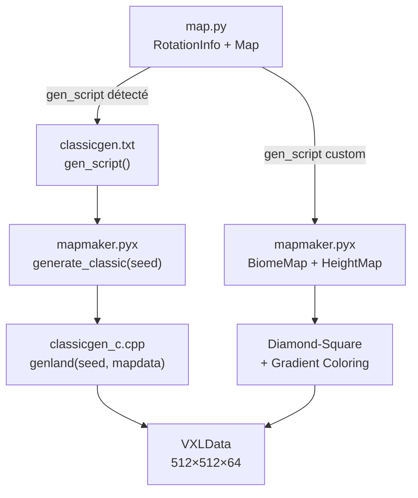

# Ace of Spades — Rapport Ultra-Détaillé sur la Génération de Map « Random »

> **Source**: [piqueserver](file:///home/alpha/Games/piqueserver) — fork communautaire du serveur Ace of Spades (pyspades)
> **Fichiers clés analysés**:
> [classicgen_c.cpp](file:///home/alpha/Games/piqueserver/pyspades/classicgen_c.cpp) ·
> [mapmaker.pyx](file:///home/alpha/Games/piqueserver/pyspades/mapmaker.pyx) ·
> [map.py](file:///home/alpha/Games/piqueserver/piqueserver/map.py) ·
> [vxl_c.h](file:///home/alpha/Games/piqueserver/pyspades/vxl_c.h) ·
> [color.py](file:///home/alpha/Games/piqueserver/pyspades/color.py) ·
> [constants_c.h](file:///home/alpha/Games/piqueserver/pyspades/constants_c.h)

---

## Table des matières

1. [Architecture Globale](#1-architecture-globale)
2. [Dimensions du Monde VXL](#2-dimensions-du-monde-vxl)
3. [Système 1 : Le Générateur Classique (C++)](#3-système-1--le-générateur-classique-c)
   - 3.1 [Improved Perlin Noise](#31-improved-perlin-noise)
   - 3.2 [Accumulation Multi-Fractale (fBm)](#32-accumulation-multi-fractale-fbm)
   - 3.3 [Calcul de la Hauteur Terrain](#33-calcul-de-la-hauteur-terrain)
   - 3.4 [Rivières par Modulation Sinusoïdale](#34-rivières-par-modulation-sinusoïdale)
   - 3.5 [Pipeline de Couleurs — Valeurs Exactes](#35-pipeline-de-couleurs--valeurs-exactes)
   - 3.6 [Éclairage Diffus Baked](#36-éclairage-diffus-baked)
   - 3.7 [Écriture dans le VXL](#37-écriture-dans-le-vxl)
4. [Système 2 : Le Générateur Biome (Python/Cython)](#4-système-2--le-générateur-biome-pythoncython)
   - 4.1 [BiomeMap — Zones de Voronoi par Flooding](#41-biomemap--zones-de-voronoi-par-flooding)
   - 4.2 [HeightMap — Diamond-Square Midpoint Displacement](#42-heightmap--diamond-square-midpoint-displacement)
   - 4.3 [Gradients de Couleur (64 niveaux)](#43-gradients-de-couleur-64-niveaux)
   - 4.4 [Post-traitement des Couleurs](#44-post-traitement-des-couleurs)
   - 4.5 [Écriture VXL depuis la HeightMap](#45-écriture-vxl-depuis-la-heightmap)
5. [Récapitulatif : Paramètres Clés pour ton Voxel Engine](#5-récapitulatif--paramètres-clés-pour-ton-voxel-engine)
6. [Correspondance avec BetterSpades / VoxPlace](#6-correspondance-avec-betterspades--voxplace)

---

## 1. Architecture Globale

Le serveur piqueserver supporte **deux systèmes** de génération de maps procédurales :



Le point d'entrée est [map.py](file:///home/alpha/Games/piqueserver/piqueserver/map.py) :

1. [RotationInfo](file:///home/alpha/Games/piqueserver/piqueserver/map.py#138-164) parse le nom de map et extrait le **seed** (optionnel via `nom#seed`)
2. Si un `gen_script` est défini dans le fichier [.txt](file:///home/alpha/Games/piqueserver/CREDITS.txt) de la map, il est exécuté
3. `random.seed(seed)` est appelé globalement **avant** la génération
4. Le résultat est un objet `VXLData` (512×512×64 voxels)

---

## 2. Dimensions du Monde VXL

Défini dans [constants_c.h](file:///home/alpha/Games/piqueserver/pyspades/constants_c.h) et [vxl_c.h](file:///home/alpha/Games/piqueserver/pyspades/vxl_c.h) :

| Paramètre | Valeur | Signification |
|---|---|---|
| `MAP_X` | 512 | Largeur du monde |
| `MAP_Y` | 512 | Profondeur du monde |
| `MAP_Z` | **64** | Hauteur maximale (z=0 = ciel, z=63 = bedrock) |
| `DEFAULT_COLOR` | `0xFF674028` | Couleur par défaut (marron terre) |

> [!IMPORTANT]
> **L'axe Z est inversé** : z=0 est le point le plus **haut**, z=63 le plus **bas**. La surface du terrain correspond typiquement à z ≈ 28–40.

Structure de stockage dans [vxl_c.h](file:///home/alpha/Games/piqueserver/pyspades/vxl_c.h#L17-L22) :
```cpp
struct MapData {
    std::bitset<512 * 512 * 64> geometry;   // 1 bit par voxel (solide ou non)
    std::unordered_map<int, int> colors;    // couleur BGRA uniquement pour les voxels solides
};
```

Format de couleur : `BGRA` packed en `int32` → `B | (G << 8) | (R << 16) | (A << 24)`

---

## 3. Système 1 : Le Générateur Classique (C++)

> **Fichier** : [classicgen_c.cpp](file:///home/alpha/Games/piqueserver/pyspades/classicgen_c.cpp)
> **Auteurs originaux** : Tom Dobrowolski (heightmap) + Ken Silverman (VXL writer)
> **Appelé via** : `generate_classic(seed)` dans [mapmaker.pyx](file:///home/alpha/Games/piqueserver/pyspades/mapmaker.pyx#L30-L33)

### 3.1 Improved Perlin Noise

L'implémentation est une version fidèle de l'**Improved Perlin Noise** de Ken Perlin (2002).

#### Initialisation du RNG

```cpp
// LCG (Linear Congruential Generator) portable
seed = seed * 214013 + 2531011;
return (seed >> 16) & 0x7FFF;
```

- C'est le **même LCG que MSVC** (`minstd_rand` de Microsoft), ce qui garantit la reproductibilité entre plateformes
- Produit des valeurs 15-bit (0–32767)

#### Table de Permutation

```cpp
static unsigned char noisep[512], noisep15[512];
```

- `noisep[0..255]` : permutation de Fisher-Yates des valeurs 0–255, générée avec le seed
- `noisep[256..511]` : copie miroir pour wrapping
- `noisep15[i] = noisep[i] & 15` : pré-calcul du masque pour le gradient lookup

#### Fonction Gradient ([fgrad](file:///home/alpha/Games/piqueserver/pyspades/classicgen_c.cpp#51-92))

16 directions prédéfinies — projection du gradient 3D sur les arêtes d'un cube :

| h | Direction |
|---|---|
| 0 | `+x+y` |
| 1 | `-x+y` |
| 2 | `+x-y` |
| 3 | `-x-y` |
| 4 | `+x+z` |
| 5 | `-x+z` |
| 6 | `+x-z` |
| 7 | `-x-z` |
| 8 | `+y+z` |
| 9 | `-y+z` |
| 10 | `+y-z` |
| 11 | `-y-z` |
| 12 | `+x+y` |
| 13 | `-x+y` |
| 14 | `+y-z` |
| 15 | `-y-z` |

#### Interpolation (Smoothstep de Perlin)

```cpp
p[i] = (3.0 - 2.0*p[i]) * p[i] * p[i];  // = 3t² - 2t³
```

C'est la **fade function d'Hermite** (pas le smootherstep de Perlin 2002, qui aurait 6t⁵ − 15t⁴ + 10t³). Cette version plus simple produit des dérivées C¹ continues mais pas C² continues — suffisant pour un terrain low-poly.

#### Signature de noise3d

```cpp
double noise3d(double fx, double fy, double fz, int mask);
```

Le paramètre `mask` limite la taille de la grille de bruit : `mask = min((1 << (octave+2)) - 1, 255)`. Pour l'octave 0, `mask = 3` → grille 4×4. Pour l'octave 9, `mask = 255` → grille 256×256.

### 3.2 Accumulation Multi-Fractale (fBm)

> [!TIP]
> Ce n'est **pas** un simple fBm (Fractional Brownian Motion). C'est un **multi-fractal** — l'amplitude de chaque octave est modulée par la valeur cumulée.

```cpp
for (o = 0; o < OCTMAX; o++) {  // OCTMAX = 10
    d += noise3d(dx, dy, 9.5, msklut[o]) * amplut[o] * (d * 1.6 + 1.0);
    river += noise3d(dx, dy, 13.2, msklut[o]) * amplut[o];
    dx *= 2;
    dy *= 2;
}
```

**Deux couches de bruit indépendantes** accumulées en parallèle :

| Couche | z-offset | Type | Formule |
|---|---|---|---|
| **Terrain (`d`)** | `9.5` | Multi-fractal | `d += noise × amp × (d × 1.6 + 1.0)` |
| **Rivière (`river`)** | `13.2` | fBm classique | `river += noise × amp` |

#### Paramètres des octaves

```cpp
amplut[i] = 0.4^i   // Persistance = 0.4 (décroissance rapide)
msklut[i] = min((1 << (i+2)) - 1, 255)  // Masque de taille de grille
```

| Octave | Amplitude | Masque | Fréquence relative |
|---|---|---|---|
| 0 | 1.0 | 3 | 1× |
| 1 | 0.4 | 7 | 2× |
| 2 | 0.16 | 15 | 4× |
| 3 | 0.064 | 31 | 8× |
| 4 | 0.0256 | 63 | 16× |
| 5 | 0.01024 | 127 | 32× |
| 6 | 0.004096 | 255 | 64× |
| 7 | 0.001638 | 255 | 128× |
| 8 | 0.000655 | 255 | 256× |
| 9 | 0.000262 | 255 | 512× |

> Le **multi-fractal** `d * 1.6 + 1.0` fait que les zones élevées gagnent encore plus de détails (pics montagneux), tandis que les zones basses restent lisses (vallées/eau). C'est la clé du look AoS.

#### Coordonnées d'entrée

```cpp
dx = (x * (256.0 / 512.0) + ...) * (1.0 / 64.0);
dy = (y * (256.0 / 512.0) + ...) * (1.0 / 64.0);
```

La map 512×512 est mappée sur un espace de bruit de `[0, 4)` × `[0, 4)` → une "île" de bruit de ~4 unités. Le facteur `1/64` contrôle l'échelle globale du terrain.

### 3.3 Calcul de la Hauteur Terrain

```cpp
samp[0] = d * -20.0 + 28.0;
```

- Le bruit `d` (typiquement dans [-1, +1]) est **inversé et mis à l'échelle** :
  - `d = -1` → `samp = 48` (point bas, près du bedrock)
  - `d = 0` → `samp = 28` (hauteur moyenne de surface)
  - `d = +1` → `samp = 8` (pic montagneux, près du ciel)

La hauteur finale est écrite comme :
```cpp
buf[k].a = (unsigned char)(63 - samp[0]);
```

→ z ∈ [0, 63], avec **z=0 = ciel** et **z=63 = sol**. La surface typique est à `z ≈ 35` (63 − 28).

### 3.4 Rivières par Modulation Sinusoïdale

```cpp
d = sin(x * (PI / 256.0) + river * 4.0) * (0.5 + 0.02) + (0.5 - 0.02);
```

Ce calcul crée des **canaux d'eau sinusoïdaux** :

1. `x * (PI / 256.0)` → oscillation sinusoïdale Est-Ouest (une période sur la largeur de la map)
2. `river * 4.0` → perturbation de la phase par le bruit fBm de la rivière → les rivières **serpentent**
3. `0.02` → **demi-largeur** de la rivière (contrôle l'épaisseur du canal)
4. Le résultat `d` agit comme un **multiplier** sur la hauteur :
   - `d ≈ 1` → terrain normal
   - `d ≈ 0` → terrain enfoncé à 0 (rivière/eau)
   - `d < 0` → clamped à 0 → eau

```cpp
samp[i] *= d;  // Hauteur modulée
if (d < 0) d = 0;
```

Quand `csamp < samp` (zone d'eau avec une concavité), un effet de **réfraction simulée** est appliqué :
```cpp
csamp[i] = -log(1.0 - csamp[i]);  // "simulate water normal"
```

### 3.5 Pipeline de Couleurs — Valeurs Exactes

> [!IMPORTANT]
> **Toutes les couleurs sont calculées analytiquement** — il n'y a aucune palette ni lookup table. Les couleurs finales sont le résultat d'un mélange progressif entre 4 couches.

#### Couche 1 : Sol de base (Ground)

```cpp
gr = 140;  gg = 125;  gb = 115;
```

→ **RGB(140, 125, 115)** — brun clair/beige (roche/terre sèche)

#### Couche 2 : Herbe (Grass) — basée sur la pente + altitude + bruit

```cpp
g = min(max(max(-nz, 0) * 1.4 - csamp[0] / 32.0
    + noise3d(x * (1.0/64.0), y * (1.0/64.0), 0.3, 15) * 0.3, 0), 1);

gr += (72 - gr) * g;    // R: 140 → 72
gg += (80 - gg) * g;    // G: 125 → 80
gb += (32 - gb) * g;    // B: 115 → 32
```

**Cible Grass** : **RGB(72, 80, 32)** — vert olive foncé / kaki

Le facteur `g` dépend de :
- **`-nz`** : composante Z de la normale (les surfaces horizontales sont plus "herbeuses")
- **`csamp[0] / 32.0`** : altitude (plus on monte, moins d'herbe — effet alpine)
- **[noise3d(..., 0.3, 15) * 0.3](file:///home/alpha/Games/piqueserver/pyspades/classicgen_c.cpp#127-159)** : bruit de variation locale à z=0.3

#### Couche 3 : Herbe secondaire (Grass2) — zone de transition

```cpp
g2 = (1 - fabs(g - 0.5) * 2) * 0.7;

gr += (68 - gr) * g2;   // R → 68
gg += (78 - gg) * g2;   // G → 78
gb += (40 - gb) * g2;   // B → 40
```

**Cible Grass2** : **RGB(68, 78, 40)** — vert légèrement plus terne

Ce facteur `g2` est maximal quand `g = 0.5` (zone de transition entre roche et herbe complète) → crée une **bande de transition** avec une couleur subtillement différente.

#### Couche 4 : Eau (Water)

```cpp
g2 = max(min((samp[0] - csamp[0]) * 1.5, 1), 0);
g  = 1 - g2 * 0.2;

gr += (60 * g - gr) * g2;    // R → ~48–60
gg += (100 * g - gg) * g2;   // G → ~80–100
gb += (120 * g - gb) * g2;   // B → ~96–120
```

**Cible Water** : approximativement **RGB(60, 100, 120)** × facteur d'assombrissement — bleu-vert foncé

Le facteur `g2 = (samp - csamp) * 1.5` mesure la **différence entre hauteur non-modulée et hauteur avec rivière** → identifie les zones rivière.

#### Résumé des couleurs cibles

| Couche | R | G | B | Hex approx. | Description |
|---|---|---|---|---|---|
| Ground (base) | 140 | 125 | 115 | `#8C7D73` | Beige roche |
| Grass | 72 | 80 | 32 | `#485020` | Vert olive kaki |
| Grass2 (transition) | 68 | 78 | 40 | `#444E28` | Vert terne |
| Water | ~48 | ~80 | ~96 | `#305060` | Bleu-vert foncé |

### 3.6 Éclairage Diffus Baked

L'éclairage est **pré-calculé** (baked) dans la couleur du voxel. Deux composantes :

#### Composante Ambiante

```cpp
d = 0.3;
amb[k].r = (unsigned char)min(max(gr * d, 0), 255);
amb[k].g = (unsigned char)min(max(gg * d, 0), 255);
amb[k].b = (unsigned char)min(max(gb * d, 0), 255);
maxa = max(max(amb[k].r, amb[k].g), amb[k].b);
```

- **30%** de la couleur de base → composante ambiante constante
- `maxa` est calculé pour éviter le clipping

#### Composante Directionnelle (Lambertien)

```cpp
// Direction de la lumière implicite : (0.5, 0.25, -1.0) normalisée
d = (nx * 0.5 + ny * 0.25 - nz) / sqrt(0.5² + 0.25² + 1.0²);
d *= 1.2;  // Boost de 20%
```

La **direction du soleil** est [(0.5, 0.25, -1.0)](file:///home/alpha/Games/piqueserver/piqueserver/map.py#63-136) — un soleil bas venant du nord-ouest, légèrement décalé.

```cpp
buf[k].r = min(max(gr * d, 0), 255 - maxa);  // Clamped pour laisser de la place à l'ambiant
buf[k].g = min(max(gg * d, 0), 255 - maxa);
buf[k].b = min(max(gb * d, 0), 255 - maxa);
```

#### Combinaison Finale

```cpp
buf[k].r += amb[k].r;
buf[k].g += amb[k].g;
buf[k].b += amb[k].b;
```

→ `couleur_finale = ambient (30% base) + diffuse (Lambertien directionnel × 120%)`

> [!NOTE]
> Cette couleur **inclut l'éclairage** — on ne peut pas séparer la couleur "pure" du voxel de son shading. C'est du **vertex baking** classique. Dans ton voxel engine, tu voudras probablement séparer la couleur de base et l'éclairage pour permettre un éclairage dynamique.

### 3.7 Écriture dans le VXL

```cpp
for (y = 0, k = 0; y < VSID; y++) {
    for (x = 0; x < VSID; x++, k++) {
        height = buf[k].a;                           // Hauteur de surface
        for (z = 63; z > height; z--)                // Du bedrock vers le haut
            map->geometry[get_pos(x, y, z)] = true;  // Remplir de solide
        map->geometry[get_pos(x, y, z)] = true;       // Surface elle-même

        lowest_z = get_lowest_height(x, y) + 1;       // Optimisation couleur
        for (; z < lowest_z; z++)
            map->colors[get_pos(x, y, z)] = buf[k];  // Colorier seulement les visibles
    }
}
```

> **Optimisation** : les couleurs ne sont assignées qu'aux voxels **entre la surface et la surface la plus basse des voisins + 1**. Les voxels profondément enterrés n'ont pas de couleur → économie mémoire.

---

## 4. Système 2 : Le Générateur Biome (Python/Cython)

> **Fichier** : [mapmaker.pyx](file:///home/alpha/Games/piqueserver/pyspades/mapmaker.pyx)
> **Auteur** : James Hofmann (2012)

Ce système est plus modulaire et permet de créer des maps avec des **biomes distincts** ayant chacun leur propre gradient de couleur.

### 4.1 BiomeMap — Zones de Voronoi par Flooding

```python
class Biome:
    def __init__(self, gradient, height, variation, noise):
        self.gradient = gradient      # Objet Gradient (palette 64 couleurs)
        self.height = height          # Hauteur typique [0.0–1.0]
        self.variation = variation    # Variation de hauteur [0.0–1.0]
        self.noise = noise            # Amplitude du bruit [0.0–1.0]
```

La `BiomeMap` est une grille 32×32 (par défaut) → chaque tuile couvre `16×16` voxels.

#### Algorithme de Flooding (Voronoi approximé)

```python
def point_flood(self, points):
    # Chaque point (x, y, biome) est floodé simultanément
    # via round-robin → distribution aussi uniforme que possible
    openp = deque([deque([p]) for p in points])
    # ... BFS par round-robin
```

Ce n'est **pas** un vrai diagramme de Voronoi, mais un **BFS multi-source simultané** qui produit un résultat similaire (frontières organiques entre biomes).

#### Jitter (Anti-aliasing spatial)

```python
def jitter(self):
    # Chaque cellule est remplacée par un voisin aléatoire (±1)
    self.tmap[idx] = self.get_repeat(x + randint(-1,1), y + randint(-1,1))
```

→ Casse les **lignes droites** entre biomes, créant des frontières organiques.

### 4.2 HeightMap — Diamond-Square Midpoint Displacement

La grille est 512×512, valeurs en `float` [0.0–1.0] :

```python
class HeightMap:
    self.hmap = array('f', [height] * 512*512)  # Hauteurs
    self.cmap = array('i', [0xFF00FFFF] * 512*512)  # Couleurs (magenta par défaut)
```

#### Diamond-Square

```python
def midpoint_displace(self, jittervalue, spanscalingmultiplier, skip=0):
    # 9 itérations (hardcodé pour 512×512 → 2⁹ = 512)
    for iterations in range(9):
        # Diamond step : moyenne des 4 coins + jitter random
        center = (topleft + topright + botleft + botright) * 0.25
                 + (random() * jitterrange + jitteroffset)
        # Square step : moyenne de 3 voisins
        self.set_repeat(x+halfspan, y, (topleft+topright+center) * 0.33)
        # ...
        span >>= 1
        spanscaling *= spanscalingmultiplier
```

**Paramètres clés** :
- `jittervalue` : amplitude initiale du bruit → contrôle la **rugosité** globale
- `spanscalingmultiplier` : facteur d'atténuation par octave → `< 1.0` = terrain lisse, `> 1.0` = très fractal

#### Post-traitements de la HeightMap

| Méthode | Effet | Formule |
|---|---|---|
| `peaking()` | Pics montagneux | `h = h²` |
| `dipping()` | Vallées (creux) | `h = sin(h × π)` |
| `rolling()` | Collines douces | `h = sin(h × π/2)` |
| `smoothing()` | Lissage box 3×3 | `h = (top+left+right+bot+center) / 5` |
| `jitter_heights(amount)` | Perturbation spatiale | Échantillonnage à position décalée aléatoirement |
| `truncate()` | Clamp [0, 1] | `h = clamp(h, 0, 1)` |

### 4.3 Gradients de Couleur (64 niveaux)

Le système `Gradient` est une **rampe de couleur à 64 étapes** qui mappe la hauteur du voxel vers une couleur de surface :

```python
class Gradient:
    def __init__(self):
        self.steps = [(0,0,0,0) for _ in range(64)]  # 64 stops RGBA

    def rgb(self, start_pos, start_color, end_pos, end_color):
        # Interpolation linéaire RGB entre deux positions
        for n in range(start_pos, end_pos):
            pct = (n - start_pos) / (end_pos - start_pos)
            self.steps[n] = interpolate_rgb(start_color, end_color, pct)

    def hsb(self, start_pos, start_color, end_pos, end_color):
        # Interpolation linéaire HSB (Hue/Saturation/Brightness)
        # Couleurs spécifiées en GIMP-style: (0-360, 0-100, 0-100)
```

#### Application du gradient

```python
def paint_gradient_fill(self, gradient):
    # Pour chaque pixel de la heightmap
    h = int(self.hmap[idx] * 63)   # Hauteur → index [0–63]
    self.cmap[idx] = paint_gradient(zcoldef, h)
```

#### Fonction `paint_gradient` — Bruit de couleur intégré

```python
cdef inline int paint_gradient(object zcoltable, int z):
    zz = z * 3
    rnd = random.randint(-4, 4)  # ±4 unités de bruit par canal
    return make_color(
        lim_byte(zcoltable[zz] + rnd),
        lim_byte(zcoltable[zz+1] + rnd),
        lim_byte(zcoltable[zz+2] + rnd)
    )
```

> [!TIP]
> **Le même offset aléatoire `rnd ∈ [-4, +4]`** est appliqué aux trois canaux RGB simultanément. Cela crée un bruit de **luminosité** (pas de teinte) — les couleurs deviennent légèrement plus claires ou plus sombres sans changer de teinte.

#### Système Multi-Gradient (Biomes)

```python
def rewrite_gradient_fill(self, gradients):
    # La cmap contient l'ID du biome → réécrire avec le gradient correspondant
    h = int(self.hmap[idx] * 63)
    self.cmap[idx] = paint_gradient(zcoldefs[self.cmap[idx]], h)
```

→ Chaque biome a son propre gradient de 64 couleurs. La `cmap` stocke d'abord l'ID du biome, puis est **réécrite** avec les vraies couleurs.

### 4.4 Post-traitement des Couleurs

#### Bruit RGB (Color Noise)

```python
def rgb_noise_colors(self, low, high):
    patterns = array('i', [randint(low, high) for _ in range(101)])
    # Pattern de 101 valeurs pré-générées, réutilisées cycliquement
    r = clamp(get_r(mid) + patterns[idx % 101])
    g = clamp(get_g(mid) + patterns[(idx+1) % 101])
    b = clamp(get_b(mid) + patterns[(idx+2) % 101])
```

- Pattern cyclique de 101 valeurs → crée un bruit **pseudo-structuré** (pas complètement random)
- Chaque canal utilise un offset décalé (+0, +1, +2) dans le pattern → **bruit chromatique** (pas monochrome)

#### Lissage de Couleurs

```python
def smooth_colors(self):
    # Box blur 3×3 sur chaque canal RGB indépendamment
    r = (left.r + right.r + up.r + down.r + center.r) / 5
    g = (left.g + right.g + up.g + down.g + center.g) / 5
    b = (left.b + right.b + up.b + down.b + center.b) / 5
```

#### Jitter de Couleurs

```python
def jitter_colors(self, amount):
    # Même que jitter_heights mais sur les couleurs
    # → crée un décalage spatial des couleurs vs la géométrie
```

### 4.5 Écriture VXL depuis la HeightMap

```python
def write_vxl(self):
    for idx in range(512*512):
        x = idx % 512
        y = idx // 512
        h = int(self.hmap[idx] * 63)       # Hauteur en z [0–63]
        vxl.set_column_fast(
            x, y,
            h,                              # z_start (surface)
            63,                             # z_end (bedrock)
            int(min(63, h + 3)),            # z_color_end (3 voxels sous la surface)
            self.cmap[idx]                  # Couleur de surface
        )
```

> Seuls les **3 premiers voxels sous la surface** sont coloriés (optimisation identique au classicgen). Les voxels plus profonds sont solides mais sans couleur assignée.

---

## 5. Récapitulatif : Paramètres Clés pour ton Voxel Engine

### Noise pour ton Terrain

| Paramètre | Classicgen (AoS) | Recommandation pour ton Engine |
|---|---|---|
| **Type de bruit** | Improved Perlin 3D (2D tranches) | Perlin 3D ou Simplex 2D |
| **Octaves** | 10 | 6–8 (suffisant pour du terrain) |
| **Persistance** | 0.4 | 0.4–0.5 |
| **Multi-fractal** | `amp × (val × 1.6 + 1.0)` | Implémente ça pour l'effet "pics détaillés, vallées lisses" |
| **Échelle globale** | `1/64 × 256/512` → 1 pixel ≈ 0.0078 unités de bruit | Ajuste selon la taille de tes chunks |
| **Hauteur** | `d × -20.0 + 28.0` dans [0, 63] | Scale linéaire après le bruit |

### Couleurs pour ton Terrain

```
Couleurs de base AoS (avant éclairage) :
┌─────────┬─────────────────────────────────────┐
│ Ground  │ RGB(140, 125, 115) — #8C7D73        │
│ Grass   │ RGB(72, 80, 32)    — #485020        │
│ Grass2  │ RGB(68, 78, 40)    — #444E28        │
│ Water   │ RGB(~48, ~80, ~96) — ~#305060       │
└─────────┴─────────────────────────────────────┘
```

### Pipeline de Bruit Couleur

1. **Gradient paint** : `±4` unités de bruit monochrome (même offset R=G=B)
2. **RGB noise** : bruit chromatique via pattern cyclique de 101 valeurs
3. **Smooth** : box blur 3×3 pour adoucir
4. **Jitter** : décalage spatial ±N pixels

---

## 6. Correspondance avec BetterSpades / VoxPlace

En référence aux conversations précédentes sur ton voxel engine :

| Aspect | AoS Classicgen | BetterSpades | Recommandation pour VoxPlace |
|---|---|---|---|
| **Éclairage** | Baked (diffuse + ambient) | Runtime (shader AO + sunblock) | Runtime shader — sépare couleur et lumière |
| **Couleur palette** | Pas de palette — couleurs analytiques | 64 couleurs palette + shader variation | Couleurs analytiques + shader variation (combine les deux) |
| **Bruit couleur** | `±4` luminosité uniforme | Shader noise per-face | Fragment shader `noise ±4` par face |
| **Gradient hauteur** | Mélange Ground/Grass/Water par formule | Non (couleurs fixes par voxel) | Gradient 64 niveaux dans le shader, indexé par altitude |
| **Rivières** | Sinus modulé par fBm | Pas de rivières | Sinus + fBm — très efficace et peu coûteux |

> [!TIP]
> **Pour reproduire le look AoS dans ton engine** :
> 1. Implémente le Perlin Noise multi-fractal (10 octaves, persistance 0.4, `amp × (val × 1.6 + 1.0)`)
> 2. Utilise les 4 couleurs de base exactes et le mélange par pente/altitude/bruit
> 3. Ajoute le bruit de couleur `±4` par voxel dans ton fragment shader
> 4. Ajoute les rivières sinusoïdales perturbées par fBm séparé
> 5. Sépare l'éclairage de la couleur de base pour profiter de ton système sunblock/AO existant
