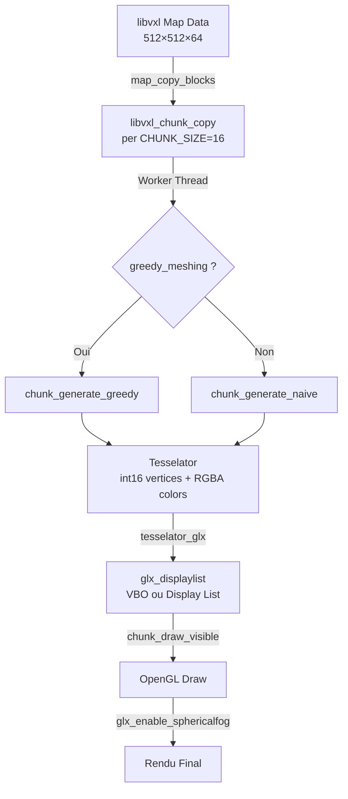
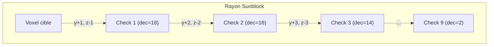

# BetterSpades — Pipeline de Rendu Esthétique Complète

> [!IMPORTANT]
> Ce document décrypte en profondeur **comment BetterSpades gère les couleurs, l'ombrage, l'AO, les gradients, le meshing, et tout le pipeline visuel** — basé sur une analyse exhaustive du code source. Rédigé comme référence pour reproduire ces techniques dans VoxPlace.

---

## Table des matières

1. [Architecture Générale](#1-architecture-générale)
2. [Stockage des Couleurs (Map & Blocs)](#2-stockage-des-couleurs)
3. [Face Shading — Facteurs par Face](#3-face-shading)
4. [Sunblock Shading — Ombre Diagonale](#4-sunblock-shading)
5. [Ambient Occlusion (AO) par Vertex](#5-ambient-occlusion)
6. [Triangulation & Quad ↔ Triangle](#6-triangulation)
7. [Greedy Meshing](#7-greedy-meshing)
8. [Couleur de Terre (Dirt Color Gradient)](#8-dirt-color-gradient)
9. [Placed Block Color — XOR Noise](#9-placed-block-color)
10. [Fog Sphérique (Spherical Fog)](#10-fog-sphérique)
11. [KV6 Model Shading](#11-kv6-model-shading)
12. [Front-to-Back Sorting & Frustum Culling](#12-front-to-back-sorting)
13. [Pipeline de Rendu Complet (drawScene)](#13-pipeline-de-rendu)
14. [Block Update & Chunk Rebuild](#14-block-update)
15. [Collapsing Structures — Face Shading Alternatif](#15-collapsing-structures)
16. [Résumé des Facteurs Numériques](#16-résumé-chiffres)
17. [Adaptation pour VoxPlace](#17-adaptation-voxplace)

---

## 1. Architecture Générale



**Points clés :**
- **Pas de shaders GLSL pour le terrain** — Tout est calculé **CPU-side** et encodé dans les **vertex colors** (RGBA par sommet)
- Pipeline **fixed-function OpenGL** (OpenGL 1.x / 2.x), compatible OpenGL ES via `#ifdef OPENGL_ES`
- Multithreading via **pthreads** pour la génération de chunks (channel producer/consumer)
- Deux modes de meshing : **naive** (per-voxel) et **greedy** (fusionne les faces identiques)

> [!NOTE]
> BetterSpades n'utilise **aucun shader fragment/vertex** pour le terrain. Toute l'esthétique (face shading, AO, sunblock) est **baked** dans les vertex colors au moment du meshing.

---

## 2. Stockage des Couleurs

### Map → Couleurs Brutes

La couleur de chaque voxel est stockée dans le format **libvxl** en BGRA. La conversion se fait à la lecture :

```c
// common.h — Macros de couleur
#define rgba(r, g, b, a) (((int)(a) << 24) | ((int)(b) << 16) | ((int)(g) << 8) | (int)(r))
#define rgb(r, g, b)     (((b) << 16) | ((g) << 8) | (r))
#define rgb2bgr(col)     rgb(blue(col), green(col), red(col))
#define red(col)         ((col) & 0xFF)
#define green(col)       (((col) >> 8) & 0xFF)
#define blue(col)        (((col) >> 16) & 0xFF)
```

> [!WARNING]
> Les canaux sont **inversés** entre libvxl (BGR) et le format interne (RGB). Le code fait systématiquement `r = blue(col)`, `g = green(col)`, `b = red(col)` pour compenser.

Référence : [chunk.c:L248-251](file:///home/alpha/Documents/TFE/BetterSpades/src/chunk.c#L248-L251), [chunk.c:L583-586](file:///home/alpha/Documents/TFE/BetterSpades/src/chunk.c#L583-L586)

### Vertex Colors

Les couleurs finales sont exprimées en `uint32_t` au format `rgba(r, g, b, a)` avec le canal alpha toujours à 255 pour les voxels opaques. La couleur est **modifiée en place** par :

1. **Sunblock** (multiplication globale)
2. **Face shading** (facteur par direction)
3. **AO** (facteur par vertex, mode naive uniquement)

---

## 3. Face Shading — Facteurs par Face

C'est la technique centrale de BetterSpades pour donner du **volume** aux blocs. Chaque face a un facteur de luminosité fixe appliqué à la couleur RGB.

### Valeurs Exactes (terrain chunks)

| Face | Direction | Facteur | Code |
|------|-----------|---------|------|
| **Top** (+Y) | `CUBE_FACE_Y_P` | **1.000** | `rgba(r, g, b, 255)` |
| **Bottom** (-Y) | `CUBE_FACE_Y_N` | **0.500** | `rgba(r * 0.5F, ...)` |
| **North** (-Z) | `CUBE_FACE_Z_N` | **0.875** | `rgba(r * 0.875F, ...)` |
| **South** (+Z) | `CUBE_FACE_Z_P` | **0.625** | `rgba(r * 0.625F, ...)` |
| **West** (-X) | `CUBE_FACE_X_N` | **0.750** | `rgba(r * 0.75F, ...)` |
| **East** (+X) | `CUBE_FACE_X_P` | **0.750** | `rgba(r * 0.75F, ...)` |

```c
// chunk.c — Commentaire lignes 555-560
//+X = 0.75
//-X = 0.75
//+Y = 1.0
//-Y = 0.5
//+Z = 0.625
//-Z = 0.875
```

Référence : [chunk.c:L555-L560](file:///home/alpha/Documents/TFE/BetterSpades/src/chunk.c#L555-L560)

### Fonctionnement

La couleur finale d'une face est :

```
finalColor.rgb = baseColor.rgb × sunblock × faceFactor × aoFactor
```

Où les facteurs sont appliqués **séquentiellement** sur les composantes RGB :

```c
// Étape 1: Sunblock (global)
float shade = solid_sunblock(blocks, x, y, z);
r *= shade;  g *= shade;  b *= shade;

// Étape 2: Face shading (par face)
// Exemple pour face -Z (North):
tesselator_set_color(tess, rgba(r * 0.875F, g * 0.875F, b * 0.875F, 255));
```

Référence : [chunk.c:L588-L618](file:///home/alpha/Documents/TFE/BetterSpades/src/chunk.c#L588-L618)

### Logique visuell

```
       +Y (1.0) — le plus clair, "plein soleil"
        ▲
        │
 -X ◄───┼───► +X (tous deux 0.75)
(0.75)  │     
        ▼
       -Y (0.5) — le plus sombre, "dessous"

   -Z (0.875) derrière = assez clair
   +Z (0.625) devant = plus sombre
```

> [!TIP]
> Les faces **latérales** (±X) sont identiques (0.75). La face **top** est toujours la plus lumineuse (simulant la lumière du soleil qui vient d'en haut).
> L'asymétrie ±Z (0.875 vs 0.625) donne un **effet de lumière directionnelle** même sans vraie lumière.

---

## 4. Sunblock Shading — Ombre Diagonale

### Concept

Le sunblock simule un **rayon de lumière diagonal** descendant depuis le haut. Il vérifie les blocs au-dessus et en diagonale pour déterminer combien de lumière atteint un voxel.

### Algorithme

```c
// chunk.c:L161-L173
static float solid_sunblock(struct libvxl_chunk_copy* blocks,
                            uint32_t x, uint32_t y, uint32_t z) {
    int dec = 18;
    int i = 127;

    while(dec && y < map_size_y) {
        if(!solid_array_isair(blocks, x, ++y, --z))
            i -= dec;
        dec -= 2;
    }

    return (float)i / 127.0F;
}
```

### Pas à pas

| Itération | `dec` | Direction vérifiée | Si bloc solide → `i` décrementé de |
|-----------|-------|--------------------|--------------------------------------|
| 1 | 18 | [(x, y+1, z-1)](file:///home/alpha/Documents/TFE/BetterSpades/src/map.c#677-680) | 18 |
| 2 | 16 | [(x, y+2, z-2)](file:///home/alpha/Documents/TFE/BetterSpades/src/map.c#677-680) | 16 |
| 3 | 14 | [(x, y+3, z-3)](file:///home/alpha/Documents/TFE/BetterSpades/src/map.c#677-680) | 14 |
| 4 | 12 | [(x, y+4, z-4)](file:///home/alpha/Documents/TFE/BetterSpades/src/map.c#677-680) | 12 |
| 5 | 10 | [(x, y+5, z-5)](file:///home/alpha/Documents/TFE/BetterSpades/src/map.c#677-680) | 10 |
| 6 | 8 | [(x, y+6, z-6)](file:///home/alpha/Documents/TFE/BetterSpades/src/map.c#677-680) | 8 |
| 7 | 6 | [(x, y+7, z-7)](file:///home/alpha/Documents/TFE/BetterSpades/src/map.c#677-680) | 6 |
| 8 | 4 | [(x, y+8, z-8)](file:///home/alpha/Documents/TFE/BetterSpades/src/map.c#677-680) | 4 |
| 9 | 2 | [(x, y+9, z-9)](file:///home/alpha/Documents/TFE/BetterSpades/src/map.c#677-680) | 2 |

**Total max de soustraction** = 18+16+14+12+10+8+6+4+2 = **90**

Donc `i` peut aller de 127 (plein soleil) à 37 (dans l'ombre maximale), soit une **plage de `37/127 ≈ 0.291` à `1.0`**.



> [!IMPORTANT]
> Le rayon va vers **+Y et -Z** (vers le haut et vers l'arrière dans l'espace BetterSpades). C'est un rayon diagonal fixe, pas un vrai raycasting — c'est **très rapide** à calculer.

### Quand est-il appliqué ?

- **Mode naive** : Appliqué per-voxel avant le face shading → `shade = solid_sunblock(...)` puis `r *= shade`
- **Mode greedy** : **PAS** appliqué ! Les facteurs de face sont utilisés seuls (sinon le greedy meshing ne pourrait pas fusionner les faces car chaque voxel aurait un shade différent)

Référence : [chunk.c:L588-L591](file:///home/alpha/Documents/TFE/BetterSpades/src/chunk.c#L588-L591) (naive), [map.c:L474-L484](file:///home/alpha/Documents/TFE/BetterSpades/src/map.c#L474-L484) (map version)

---

## 5. Ambient Occlusion (AO) par Vertex

### Source

Basé sur l'article de **0fps.net** : [Ambient Occlusion for Minecraft-like Worlds](https://0fps.net/2013/07/03/ambient-occlusion-for-minecraft-like-worlds/)

### Activation

L'AO est **optionnel** (`settings.ambient_occlusion`). Quand activé :
- `glShadeModel(GL_SMOOTH)` — interpolation des couleurs entre les vertices
- Chaque vertex d'une face reçoit un facteur AO différent

Quand désactivé :
- `glShadeModel(GL_FLAT)` — couleur uniforme par face

### Algorithme [vertexAO](file:///home/alpha/Documents/TFE/BetterSpades/src/chunk.c#562-570)

```c
// chunk.c:L563-L569
static float vertexAO(int side1, int side2, int corner) {
    if(!side1 && !side2) {
        return 0.25F;
    }
    return 0.75F - (!side1 + !side2 + !corner) * 0.25F + 0.25F;
}
```

> [!NOTE]
> Les paramètres `side1`, `side2`, `corner` sont le **résultat de [solid_array_isair()](file:///home/alpha/Documents/TFE/BetterSpades/src/chunk.c#151-160)**, donc `1 = air, 0 = solid`.
> Un `!side1` signifie "ce voisin est solide" → ajoute de l'ombre.

### Table des valeurs

| `side1` (air?) | `side2` (air?) | `corner` (air?) | Résultat |
|:-:|:-:|:-:|:-:|
| 0 (solid) | 0 (solid) | ∅ | **0.25** (max ombre) |
| 0 (solid) | 1 (air) | 0 (solid) | **0.50** |
| 0 (solid) | 1 (air) | 1 (air) | **0.75** |
| 1 (air) | 0 (solid) | 0 (solid) | **0.50** |
| 1 (air) | 0 (solid) | 1 (air) | **0.75** |
| 1 (air) | 1 (air) | 0 (solid) | **0.75** |
| 1 (air) | 1 (air) | 1 (air) | **1.00** (pas d'ombre) |

### Schéma de l'AO pour la face Top (+Y)

```
Pour le vertex A (coin x, z) de la face +Y du bloc (x,y,z):

              z-1
               │
    x-1 ──────A────── x+1
               │
              z+1

    side1  = isair(x-1, y+1, z)    ← côté X
    side2  = isair(x, y+1, z-1)    ← côté Z
    corner = isair(x-1, y+1, z-1)  ← diagonale
```

```c
// chunk.c:L710-L721 — AO pour face Top
float A = vertexAO(
    solid_array_isair(blocks, x-1, y+1, z),      // side1
    solid_array_isair(blocks, x,   y+1, z-1),    // side2
    solid_array_isair(blocks, x-1, y+1, z-1)     // corner
);
float B = vertexAO(
    solid_array_isair(blocks, x-1, y+1, z),
    solid_array_isair(blocks, x,   y+1, z+1),
    solid_array_isair(blocks, x-1, y+1, z+1)
);
// C et D similaires pour les coins x+1
```

### Application Finale

Le facteur AO est **multiplié** avec le face shading :

```c
// Face Top (+Y) avec AO:
rgba(r * A, g * A, b * A, 255)  // vertex A (face_factor = 1.0 pour top)

// Face Bottom (-Y) avec AO:
rgba(r * 0.5F * A, g * 0.5F * A, b * 0.5F * A, 255)  // face_factor × AO
```

### Ombres Triangulaires

Avec `GL_SMOOTH` et une interpolation linéaire des vertex colors à travers un quad (ou 2 triangles), l'AO produit des **gradients triangulaires** sur les faces des blocs :

```
Quad face avec AO:
┌─────────────┐
│ A=0.25       B=0.75 │  ← coin A dans l'ombre, B pas
│   ╲            ╱    │
│     ╲ smooth ╱      │  ← le GPU interpole les couleurs
│       ╲    ╱        │     → produit un dégradé triangulaire
│ D=0.75  ╲╱  C=1.0  │
└─────────────┘
```

> [!TIP]
> L'ombre "triangulaire" vient naturellement de l'interpolation GPU des vertex colors sur les 2 triangles d'un quad. C'est le mécanisme `GL_SMOOTH` de OpenGL.

---

## 6. Triangulation & Quad ↔ Triangle

### Compilation Conditionnelle

```c
// tesselator.h:L27-L31
#ifdef OPENGL_ES
    #define TESSELATE_TRIANGLES
#else
    #define TESSELATE_QUADS
#endif
```

### Mode Quads (Desktop)

- 4 vertices par face
- `glDrawArrays(GL_QUADS, 0, quad_count * 4)`

### Mode Triangles (ES/Mobile)

Chaque quad `ABCD` est converti en 2 triangles `ABC + ACD` :

```c
// tesselator.c:L200-L203 — Triangle emission
memcpy(colors + quad_count * 6, colors_in, sizeof(uint32_t) * 3);     // A B C
colors[quad_count * 6 + 3] = colors_in[0];                             // A (repeat)
memcpy(colors + quad_count * 6 + 4, colors_in + 2, sizeof(uint32_t) * 2); // C D
```

```
Quad ABCD → Triangle ABC + Triangle ACD

  A ─────── B         A ─────── B       A
  │         │   →     │       ╱    +     │ ╲
  │         │         │     ╱            │   ╲
  │         │         │   ╱              │     ╲
  D ─────── C         D              D ─── C
```

---

## 7. Greedy Meshing

### Concept

Le greedy meshing **fusionne les faces adjacentes de même couleur** en un seul quad étendu, réduisant drastiquement le nombre de triangles.

### Algorithme (simplifié)

Pour chaque face direction (±X, ±Y, ±Z) :

1. Itérer sur les voxels du chunk
2. Pour chaque face visible non encore marquée :
   - **Étendre en Y** (trouver `len_y` faces consécutives de même couleur)
   - **Étendre en X** (trouver `len_x` lignes de `len_y` faces similaires)
   - Marquer toutes les faces fusionnées
   - Émettre un seul quad de taille (`len_x × len_y`)

```c
// chunk.c:L256-L288 — Greedy pour face -Z
int len_y = 1;
int len_x = 1;

// Extend en Y
for(int a = 1; a < map_size_y - y; a++) {
    if(same_color && same_face && !checked)
        len_y++;
    else break;
}

// Extend en X
for(int b = 1; b < (start_x + CHUNK_SIZE - x); b++) {
    // Vérifier toute la colonne de len_y
    ...
    if(all_match) len_x++;
    else break;
}

// Un seul quad au lieu de len_x × len_y quads
tesselator_set_color(tess, rgba(r * 0.875F, g * 0.875F, b * 0.875F, 255));
tesselator_addi_simple(tess, (int16_t[]) {
    x, y, z,
    x, y + len_y, z,
    x + len_x, y + len_y, z,
    x + len_x, y, z
});
```

> [!WARNING]
> En mode greedy, le **sunblock n'est PAS appliqué** car les voxels fusionnés pourraient avoir des shades différents. Seul le face shading fixe est utilisé.
> L'**AO est également incompatible** avec le greedy meshing dans BetterSpades.

---

## 8. Dirt Color Gradient

### Concept

Quand un bloc est détruit et révèle un bloc "intérieur" (terre), BetterSpades génère une **couleur procédurale** basée sur la profondeur Y.

### Table de Couleurs de Terre

```c
// map.c:L681-L682
static int dirt_color_table[]
    = {0x506050, 0x605848, 0x705040, 0x804838,
       0x704030, 0x603828, 0x503020, 0x402818, 0x302010};
```

Visuellement (de la surface vers le profond) :

| Index (depth) | Couleur Hex | Description |
|:---:|:---:|:---|
| 0 | `#506050` | Gris-vert (surface) |
| 1 | `#605848` | Brun clair |
| 2 | `#705040` | Brun |
| 3 | `#804838` | Brun-rouge |
| 4 | `#704030` | Brun foncé |
| 5 | `#603828` | Terre foncée |
| 6 | `#503020` | Terre très foncée |
| 7 | `#402818` | Presque noir |
| 8 | `#302010` | Noir-brun |

### Interpolation (Lerp)

```c
// map.c:L677
static int lerp(int a, int b, int amt) { // amt from 0 to 8
    return a + (b - a) * amt / 8;
}
```

La profondeur est découpée en **tranches de 8 blocs** avec interpolation linéaire entre les couleurs :

```c
// map.c:L685-L700
int map_dirt_color(int x, int y, int z) {
    int vertical_slice = (map_size_y - 1 - y) / 8;
    int lerp_amt       = (map_size_y - 1 - y) % 8;
    int dirt_base_color = dirt_color_table[vertical_slice];
    int dirt_next_color = dirt_color_table[vertical_slice + 1];

    int red   = lerp(base & 0xFF0000, next & 0xFF0000, lerp_amt) >> 16;
    int green = lerp(base & 0x00FF00, next & 0x00FF00, lerp_amt) >> 8;
    int blue  = lerp(base & 0x0000FF, next & 0x0000FF, lerp_amt);

    // Pseudo-random variation (onde triangulaire + bruit)
    int rng = ms_rand() % 8;
    red   += 4 * abs((x % 8) - 4) + rng;
    green += 4 * abs((z % 8) - 4) + rng;
    blue  += 4 * abs(((map_size_y - 1 - y) % 8) - 4) + rng;

    return rgb(red, green, blue);
}
```

### Onde Triangulaire

L'expression `4 * abs((x % 8) - 4)` produit une **onde triangulaire** avec période 8 et amplitude 16 :

```
x mod 8:  0   1   2   3   4   5   6   7
|x-4|:    4   3   2   1   0   1   2   3
4*|x-4|: 16  12   8   4   0   4   8  12
```

Cela crée un motif de **variation de couleur spatiale** sans la régularité d'un simple modulo, donnant un aspect plus naturel à la terre.

> [!TIP]
> **Pour VoxPlace :** Cette technique d'onde triangulaire + LCG noise est idéale pour la variation shader. La formule GLSL serait :
> ```glsl
> float triWave(float x) { return abs(mod(x, 8.0) - 4.0) * 4.0; }
> ```

---

## 9. Placed Block Color — XOR Noise

Quand un **joueur place un bloc**, la couleur est légèrement perturbée :

```c
// map.c:L703-L708
static int gkrand = 0;
int map_placedblock_color(int color) {
    color = color | 0x7F000000;
    gkrand = 0x1A4E86D * gkrand + 1;      // LCG déterministe
    return color ^ (gkrand & 0x70707);     // XOR sur R, G, B bas bits
}
```

### Décomposition

1. **Set alpha** : `color | 0x7F000000` → force le bit 31:24 à `0x7F` (marqueur "placed block")
2. **LCG** : `gkrand = 0x1A4E86D * gkrand + 1` — générateur pseudo-aléatoire déterministe (Linear Congruential Generator)
3. **XOR perturbation** : `gkrand & 0x70707` masque les bits :
   - Bit pattern: `0000 0000 0000 0111 0000 0111 0000 0111`
   - Soit les **3 bits bas** de chaque canal RGB
   - Le XOR perturbe de ±7 chaque canal → variation subtile mais visible

> [!NOTE]
> C'est ce qui fait que chaque bloc placé a une **micro-variation de couleur** même si le joueur choisit la même couleur. Ça empêche l'aspect "plastique uniforme" de Minecraft.

---

## 10. Fog Sphérique (Spherical Fog)

BetterSpades utilise une technique de fog circulaire via une **texture gradient 2D** mappée dans l'espace monde.

### Génération de la Texture

```c
// texture.c:L322-L330
void texture_gradient_fog(unsigned int* gradient) {
    int size = 512;
    for(int y = 0; y < size; y++) {
        for(int x = 0; x < size; x++) {
            int d = min(sqrt(distance2D(size/2, size/2, x, y))
                        / (float)size * 2.0F * 255.0F, 255);
            gradient[x + y * size] = rgba(d, d, d, 255);
        }
    }
}
```

C'est un **disque radial** : noir au centre (pas de fog), blanc aux bords (fog maximal).

### Application

Deux modes disponibles :

#### Mode 1 : Texture Gen (non smooth)
```c
// glx.c:L222-L242 — Mapping dans l'espace monde
glTexGeni(GL_T, GL_TEXTURE_GEN_MODE, GL_EYE_LINEAR);
glTexGeni(GL_S, GL_TEXTURE_GEN_MODE, GL_EYE_LINEAR);
glTexGenfv(GL_T, GL_EYE_PLANE,
    (float[]) {1.0F / render_distance / 2.0F, 0.0F, 0.0F,
               -camera_x / render_distance / 2.0F + 0.5F});
glTexGenfv(GL_S, GL_EYE_PLANE,
    (float[]) {0.0F, 0.0F, 1.0F / render_distance / 2.0F,
               -camera_z / render_distance / 2.0F + 0.5F});
```

La texture est mappée en **coordonnées monde** centrées sur la caméra. La couleur du fog est mélangée via `GL_TEXTURE_ENV_MODE = GL_BLEND` avec `GL_TEXTURE_ENV_COLOR = fog_color`.

#### Mode 2 : Smooth fog (spotlight)
Utilise un **GL_LIGHT1** en mode spotlight pointant vers le bas, simulant un éclairage circulaire qui s'estompe avec la distance.

#### Mode 3 : OpenGL ES
Simple `GL_FOG` linéaire (fallback).

---

## 11. KV6 Model Shading

Les modèles de joueurs/objets (format KV6) ont leur **propre set de face shading** :

```c
// model.c — kv6_render, facteurs par face :
// Face Top    (+Y) : 1.00
// Face Bottom (-Y) : 0.60
// Face North  (-Z) : 0.95
// Face South  (+Z) : 0.90
// Face West   (-X) : 0.85
// Face East   (+X) : 0.80
```

| Face | Terrain Factor | Model (KV6) Factor |
|------|:-:|:-:|
| +Y (Top) | 1.000 | 1.000 |
| -Y (Bottom) | 0.500 | 0.600 |
| -Z (North) | 0.875 | 0.950 |
| +Z (South) | 0.625 | 0.900 |
| -X (West) | 0.750 | 0.850 |
| +X (East) | 0.750 | 0.800 |

> [!NOTE]
> Les modèles ont un contraste **plus faible** que le terrain (plage 0.60-1.00 vs 0.50-1.00). Ceci les fait paraître plus "plats" et empêche les artefacts visuels sur les petits objets.

### Lighting des modèles

Les modèles utilisent en plus **OpenGL lighting** (GL_LIGHT0) avec le sunblock de la map :

```c
// model.c:L214-L225
void kv6_calclight(int x, int y, int z) {
    float f = 1.0F;
    if(x >= 0 && y >= 0 && z >= 0)
        f = map_sunblock(x, y, z);

    float lambient[4] = {0.5F * f, 0.5F * f, 0.5F * f, 1.0F};
    float ldiffuse[4] = {0.5F * f, 0.5F * f, 0.5F * f, 1.0F};

    glLightfv(GL_LIGHT0, GL_AMBIENT, lambient);
    glLightfv(GL_LIGHT0, GL_DIFFUSE, ldiffuse);
}
```

Les modèles ont aussi des **normales KV6** pour du vrai diffuse lighting :
```c
tesselator_set_normal(tess, kv6_normals[a][0]*128, -kv6_normals[a][2]*128, kv6_normals[a][1]*128);
```

---

## 12. Front-to-Back Sorting & Frustum Culling

### Frustum Culling

Chaque chunk est testé avec un **AABB** via [camera_CubeInFrustum()](file:///home/alpha/Documents/TFE/BetterSpades/src/camera.c#370-401) :

```c
// chunk.c:L133-L134
if(camera_CubeInFrustum(
    (x + 0.5F) * CHUNK_SIZE,  // centre X
    0.0F,                      // Y min
    (y + 0.5F) * CHUNK_SIZE,  // centre Z
    CHUNK_SIZE / 2,            // demi-taille XZ
    c->max_height))            // hauteur max du chunk
```

`max_height` est calculé pendant le meshing → économie de culling pour les chunks plats.

### Front-to-Back Sorting

```c
// chunk.c:L92-L99
static int chunk_sort(const void* a, const void* b) {
    return distance2D(aa->chunk->x * CHUNK_SIZE + CHUNK_SIZE/2,
                      aa->chunk->y * CHUNK_SIZE + CHUNK_SIZE/2,
                      camera_x, camera_z)
         - distance2D(bb->chunk->x * CHUNK_SIZE + CHUNK_SIZE/2,
                      bb->chunk->y * CHUNK_SIZE + CHUNK_SIZE/2,
                      camera_x, camera_z);
}

// chunk.c:L145
qsort(chunks_draw, index, sizeof(struct chunk_render_call), chunk_sort);
```

Le tri par distance **exploite le Early-Z** du GPU : les fragments des chunks proches sont dessinés en premier et masquent les fragments distants via le depth buffer.

### Map Wrapping

BetterSpades supporte le **wrapping** de la map (monde toroïdal) avec un overshoot :

```c
// chunk.c:L121-L139
int overshoot = (settings.render_distance + CHUNK_SIZE - 1) / CHUNK_SIZE + 1;
for(int y = -overshoot; y < CHUNKS_PER_DIM + overshoot; y++) {
    ...
    .mirror_x = (x < 0) ? -1 : ((x >= CHUNKS_PER_DIM) ? 1 : 0),
    .mirror_y = (y < 0) ? -1 : ((y >= CHUNKS_PER_DIM) ? 1 : 0),
}
```

---

## 13. Pipeline de Rendu Complet (drawScene)

```c
// main.c:L87-L175 — drawScene()
void drawScene() {
    // 1. Shade model
    if(settings.ambient_occlusion)
        glShadeModel(GL_SMOOTH);     // interpole vertex colors
    else
        glShadeModel(GL_FLAT);       // couleur uniforme par face

    // 2. Terrain chunks
    matrix_upload();
    chunk_draw_visible();            // chunks triés front-to-back

    // 3. Fog smooth (optionnel)
    if(settings.smooth_fog) {
        glFogi(GL_FOG_MODE, GL_EXP2);
        glFogf(GL_FOG_DENSITY, 0.015F);
        ...
    }

    // 4. Modèles & effets
    glShadeModel(GL_FLAT);           // reset pour les modèles
    kv6_calclight(-1, -1, -1);       // lighting global
    matrix_upload();
    particle_render();               // particules (voxels flottants)
    tracer_render();                 // traces de balles
    grenade_render();                // grenades
    map_damaged_voxels_render();     // cracks de dégâts

    // 5. Game objects (intel, tent, etc.)
    ...kv6_render(&model_intel, team)...
}
```

### Séquence d'initialisation OpenGL

```c
// main.c:L471-L506
void init() {
    glEnable(GL_DEPTH_TEST);
    glEnable(GL_CULL_FACE);     // Back-face culling
    glCullFace(GL_BACK);
    glFrontFace(GL_CCW);         // Counter-clockwise = front
    glClearDepth(1.0F);
    glDepthFunc(GL_LEQUAL);
    glShadeModel(GL_SMOOTH);
}
```

---

## 14. Block Update & Chunk Rebuild

### Quand un bloc est posé/détruit

```c
// map.c:L540-L587
void map_set(int x, int y, int z, unsigned int color) {
    // 1. Mettre à jour libvxl
    if(color == 0xFFFFFFFF)
        libvxl_map_setair(&map, x, z, map_size_y - 1 - y);
    else
        libvxl_map_set(&map, x, z, map_size_y - 1 - y, rgb2bgr(color));

    // 2. Rebuild chunk contenant le bloc
    chunk_block_update(x, y, z);

    // 3. Rebuild chunks voisins si le bloc est sur un bord
    int x_off = x % CHUNK_SIZE;
    if(x > 0 && x_off == 0)
        chunk_block_update(x - 1, y, z);          // chunk -X
    if(x < map_size_x - 1 && x_off == CHUNK_SIZE - 1)
        chunk_block_update(x + 1, y, z);          // chunk +X
    // ... idem pour Z

    // 4. Si AO activé → rebuild chunks diagonaux aussi
    if(settings.ambient_occlusion) {
        if(x_off == 0 && z_off == 0)
            chunk_block_update(x-1, y, z-1);      // chunk diagonal
        // ... 3 autres diagonales
    }
}
```

> [!IMPORTANT]
> Avec l'AO, un **changement de bloc** peut entraîner le rebuild de **jusqu'à 9 chunks** (le chunk principal + 4 adjacents + 4 diagonaux). C'est pourquoi l'AO a un coût en rebuild.

### Queue de Travail


La HashTable `chunk_block_queue` **déduplique** les demandes : si un bloc change 5 fois rapidement, le chunk n'est rebuilé qu'une fois.

---

## 15. Collapsing Structures — Face Shading Alternatif

Les structures qui tombent (blocs déconnectés du sol) ont un **jeu de facteurs légèrement différent** :

```c
// map.c:L195-L223 — falling_blocks_meshing
// Face +Y (Top)    : 1.00
// Face -Y (Bottom) : 0.50
// Face -Z (North)  : 0.70
// Face +Z (South)  : 0.60
// Face -X (West)   : 0.90
// Face +X (East)   : 0.80
```

Et un alpha de `0xCC` (204/255 ≈ 80% opacité) pour un effet semi-transparent.

---

## 16. Résumé des Facteurs Numériques

### Tous les facteurs de face shading

| Contexte | +Y | -Y | -Z | +Z | -X | +X |
|----------|:--:|:--:|:--:|:--:|:--:|:--:|
| **Terrain (chunks)** | 1.000 | 0.500 | 0.875 | 0.625 | 0.750 | 0.750 |
| **KV6 (modèles)** | 1.000 | 0.600 | 0.950 | 0.900 | 0.850 | 0.800 |
| **Collapsing** | 1.000 | 0.500 | 0.700 | 0.600 | 0.900 | 0.800 |

### Sunblock

- **Plage** : 0.291 → 1.000
- **Direction** : diagonale Y+, Z-
- **Itérations** : 9 (dec: 18, 16, 14, ... 2)
- **Applicable en** : mode naive uniquement

### AO

- **Plage** : 0.25 → 1.00 (par vertex)
- **Mode** : naive uniquement, `GL_SMOOTH`
- **Source** : 0fps.net algorithme

### Dirt Color

- **Profondeur** : 9 niveaux (table de 9 couleurs)
- **Interpolation** : linéaire par tranches de 8 blocs
- **Variation** : onde triangulaire (période 8) + LCG random (±7)

### Placed Block

- **Perturbation** : XOR avec `gkrand & 0x70707` (±7 par canal)
- **LCG** : `gkrand = 0x1A4E86D * gkrand + 1`

---

## 17. Adaptation pour VoxPlace

### Ce que tu peux reprendre directement

| Feature | CPU ou GPU | Complexité |
|---------|:---:|:---:|
| Face shading (6 facteurs) | GPU (shader uniform) | ⭐ |
| Sunblock diagonal | CPU (mesh time) ou GPU | ⭐⭐ |
| AO per-vertex (0fps) | CPU (mesh time) | ⭐⭐⭐ |
| Onde triangulaire color variation | GPU (fragment shader) | ⭐ |
| XOR block noise | CPU (place time) | ⭐ |
| Dirt color gradient | CPU (mesh time) | ⭐⭐ |
| Spherical fog | GPU (shader) | ⭐⭐ |

### Architecture Recommandée (Shader-Based)

Puisque VoxPlace utilise des shaders modernes (GLSL), tu peux encoder ces infos dans le vertex data :

```glsl
// Vertex Shader
layout(std430, binding = 0) buffer FaceData {
    uint data[];  // bit-packed: x(4) y(6) z(4) face(3) color(6) shade(1) ao0(2) ao1(2) ao2(2) ao3(2)
};

const float FACE_BRIGHTNESS[6] = float[6](
    1.000,  // +Y TOP
    0.500,  // -Y BOTTOM
    0.875,  // -Z NORTH
    0.625,  // +Z SOUTH
    0.750,  // -X WEST
    0.750   // +X EAST
);

// Fragment Shader
float triWave(float x, float period) {
    return abs(mod(x, period) - period * 0.5) / (period * 0.5);
}

vec3 finalColor = baseColor
    * faceBrightness           // face shading
    * sunblockFactor           // sunblock (from bit)
    * aoFactor                 // AO (interpolated)
    * (1.0 + 0.03 * triWave(worldPos.x, 8.0));  // color variation
```

> [!TIP]
> Contrairement à BetterSpades qui bake tout dans les vertex colors, tu peux passer le `faceIndex` et [sunblock](file:///home/alpha/Documents/TFE/BetterSpades/src/map.c#473-485) bit dans les données SSBO et calculer le shading dans le **fragment shader** — c'est plus flexible et permet de changer les facteurs à la volée.
