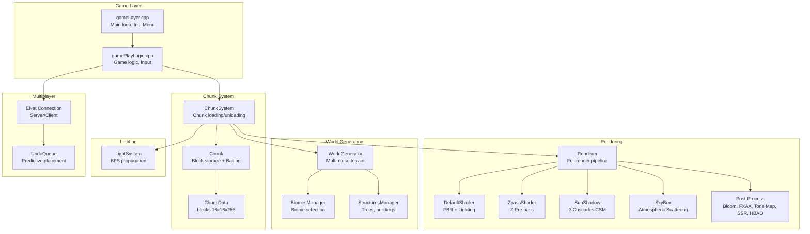
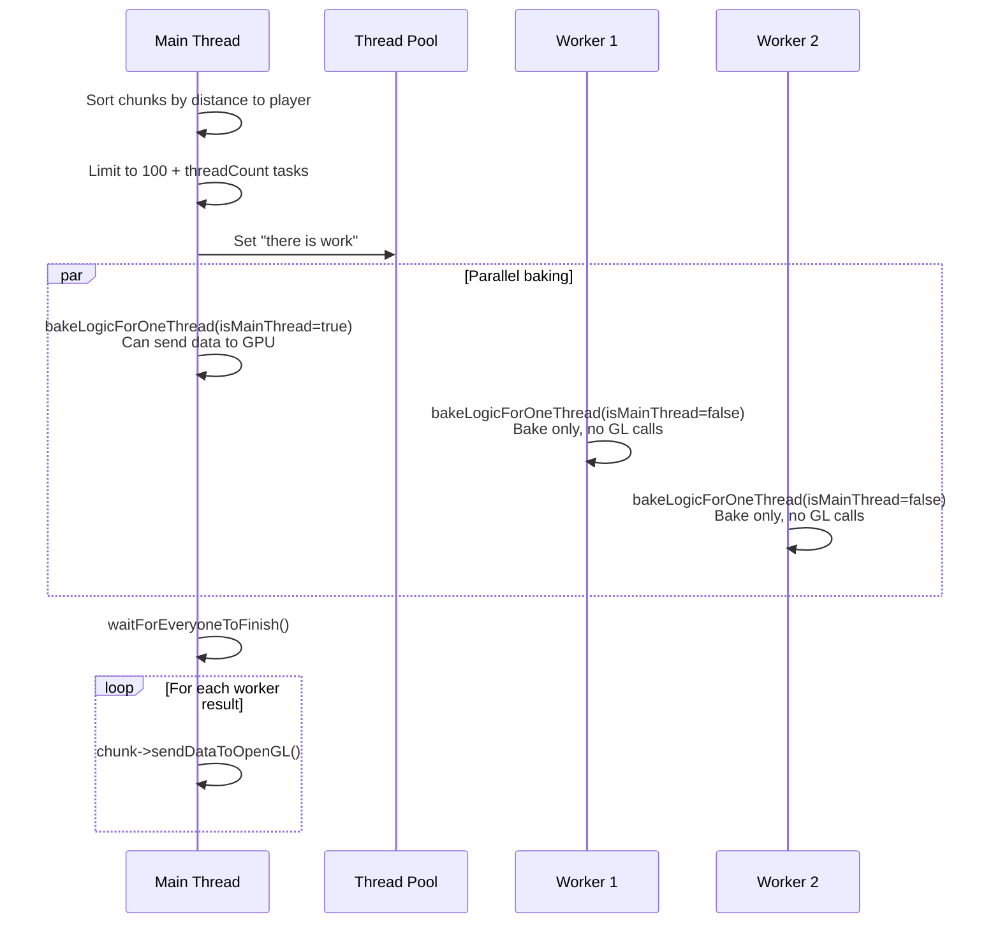
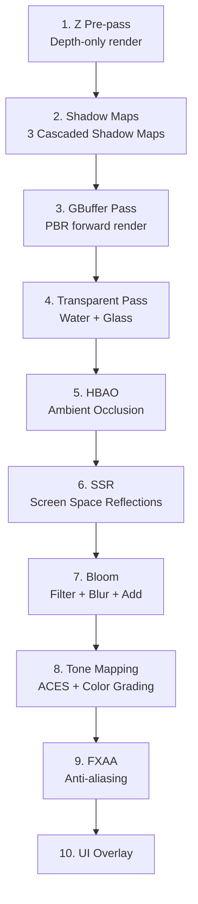
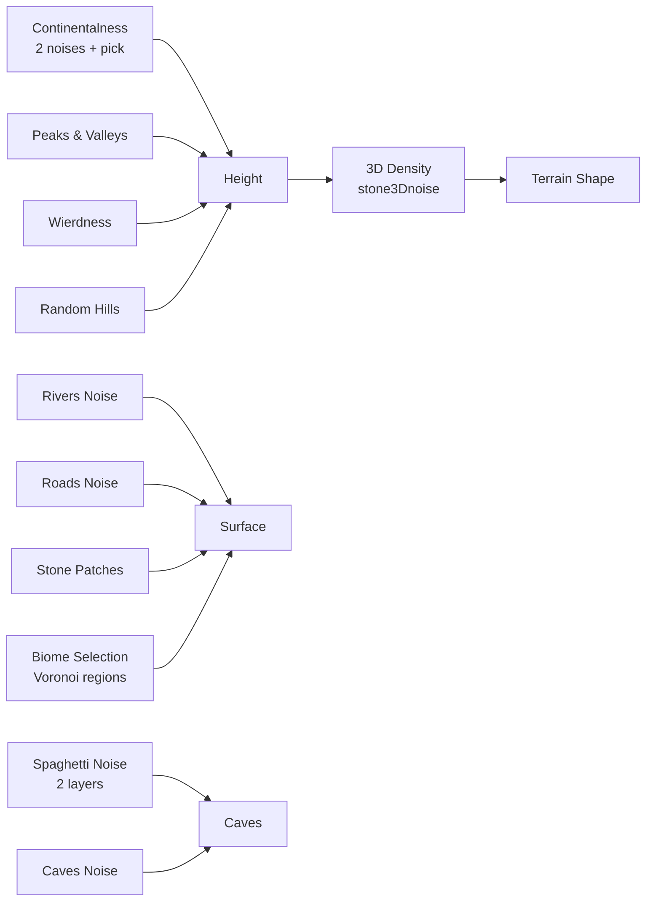

# 🎮 OurCraft — Architecture & Optimizations Deep-Dive

> **Repository**: [meemknight/ourCraft](https://github.com/meemknight/ourCraft) — A Minecraft-like voxel engine in C++17 / OpenGL 4.3
> **Author**: meemknight (YouTube series)

---

## 📑 Table of Contents

1. [Vue d'ensemble du projet](#1-vue-densemble-du-projet)
2. [Architecture globale](#2-architecture-globale)
3. [Système de Chunks](#3-système-de-chunks)
4. [Meshing (Baking) — Génération de Géométrie](#4-meshing-baking--génération-de-géométrie)
5. [Pipeline de Rendu](#5-pipeline-de-rendu)
6. [Système d'éclairage](#6-système-déclairage)
7. [Génération de monde (World Generator)](#7-génération-de-monde-world-generator)
8. [Système multijoueur](#8-système-multijoueur)
9. [Optimisations clés](#9-optimisations-clés)
10. [Stack technique & Dépendances](#10-stack-technique--dépendances)
11. [Comparaison avec BetterSpades / VoxPlace](#11-comparaison-avec-betterspades--voxplace)

---

## 1. Vue d'ensemble du projet

OurCraft est un clone Minecraft complet écrit en **C++17** avec **OpenGL 4.3 Core**, développé par "meemknight". C'est la troisième itération de son moteur voxel, avec des features avancées :

### Features implémentées
| Catégorie | Features |
|-----------|----------|
| **Rendering** | PBR pipeline, Cascaded Shadow Maps, SSR, HBAO/SSAO, HDR + ACES Tone Mapping, Bloom, Atmospheric Scattering, Fog, God Rays, FXAA, Lens Flare, Color Grading, Automatic Exposure |
| **Eau** | Animated Water avec DUDV distortion, Depth-based transparency, Caustics, Underwater fog |
| **Chunks** | Système de chunks 16×16×256, LOD system, Multi-threaded baking |
| **Multiplayer** | Client-server via ENet, Undo queue, Rubber banding, Entity sync |
| **Gameplay** | 260+ block types, Stairs/Slabs/Walls, Furniture, Crafting, Inventory, Structures |

### Métriques du code
- **Shader principal** ([defaultShader.frag](file:///home/alpha/Documents/TFE/ourCraft/resources/shaders/rendering/defaultShader.frag)): **~2300 lignes** de GLSL
- **Renderer** ([renderer.cpp](file:///home/alpha/Documents/TFE/ourCraft/src/gameLayer/rendering/renderer.cpp)): **~6660 lignes**
- **Chunk meshing** ([chunk.cpp](file:///home/alpha/Documents/TFE/ourCraft/src/gameLayer/rendering/chunk.cpp)): **~2678 lignes**
- **World generator** ([worldGenerator.cpp](file:///home/alpha/Documents/TFE/ourCraft/src/gameLayer/worldGenerator.cpp)): **~2388 lignes**
- **260+ types de blocs** définis dans [blocks.h](file:///home/alpha/Documents/TFE/ourCraft/shared/blocks.h)

---

## 2. Architecture globale



### Organisation des fichiers

```
ourCraft/
├── include/gameLayer/         # Headers principaux
│   ├── chunk.h                # Chunk struct + bake interface
│   ├── chunkSystem.h          # ChunkSystem manager
│   ├── rendering/
│   │   ├── renderer.h         # Full renderer (640 lignes de header !)
│   │   ├── bigGpuBuffer.h     # GPU arena allocator
│   │   ├── frustumCulling.h   # AABB frustum culling
│   │   ├── camera.h           # Camera avec decomposePosition
│   │   └── sunShadow.h       # 3-cascade shadow mapping
│   └── lightSystem.h          # BFS light propagation
├── src/gameLayer/
│   ├── rendering/
│   │   ├── renderer.cpp       # 6660 lignes — pipeline complet
│   │   └── chunk.cpp          # 2678 lignes — mesh baking
│   ├── chunkSystem.cpp        # Chunk loading + multi-threaded bake
│   ├── worldGenerator.cpp     # Terrain + biomes + structures
│   └── lightSystem.cpp        # Flood-fill lighting
├── shared/
│   ├── blocks.h/cpp           # 260+ block types
│   ├── biome.h/cpp            # Biome definitions
│   └── worldGeneratorSettings.h/cpp  # Noise settings + splines
└── resources/shaders/
    ├── rendering/
    │   ├── defaultShader.vert/frag   # Main terrain shader
    │   ├── zpass.vert/frag           # Z pre-pass
    │   └── renderDepth.vert/frag     # Shadow depth
    ├── postprocess/                   # Bloom, FXAA, Tone Map, SSR...
    └── skybox/                        # Atmospheric scattering, Sun
```

---

## 3. Système de Chunks

### Structure de données

Défini dans [chunk.h](file:///home/alpha/Documents/TFE/ourCraft/include/gameLayer/chunk.h) et [metrics.h](file:///home/alpha/Documents/TFE/ourCraft/include/gameLayer/metrics.h).

```cpp
constexpr int CHUNK_SIZE = 16;
constexpr int CHUNK_HEIGHT = 256;

struct Block {
    BlockType typeAndFlags = 0;    // 16 bits: 11 bits type + 5 bits flags
    unsigned char lightLevel = 0;  // 4 bits sky + 4 bits torch
    unsigned char colorAndOtherFlags = 0; // 5 bits color + 3 bits flags
};
// sizeof(Block) = 4 bytes seulement !

struct ChunkData {
    Block blocks[CHUNK_SIZE][CHUNK_SIZE][CHUNK_HEIGHT]; // 16*16*256 = 65536 blocks × 4B = 256 KB
    unsigned char flags[CHUNK_SIZE][CHUNK_SIZE];
    float vegetation;
    int regionCenterX, regionCenterZ;
    int x, z;  // chunk coordinates
};
```

> [!IMPORTANT]
> Le [Block](file:///home/alpha/Documents/TFE/ourCraft/shared/blocks.h#428-840) ne fait que **4 octets** ! C'est très compact. Le type utilise 11 bits (2048 types max), les 5 bits restants stockent rotation, slab top/bottom, etc. La lumière est compressée en 2 nibbles (sky + torch).

### Chunk côté Client

Le [Chunk](file:///home/alpha/Documents/TFE/ourCraft/include/gameLayer/chunk.h#120-241) client hérite de [ChunkData](file:///home/alpha/Documents/TFE/ourCraft/include/gameLayer/chunk.h#48-107) et ajoute :

```cpp
struct Chunk {
    ChunkData data;
    Block chunkLod1[CHUNK_SIZE/2][CHUNK_SIZE/2][CHUNK_HEIGHT/2]; // LOD level 1

    // GPU buffers par chunk
    GLuint opaqueGeometryBuffer, opaqueGeometryIndex, vao;
    GLuint transparentGeometryBuffer, transparentGeometryIndex, transparentVao;
    GLuint lightsBuffer;

    // State flags via bitset<16>
    // Dirty, DirtyTransparency, NeighbourFlags (8 directions), DontDrawYet, Culled
};
```

### ChunkSystem — Gestion du chargement

Le [ChunkSystem](file:///home/alpha/Documents/TFE/ourCraft/include/gameLayer/chunkSystem.h) gère un **tableau plat** de pointeurs `Chunk*` :

```cpp
struct ChunkSystem {
    std::vector<Chunk*> loadedChunks;  // squareSize × squareSize
    int squareSize = 4;               // render distance diameter
    glm::ivec2 cornerPos;             // bottom-left chunk position
    BigGpuBuffer gpuBuffer;           // GPU arena allocator
};
```

**Mécanisme de chargement** ([chunkSystem.cpp:350-728](file:///home/alpha/Documents/TFE/ourCraft/src/gameLayer/chunkSystem.cpp#L350-L728)):

1. **Calcul de la grille** : `minPos = playerChunkPos - squareSize/2`
2. **Réorganisation** : Quand le joueur bouge de chunk, les chunks existants sont copiés dans un nouveau vecteur. Les chunks hors-portée sont libérés et le serveur est notifié
3. **Culling circulaire** : [isChunkInRadius()](file:///home/alpha/Documents/TFE/ourCraft/include/gameLayer/chunkSystem.h#149-150) — les chunks sont chargés dans un **cercle**, pas un carré

```cpp
bool isChunkInRadius(glm::ivec2 playerPos, glm::ivec2 chunkPos, int squareSize) {
    glm::vec2 diff = playerPos - chunkPos;
    return std::sqrt(glm::dot(diff, diff)) <= (squareSize / 2) - 0.1;
}
```

---

## 4. Meshing (Baking) — Génération de Géométrie

Le meshing est le processus le plus critique pour la performance. Il est implémenté dans [chunk.cpp](file:///home/alpha/Documents/TFE/ourCraft/src/gameLayer/rendering/chunk.cpp).

### Format des vertices

Chaque face utilise **4 ints** (16 bytes par face) grâce au **instanced rendering** :

```
int[0]: mergeShortsUnsigned(faceShape, textureAndColor)
        faceShape: 16 bits — face orientation index (0-5: cube, 6-9: grass, 10-15: leaves, 22+: water, ...)
        textureAndColor: 5 bits color index | 11 bits texture index

int[1]: position.x (block world position)

int[2]: mergeShorts(positionY, mergeChars(flags, light))
        positionY: 16 bits Y position
        flags: 8 bits (isWater, isInWater, aoShape in top 4 bits)
        light: 4 bits sky + 4 bits torch

int[3]: position.z (block world position)
```

> [!TIP]
> Ce format est extrêmement compact. Une seule face = 16 bytes. Pas de position float, pas de normal explicite — tout est calculé dans le vertex shader à partir de l'index d'orientation.

### Algorithme de meshing (Face Culling)

```cpp
auto blockBakeLogicForSolidBlocks = [&](int x, int y, int z, ...) {
    Block *sides[26] = {};   // 26 voisins pour l'AO
    getNeighboursLogic(x, y, z, sides, 0);

    for (int i = 0; i < 6; i++) {  // 6 faces
        if (sides[i] != nullptr && !sides[i]->isOpaque()) {
            // Face visible ! On la génère
            pushFaceShapeTextureAndColor(vector, faceIndex, textureIndex, color);
            pushFlagsLightAndPosition(vector, position, isWater, isInWater, sun, torch, aoShape);
        }
    }
};
```

**Points clés du meshing** :
- **Face culling standard** : une face n'est émise que si le bloc voisin est transparent/air
- **Leaves special case** : les feuilles adjacentes ne cachent PAS les faces entre elles (double-rendu des feuilles)
- **Bottom face skip** : la face inférieure à `y=0` n'est PAS rendue (ligne 660: commentée)
- **Top face always** : la face supérieure à `y=CHUNK_HEIGHT-1` est toujours rendue

### Accès aux voisins cross-chunk

Le meshing nécessite les **8 chunks voisins** (left, right, front, back + 4 diagonales) pour :
1. Face culling aux bords de chunk
2. Calcul de l'AO (Ambient Occlusion) aux bords

```cpp
bool Chunk::bake(Chunk *left, Chunk *right, Chunk *front, Chunk *back,
    Chunk *frontLeft, Chunk *frontRight, Chunk *backLeft, Chunk *backRight, ...);
```

### Ambient Occlusion (Block AO)

L'AO est calculé côté CPU pendant le meshing, en examinant les 26 voisins :

```cpp
auto determineAOShape = [&](int faceIndex, Block *sides[26]) -> int {
    // Pour chaque face (front, back, top, bottom, left, right):
    // Examine les 8 blocs dans le plan de la face
    // Retourne un "aoShape" (0-14) qui encode la configuration d'ombre
    // 0 = pas d'AO, 5-8 = coin simple, 9-12 = coin sombre, 13 = ombre complète, 14 = coins opposés
};
```

> [!NOTE]
> L'aoShape est stocké dans **4 bits** des flags du vertex. Le fragment shader décode cette valeur et sample une texture AO précalculée avec des coordonnées UV rotées selon la configuration.

### Multi-threaded Baking

Le baking est **distribué** sur un thread pool ([chunkSystem.cpp:149-277](file:///home/alpha/Documents/TFE/ourCraft/src/gameLayer/chunkSystem.cpp#L149-L277)):



**Points d'optimisation du baking** :
1. **Task stealing** par atomic exchange (lock-free)
2. **Workers bake la géométrie** mais n'envoient PAS les données à OpenGL (pas de contexte GL)
3. **Main thread** collecte les résultats et fait les `glBufferData` calls
4. **Rate limiting** : max 1 chunk rebake par thread par frame
5. **Adaptive thread count** : le nombre de threads baisse quand le ratio de chunks à rebake est faible

### LOD (Level of Detail)

OurCraft implémente un **LOD 1** qui réduit la résolution du chunk par 2 :

```cpp
Block chunkLod1[CHUNK_SIZE/2][CHUNK_SIZE/2][CHUNK_HEIGHT/2]; // 8×8×128

int determineLodLevel(glm::ivec2 playerChunkPos, glm::ivec2 chunkPos) {
    float distSquared = ...; // distance au joueur
    float threshold = lodStrength * viewDistance; // configurable
    return distSquared > threshold*threshold ? 1 : 0;
}
```

En LOD 1, les vertices utilisent des faces de **2×2 blocks** (géométrie spéciale `lod1Parts = 82`).

### Tri de la géométrie

Après le meshing, les faces opaques sont **triées par type de face** pour maximiser le GPU cache :

```cpp
void arangeData(std::vector<int> &currentVector) {
    // Sort the ivec4 entries by face orientation (first short)
    // then by texture index (second short)
    std::sort(geometryArray, geometryArray + numElements, comparator);
}
```

---

## 5. Pipeline de Rendu

Le rendu est orchestré par `Renderer::renderFromBakedData()` dans [renderer.cpp](file:///home/alpha/Documents/TFE/ourCraft/src/gameLayer/rendering/renderer.cpp).

### Vue d'ensemble du pipeline



### Z Pre-pass

Le Z pre-pass remplit le depth buffer sans écrire de couleur ([zpass.vert](file:///home/alpha/Documents/TFE/ourCraft/resources/shaders/rendering/zpass.vert), [zpass.frag](file:///home/alpha/Documents/TFE/ourCraft/resources/shaders/rendering/zpass.frag)):

```glsl
// zpass.frag — juste un alpha test
void main() {
    float a = texture(sampler2D(v_textureSampler), v_uv).a;
    if(a <= 0) { discard; }
}
```

> [!TIP]
> Le Z pre-pass est un classique d'optimisation : le main pass peut ensuite utiliser `GL_EQUAL` depth test, éliminant tout le overdraw. C'est l'équivalent du "Early-Z rejection" exploité volontairement.

### Vertex Data via SSBOs (Shader Storage Buffer Objects)

Le moteur utilise des **SSBOs** pour stocker la géométrie et les textures, au lieu de vertex buffers classiques :

```glsl
// Géométrie des faces
readonly restrict layout(std430) buffer u_vertexData {
    float vertexData[];  // Positions des vertices pour chaque type de face
};

// UVs des faces
readonly restrict layout(std430) buffer u_vertexUV {
    float vertexUV[];    // UVs pour chaque type de face
};

// Textures bindless
readonly restrict layout(std430) buffer u_textureSamplerers {
    uvec2 textureSamplerers[];  // Bindless texture handles
};
```

### Bindless Textures

OurCraft utilise l'extension **`GL_ARB_bindless_texture`** — chaque bloc a sa texture identifiée par un `uvec2` handle dans un SSBO. Cela élimine les texture binds entre les draw calls.

```glsl
#extension GL_ARB_bindless_texture: require

// Dans le fragment shader :
vec4 textureColor = texture(sampler2D(v_textureSampler), v_uv);
// v_textureSampler est un uvec2 passé en flat varying depuis le vertex shader
```

> [!IMPORTANT]
> Les bindless textures sont **la** feature qui permet de rendre des centaines de chunks différents sans changer de state. Un seul draw call par chunk, avec toutes les textures accessibles.

### Face Shading

Le vertex shader applique un **multiplier par face** pour donner de la profondeur visuelle :

```glsl
float vertexColor[] = float[](
    0.95,  // front
    0.85,  // back
    1.0,   // top (brightest)
    0.8,   // bottom (darkest)
    0.85,  // left
    0.95   // right
);
```

### PBR Lighting dans le Fragment Shader

Le fragment shader implémente un **PBR complet** avec :

- **Cook-Torrance BRDF** : GGX NDF + Schlick Fresnel + Smith geometry
- **Oren-Nayar diffuse** (improved version)
- **Material maps** : roughness (red), metallic (green), emissive (blue)
- **Normal mapping** avec rotation matrix

```glsl
vec3 computePointLightSource(vec3 L, float metallic, float roughness,
    vec3 lightColor, vec3 V, vec3 color, vec3 normal, vec3 F0) {
    
    vec3 halfwayVec = normalize(L + V);
    vec3 F = fresnelSchlick(max(dot(halfwayVec, V), 0.0), F0);
    float NDF = DistributionGGX(normal, halfwayVec, roughness);
    float G = GeometrySmith(normal, V, L, roughness);
    vec3 specular = (NDF * G * F) / max(4.0 * dotNV * NdotL, 0.001);
    vec3 diffuse = fDiffuseOrenNayar2(color, roughness, L, V, normal);
    
    return (kD * diffuse + specular) * radiance * NdotL;
}
```

### Cascaded Shadow Maps

3 cascades avec des distances fixes ([defaultShader.frag:936-946](file:///home/alpha/Documents/TFE/ourCraft/resources/shaders/rendering/defaultShader.frag#L936-L946)):

| Cascade | Distance (view-space) | Usage |
|---------|----------------------|-------|
| 0 | < 16 | Close-up shadows, tight resolution |
| 1 | 16 — 44 | Medium range |
| 2 | > 44 | Far shadows |

Avec **PCF soft shadows** par Vogel disk sampling (9 samples optimisé en 5+4).

### Water Rendering

Le rendu de l'eau est un pipeline multi-pass :

1. **Depth Peeling** : render opaque → render water over → compare depths
2. **DUDV Distortion** : texture de distorsion animée pour les réfrations
3. **Fresnel** : `pow(1 - dotNV, 2) * 0.8 + 0.1` — plus reflective aux angles rasants
4. **Caustics** : texture de caustiques avec aberration chromatique
5. **Depth darkening** : l'eau s'assombrit avec la profondeur

### Block Painting System

Le moteur supporte **16 couleurs de peinture** :

```glsl
vec3 colorsVector[] = vec3[](
    vec3(1.0, 1.0, 1.0),     // white
    vec3(0.75, 0.75, 0.75),   // lightGray
    // ... 14 more colors
    vec3(1.0, 0.5, 0.75)      // pink
);
```

La peinture modifie le HSV de la texture de base en composant avec la couleur choisie.

### Instanced Drawing

Le rendu utilise **`glDrawArraysInstanced`** sans index buffer. Chaque "instance" est une face, avec `glVertexAttribDivisor(attr, 1)`. Les 4 vertices d'un quad sont générés dans le vertex shader via `gl_VertexID` :

```cpp
void setupVertexAttributes() {
    glVertexAttribIPointer(0, 1, GL_SHORT, 4*sizeof(int), 0);
    glVertexAttribDivisor(0, 1); // Per-instance !
    
    glVertexAttribIPointer(1, 1, GL_SHORT, 4*sizeof(int), (void*)(sizeof(short)));
    glVertexAttribDivisor(1, 1);
    
    glVertexAttribIPointer(2, 3, GL_INT, 4*sizeof(int), (void*)(sizeof(int)));
    glVertexAttribDivisor(2, 1);
}
```

---

## 6. Système d'éclairage

Implémenté dans [lightSystem.cpp](file:///home/alpha/Documents/TFE/ourCraft/src/gameLayer/lightSystem.cpp).

### Propagation BFS (Breadth-First Search)

L'éclairage utilise un algorithme de **flood-fill** classique de Minecraft avec 4 queues :

```cpp
struct LightSystem {
    std::deque<Light> sunLigtsToAdd;
    std::deque<Light> sunLigtsToRemove;
    std::deque<Light> ligtsToAdd;      // torch lights
    std::deque<Light> ligtsToRemove;
};
```

**Propagation de la lumière du soleil** :
1. Pour chaque chunk chargé, la colonne de blocs non-opaques depuis `y=255` reçoit skyLight = 15
2. La lumière se propage **vers le bas sans atténuation** (skyLight 15 traverse verticalement)
3. Latéralement, elle perd 1 level par bloc
4. La propagation s'arrête aux blocs opaques

**Propagation des torches** :
- Identique mais pas de propagation continue vers le bas
- Atténuation de 1 par bloc dans toutes les directions

### Budget de propagation

Pour éviter les stalls, la propagation est **budgétée** :

```cpp
const int maxUpperBoundPerElement = 1000;  // par queue par frame
const int totalMaxUpperBound = 100'000;    // total par frame
```

Si le budget est dépassé, un marqueur `-1` est inséré dans la queue pour reprendre à la frame suivante.

### Light data dans le vertex

La lumière est baked dans chaque face pendant le meshing :

```
lightLevel byte: [sky: 4 bits | torch: 4 bits]
```

Dans le vertex shader :
```glsl
v_skyLight = (in_skyAndNormalLights & 0xf0) >> 4;    // 0-15
v_normalLight = (in_skyAndNormalLights & 0xf);        // 0-15
v_skyLight = max(v_skyLight - (15 - u_skyLightIntensity), 0); // Day/night cycle
v_ambientInt = max(v_skyLight, v_normalLight);
```

---

## 7. Génération de monde (World Generator)

Implémenté dans [worldGenerator.cpp](file:///home/alpha/Documents/TFE/ourCraft/src/gameLayer/worldGenerator.cpp) avec **FastNoiseSIMD** (AVX2 optimisé).

### Multi-noise approach (à la Minecraft 1.18+)



### Noises utilisées

| Noise | Type | Usage |
|-------|------|-------|
| `continentalnessNoise` + `continentalness2Noise` | SimplexFractal | Continent shape, picked via `continentalnessPickNoise` |
| `peaksValiesNoise` | SimplexFractal | Mountain/valley definition |
| `wierdnessNoise` | SimplexFractal | Terrain weirdness (Minecraft-style) |
| `stone3Dnoise` | SimplexFractal 3D | 3D density for terrain carving |
| `spagettiNoise` | SimplexFractal 3D | Spaghetti caves (2 layers shifted) |
| `cavesNoise` | SimplexFractal 3D | Traditional caves |
| `riversNoise` | - | River carving |
| `treesAmountNoise` / `treesTypeNoise` | - | Vegetation control |
| `whiteNoise` / `whiteNoise2` | White | Random placement |

> [!NOTE]
> Toutes les noises sont passées par des **splines** configurables pour mapper [-1,1] vers des hauteurs/valeurs utiles. C'est très similaire à l'approche de Minecraft 1.18.

### Biomes (Voronoi regions)

Les biomes sont assignés par **régions Voronoi** : chaque chunk appartient à une cellule dont le centre définit le biome. La hauteur de la région (6 niveaux : water, water, plains, hills, mountain, big mountain) détermine le type de terrain.

### Structures

Les structures sont placées via un **hash spatial** avec espacement minimum :

```cpp
bool generateFeature(int x, int y, int seedHash, ..., float threshold, int radius) {
    uint32_t h = hash(x, y, 0);
    float value = hashNormalized(h);
    if (value >= threshold) return false; // Not selected
    // Check neighbors in positive directions to avoid conflicts
    for (int dx = 0; dx <= radius; ++dx)
        for (int dy = 0; dy <= radius; ++dy) { /* ... */ }
    return true;
}
```

Structures supportées : Trees (oak, birch, spruce, jungle, palm), Pyramids, Igloos, TreeHouses, Taverns, Barns, GoblinTowers, MinesDungeons, etc.

---

## 8. Système multijoueur

### Architecture réseau

- **ENet** pour la communication réseau (UDP reliable + unreliable channels)
- Client-server model
- **UndoQueue** pour les actions prédictives du client (placement/destruction de blocs)
- Le serveur **valide** les positions et peut faire du rubber-banding

### Channels

```cpp
sendPacket(server, p, data, size, reliability,
    channelPlayerPositions);  // channel spécialisé
```

### Sync des chunks

Quand le joueur se déplace :
1. Client calcule les nouveaux chunks nécessaires
2. Envoie une requête au serveur (`maxWaitingSubmisions = 15` en vol)
3. Le serveur envoie les données de chunk
4. Le client notifie quand il drop des chunks (`headerClientDroppedChunk`)

---

## 9. Optimisations clés

### 🚀 Rendering Optimizations

| Technique | Impact | Détail |
|-----------|--------|--------|
| **Z Pre-pass** | ⭐⭐⭐ | Élimine l'overdraw, le main pass ne dessine que les fragments visibles |
| **Frustum Culling** | ⭐⭐⭐ | AABB par chunk, chunks hors caméra non rendus ([frustumCulling.h](file:///home/alpha/Documents/TFE/ourCraft/include/gameLayer/rendering/frustumCulling.h)) |
| **Chunk Sorting** | ⭐⭐ | Front-to-back sort pour maximiser Early-Z rejection |
| **Instanced Rendering** | ⭐⭐⭐ | 1 draw call par chunk, faces comme instances |
| **Bindless Textures** | ⭐⭐⭐ | Zéro texture bind entre les chunks |
| **Face Culling** | ⭐⭐⭐ | Seules les faces visibles (adjacentes à l'air/transparent) sont émises |
| **Compact Vertex Format** | ⭐⭐ | 16 bytes/face, tout encodé en integers |
| **LOD System** | ⭐⭐ | Chunks distants en résolution réduite (8×8×128 au lieu de 16×16×256) |
| **Circular Loading** | ⭐ | Charge en cercle, pas en carré → ~21% moins de chunks |

### 🚀 CPU Optimizations

| Technique | Impact | Détail |
|-----------|--------|--------|
| **Multi-threaded Meshing** | ⭐⭐⭐ | Thread pool avec task stealing atomic |
| **Adaptive Thread Count** | ⭐⭐ | Threads réduits quand peu de chunks à rebuild |
| **Rate-limited Baking** | ⭐⭐ | Max 1 chunk par thread par frame |
| **AVX2 Noise** | ⭐⭐⭐ | FastNoiseSIMD exploite AVX2 pour la génération de terrain |
| **Budgeted Light Propagation** | ⭐⭐ | Max 100K propagations par frame |
| **Sorted Bake Queue** | ⭐⭐ | Chunks les plus proches baked en premier |
| **Dirty Flagging** | ⭐⭐ | Chunks ne sont re-baked que si dirty ou si un voisin change |

### 🚀 Memory Optimizations

| Technique | Impact | Détail |
|-----------|--------|--------|
| **4-byte Block** | ⭐⭐⭐ | Type (11b) + flags (5b) + light (8b) + color (5b) + flags (3b) = 32 bits |
| **Bit packing** | ⭐⭐ | Rotation, slab top, color dans les mêmes champs que le type |
| **Per-chunk GPU buffers** | ⭐⭐ | Chaque chunk a son propre VBO, pas d'allocation globale massive |
| **BigGpuBuffer (Arena)** | ⭐ | GPU arena allocator (disabled by default: `REMOVE_BIG_GPU_BUFFER = 1`) |

### 🚀 Shader Optimizations

| Technique | Impact | Détail |
|-----------|--------|--------|
| **Shadow cascade optimization** | ⭐⭐ | PCF avec Vogel disk: 5 samples initiaux, si unanimes → skip les 4 restants |
| **Interleaved Gradient Noise** | ⭐⭐ | Rotation du kernel d'ombres par pixel pour casser les patterns |
| **Configurable PBR** | ⭐ | Mode "shaders off" (u_shaders == 0) pour le fallback simple |
| **Early discard** | ⭐ | Alpha test immédiat, depth peel discard |
| **Light culling** | ⭐⭐ | Point lights skippées si Manhattan distance > light level |

### Big GPU Buffer (Arena Allocator)

Bien que désactivé par défaut (`REMOVE_BIG_GPU_BUFFER = 1`), le [BigGpuBuffer](file:///home/alpha/Documents/TFE/ourCraft/src/gameLayer/rendering/bigGpuBuffer.cpp) implémente un **allocateur d'arène** sur un seul VBO :

```cpp
struct BigGpuBuffer {
    GLuint opaqueGeometryBuffer; // Un seul buffer pour TOUS les chunks
    size_t arenaSize;            // chunks * 10000 * 4 * sizeof(int)
    
    std::list<GpuEntry> entriesList;  // Linked list d'allocations
    std::unordered_map<glm::ivec2, iterator> entriesMap; // Lookup par chunk
    
    void addChunk(glm::ivec2 pos, std::vector<int> &data);  // First-fit allocation
    void removeChunk(glm::ivec2 pos);  // Free
};
```

L'avantage : **un seul draw call** pour tout le terrain ! L'inconvénient : fragmentation et complexité.

---

## 10. Stack technique & Dépendances

| Bibliothèque | Version | Usage |
|--------------|---------|-------|
| **GLFW** | 3.3.7 | Fenêtrage + input |
| **GLAD** | - | OpenGL loader |
| **GLM** | - | Maths (vec, mat, transforms) |
| **FastNoiseSIMD** | - | Bruit procédural AVX2 |
| **FastNoise2** | - | Bruit procédural next-gen |
| **ENet** | 1.3.18 | Réseau UDP multiplayer |
| **stb_image** | - | Chargement de textures |
| **stb_truetype** | - | Rendu de texte |
| **ImGui** | Docking | Debug UI |
| **gl2d** | - | 2D rendering |
| **glui** | - | Game UI framework |
| **Assimp** | 5.2.4 | Import de modèles 3D (OBJ, glTF) |
| **raudio** | - | Audio engine |
| **magic_enum** | 0.9.3 | Enum reflection |
| **safeSave** | - | Sauvegarde robuste |
| **profilerLib** | - | Profiling |
| **zstd** | 1.5.5 | Compression |

### Compiler flags notables :
```cmake
set(CMAKE_CXX_FLAGS "${CMAKE_CXX_FLAGS} -mavx2")  # AVX2 pour FastNoiseSIMD
set(CMAKE_CXX_STANDARD 17)
add_definitions(-D_ITERATOR_DEBUG_LEVEL=0)  # Performance en debug
```

---

## 11. Comparaison avec BetterSpades / VoxPlace

| Aspect | OurCraft | BetterSpades | VoxPlace (ton projet) |
|--------|----------|-------------|----------------------|
| **Block size** | 4 bytes | 1 byte (color only) | Variable |
| **Chunk size** | 16×16×256 | 64 colonne | 16×16×256 |
| **Meshing** | Greedy-like face culling | Greedy meshing | Face culling |
| **Lighting** | BFS flood-fill (4+4 bits) | Sunblock gradient (6 bits) | Sunblock binary / gradient |
| **Rendering** | Forward PBR + post-process | Simple forward | Forward with face shading |
| **Textures** | Bindless texture arrays | Palette 64 couleurs + shader | Texture atlas |
| **Shadows** | 3-cascade CSM + PCF | Pas de shadow maps | — |
| **Water** | Multi-pass depth peeling | Simple transparent faces | — |
| **AO** | CPU-baked block AO (14 configs) | Texture-based AO | — |
| **Multi-thread** | Thread pool baking | Single-thread | — |
| **LOD** | 2 niveaux (8×8×128) | Pas de LOD | — |
| **Language** | C++17 | C | C++ |

### Ce que tu peux reprendre pour ton moteur VoxPlace

> [!TIP]
> **Optimisations essentielles à implémenter en priorité :**
> 1. **Z Pre-pass** : réduit dramatiquement l'overdraw
> 2. **Front-to-back chunk sorting** : maximise Early-Z
> 3. **Face culling** côté CPU : ne rend que les faces visibles
> 4. **Compact vertex format** : 16 bytes/face max
> 5. **Multi-threaded meshing** : ne pas bloquer le main thread
> 6. **Frustum culling** par chunk AABB
> 7. **Sunblock gradient** (comme BetterSpades, pas binaire)
> 8. **Face shading multipliers** : 0.8/0.85/0.95/1.0 selon l'orientation

---

> **Document généré le 2026-03-05** par analyse complète du repository `meemknight/ourCraft` — ~107 fichiers C++/GLSL analysés.
