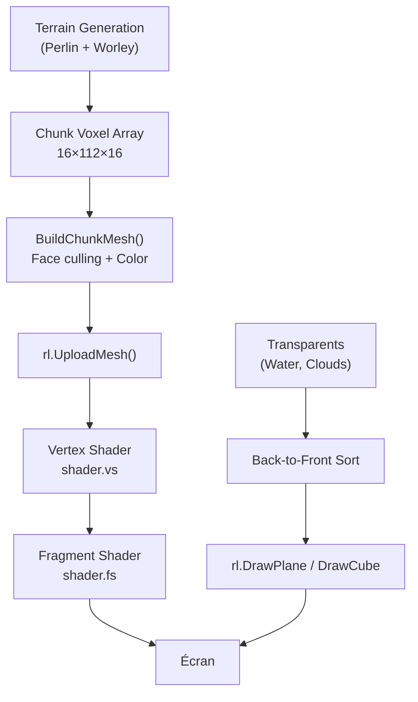
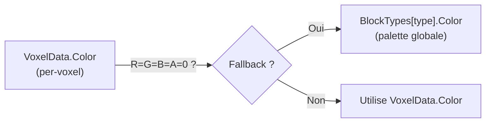
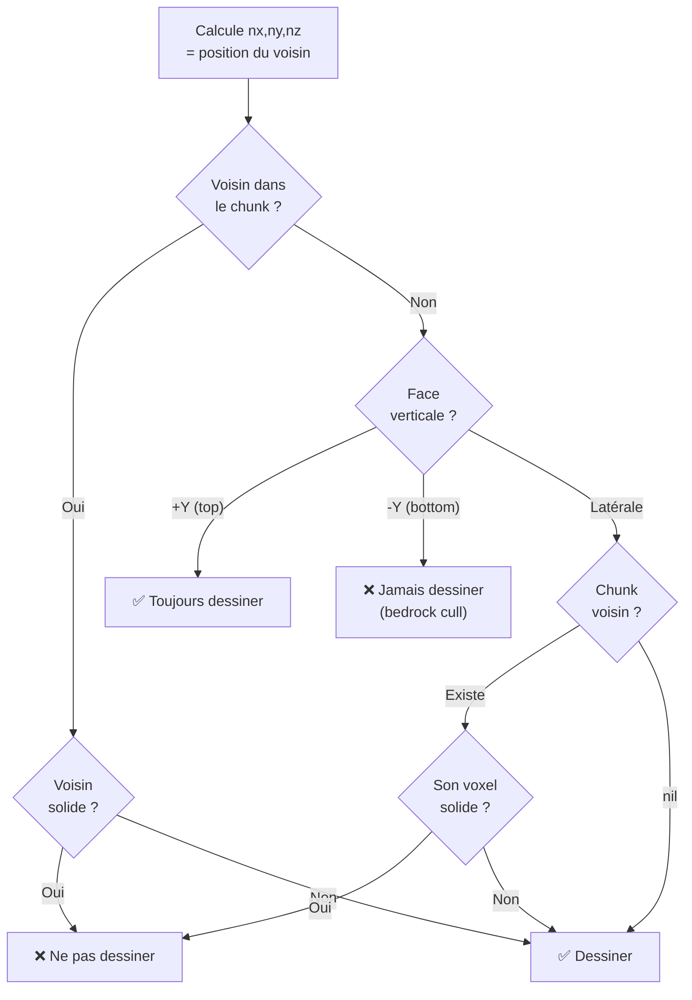
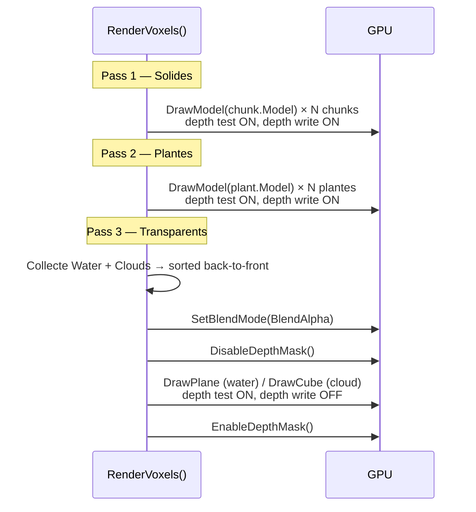
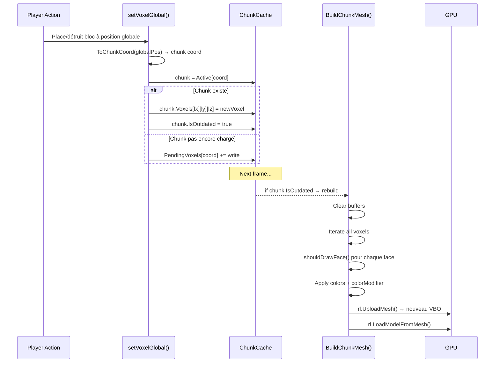
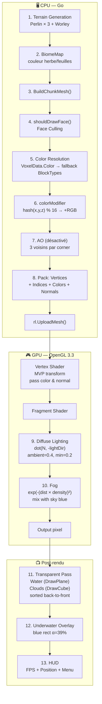
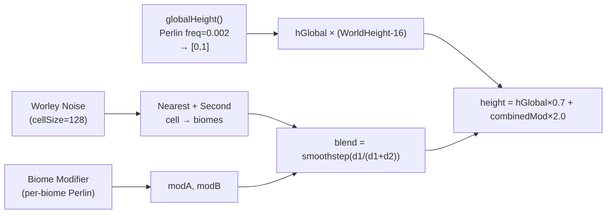
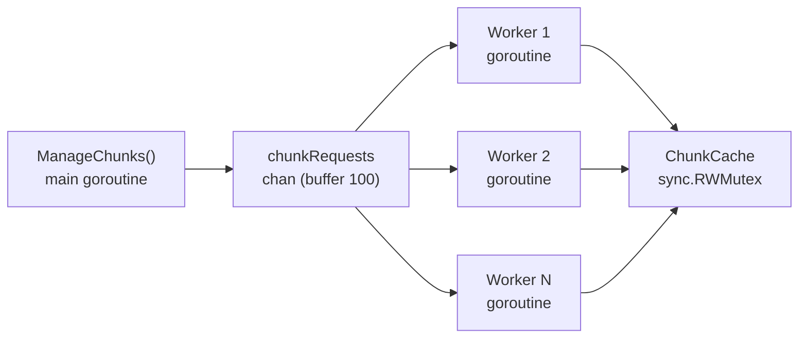

# 🎨 Pipeline Esthétique — ProtahovatsiStroj-VoxelEngine

> **Document de référence** décrivant en profondeur comment le moteur gère les couleurs, l'ombrage, l'AO, le fog, les gradients, la transparence et l'ensemble du pipeline de rendu visuel. **Vérifié contre le code source** (11 fichiers Go + 2 shaders GLSL).

---

## Table des matières

1. [Vue d'ensemble de l'architecture](#1-vue-densemble-de-larchitecture)
2. [Palette de couleurs & Block Types](#2-palette-de-couleurs--block-types)
3. [Color Modifier — Le "bruit par bloc"](#3-color-modifier--le-bruit-par-bloc)
4. [Couleurs par biome (GrassColor / LeavesColor)](#4-couleurs-par-biome-grasscolor--leavescolor)
5. [Construction du mesh — Face Culling & Vertices](#5-construction-du-mesh--face-culling--vertices)
6. [Le pipeline shader (Vertex → Fragment)](#6-le-pipeline-shader-vertex--fragment)
7. [Éclairage directionnel (Diffuse + Ambient)](#7-éclairage-directionnel-diffuse--ambient)
8. [Ambient Occlusion (AO)](#8-ambient-occlusion-ao)
9. [Fog (brouillard exponentiel)](#9-fog-brouillard-exponentiel)
10. [Transparence & Tri Back-to-Front](#10-transparence--tri-back-to-front)
11. [Effet sous-marin (Underwater overlay)](#11-effet-sous-marin-underwater-overlay)
12. [Que se passe-t-il quand un bloc est posé ?](#12-que-se-passe-t-il-quand-un-bloc-est-posé-)
13. [Nuages — Greedy Meshing simplifié](#13-nuages--greedy-meshing-simplifié)
14. [Résumé visuel du pipeline complet](#14-résumé-visuel-du-pipeline-complet)
15. [Points d'amélioration prévus](#15-points-damélioration-prévus)
16. [Terrain Generation — Worley + Perlin + Biome Modifiers](#16-terrain-generation--worley--perlin--biome-modifiers)
17. [Arbres — L-System procédural](#17-arbres--l-system-procédural)
18. [Grottes — Perlin Worms](#18-grottes--perlin-worms)
19. [Eau & Sable — Formation automatique](#19-eau--sable--formation-automatique)
20. [Plantes — Modèles .vox](#20-plantes--modèles-vox)
21. [Multithreading — Worker Pool goroutines](#21-multithreading--worker-pool-goroutines)
22. [Analyse AO Offsets — Bug potentiel](#22-analyse-ao-offsets--bug-potentiel)

---

## 1. Vue d'ensemble de l'architecture

Le moteur est écrit en **Go** avec **raylib-go** (binding Go de Raylib) et utilise **OpenGL 3.3** (core profile, `#version 330`).



**Fichiers clés :**

| Fichier | Rôle |
|---------|------|
| [common.go](file:///home/alpha/Documents/TFE/ProtahovatsiStroj-VoxelEngine/src/pkg/common.go) | Structures de données (VoxelData, Chunk, FaceVertices, AO offsets) |
| [features.go](file:///home/alpha/Documents/TFE/ProtahovatsiStroj-VoxelEngine/src/world/features.go) | Définition des BlockTypes (palette), génération de plantes/arbres/nuages/eau |
| [biomes.go](file:///home/alpha/Documents/TFE/ProtahovatsiStroj-VoxelEngine/src/world/biomes.go) | Types de biomes avec couleurs spécifiques par biome |
| [terrain.go](file:///home/alpha/Documents/TFE/ProtahovatsiStroj-VoxelEngine/src/world/terrain.go) | Génération du terrain (Perlin + Worley blending) |
| [culling.go](file:///home/alpha/Documents/TFE/ProtahovatsiStroj-VoxelEngine/src/render/culling.go) | Construction du mesh : vertices, indices, couleurs, normales |
| [effects.go](file:///home/alpha/Documents/TFE/ProtahovatsiStroj-VoxelEngine/src/render/effects.go) | Fonctions AO et lighting CPU-side (partiellement désactivées) |
| [render.go](file:///home/alpha/Documents/TFE/ProtahovatsiStroj-VoxelEngine/src/render/render.go) | Boucle de rendu principale, tri des transparents, underwater overlay |
| [shader.vs](file:///home/alpha/Documents/TFE/ProtahovatsiStroj-VoxelEngine/shaders/shader.vs) | Vertex shader — transforme positions, passe couleurs+normales |
| [shader.fs](file:///home/alpha/Documents/TFE/ProtahovatsiStroj-VoxelEngine/shaders/shader.fs) | Fragment shader — lighting directionnel + fog exponentiel |
| [game.go](file:///home/alpha/Documents/TFE/ProtahovatsiStroj-VoxelEngine/src/load/game.go) | Initialisation du shader, de la lumière, du fog |

---

## 2. Palette de couleurs & Block Types

La palette est **hardcodée** dans [features.go](file:///home/alpha/Documents/TFE/ProtahovatsiStroj-VoxelEngine/src/world/features.go#L22-L73). Chaque type de bloc a une couleur `rl.Color` (RGBA 8-bit) :

```go
var BlockTypes = map[string]BlockProperties{
    "Grass":   {Color: rl.NewColor(72, 174, 34, 255),   IsSolid: true},
    "Dirt":    {Color: rl.Brown,                        IsSolid: true},
    "Sand":    {Color: rl.NewColor(236, 221, 178, 255), IsSolid: true},
    "Stone":   {Color: rl.Gray,                         IsSolid: true},
    "OakWood": {Color: rl.NewColor(126, 90, 57, 255),   IsSolid: true},
    "Leaves":  {Color: rl.NewColor(73, 129, 49, 255),   IsSolid: true},
    "Plant":   {Color: rl.Red,                          IsSolid: false},
    "Water":   {Color: rl.NewColor(0, 0, 255, 110),     IsSolid: false},
    "Cloud":   {Color: rl.NewColor(249, 248, 248, 160), IsSolid: false},
    "Air":     {Color: rl.NewColor(0, 0, 0, 0),         IsSolid: false},
}
```

> [!IMPORTANT]
> La couleur du bloc stockée dans `BlockTypes` est un **fallback**. Chaque [VoxelData](file:///home/alpha/Documents/TFE/ProtahovatsiStroj-VoxelEngine/src/pkg/common.go#19-24) peut porter sa propre couleur (champ `Color`). Ceci est utilisé notamment par les biomes pour que l'herbe ait des teintes différentes selon le biome.

### Hiérarchie de résolution de la couleur



Code correspondant dans [culling.go:84-88](file:///home/alpha/Documents/TFE/ProtahovatsiStroj-VoxelEngine/src/render/culling.go#L84-L88) :
```go
c := voxel.Color
if c.R == 0 && c.G == 0 && c.B == 0 && c.A == 0 {
    c = block.Color  // fallback to default color if not set
}
```

---

## 3. Color Modifier — Le "bruit par bloc"

C'est le **mécanisme de gradient/variation** du moteur. Pour éviter que tous les blocs d'herbe aient exactement la même couleur (ce qui serait très artificiel), chaque bloc reçoit un **modificateur de couleur pseudo-aléatoire déterministe**.

### Formule

```go
colorModifier := uint8(
    ((pos.X*73856093 + pos.Y*19349663) ^
     (pos.Z*83492791 + pos.X*19349663) ^
     (pos.Y*83492791 + pos.Z*73856093)) % 16)
```

Ce modificateur est un `uint8` entre **0 et 15** qui est ensuite **ajouté** à chaque canal R, G, B de la couleur de base :

```go
chunk.Colors = append(chunk.Colors,
    c.R + colorModifier,
    c.G + colorModifier,
    c.B + colorModifier,
    c.A,
)
```

### Propriétés clés

| Propriété | Détail |
|-----------|--------|
| **Déterministe** | Dépend uniquement de [(x, y, z)](file:///home/alpha/Documents/TFE/ProtahovatsiStroj-VoxelEngine/src/world/chunks.go#245-251) — le même bloc produit toujours la même variation |
| **Hash spatial** | Utilise des nombres premiers (73856093, 19349663, 83492791) + XOR pour disperser les valeurs |
| **Amplitude** | 0 à 15 sur 255 → variation de **~6%** — subtile mais visible |
| **Uniforme** | Appliqué identiquement aux 3 canaux RGB → décale vers le blanc/plus clair, **ne change pas la teinte** |

> [!NOTE]
> Le fait que le même offset soit ajouté à R, G et B produit un effet de **luminosité variable** plutôt qu'un changement de teinte. C'est un choix simple mais efficace visuellement.

### Effet visuel

Imaginons un champ d'herbe RGB(72, 174, 34) :
- Bloc A (modifier = 0) → [(72, 174, 34)](file:///home/alpha/Documents/TFE/ProtahovatsiStroj-VoxelEngine/src/world/chunks.go#245-251) — couleur normale
- Bloc B (modifier = 8) → [(80, 182, 42)](file:///home/alpha/Documents/TFE/ProtahovatsiStroj-VoxelEngine/src/world/chunks.go#245-251) — légèrement plus clair
- Bloc C (modifier = 15) → [(87, 189, 49)](file:///home/alpha/Documents/TFE/ProtahovatsiStroj-VoxelEngine/src/world/chunks.go#245-251) — le plus clair

Cela crée un **subtil dithering naturel** qui brise la monotonie des surfaces planes.

---

## 4. Couleurs par biome (GrassColor / LeavesColor)

Chaque biome définit ses propres couleurs pour l'herbe et les feuilles, ce qui crée des transitions visuelles entre biomes :

```go
"Meadow":    { GrassColor: rl.NewColor(72, 174, 34, 255),  LeavesColor: rl.NewColor(73, 129, 49, 255) }  // vert vif
"Birchwood": { GrassColor: rl.NewColor(69, 143, 72, 255),  LeavesColor: rl.NewColor(53, 105, 56, 255) }  // vert forêt
"Savanna":   { GrassColor: rl.NewColor(134, 157, 36, 255), LeavesColor: rl.NewColor(102, 119, 23, 255) } // jaune-vert
"Desert":    { SurfaceBlock: "Sand" }  // pas d'herbe, utilise sable
```

### Comment c'est appliqué

À la génération du terrain ([terrain.go:80-84](file:///home/alpha/Documents/TFE/ProtahovatsiStroj-VoxelEngine/src/world/terrain.go#L80-L84)), la couleur du biome est injectée directement dans le [VoxelData](file:///home/alpha/Documents/TFE/ProtahovatsiStroj-VoxelEngine/src/pkg/common.go#19-24) :

```go
if y == height && y > waterLevel {
    chunk.Voxels[x][y][z] = VoxelData{
        Type:  biome.SurfaceBlock,
        Color: biome.GrassColor,   // ← couleur spécifique au biome
    }
}
```

Pour les feuilles d'arbre, dans [features.go:271-274](file:///home/alpha/Documents/TFE/ProtahovatsiStroj-VoxelEngine/src/world/features.go#L271-L274) :

```go
setVoxelGlobal(chunkCache, leafPos, VoxelData{
    Type:  "Leaves",
    Color: biome.LeavesColor,   // ← vert foncé selon le biome
})
```

### Transition entre biomes (blending)

Le moteur utilise un **Worley noise + smoothstep blending** pour des transitions douces entre biomes :

```go
blend := d1 / (d1 + d2)
blend = blend * blend * (3 - 2*blend)  // smoothstep hermite
```

La hauteur du terrain est interpolée, mais la couleur elle-même est celle du **biome dominant** (pas interpolée en couleur) — ce qui donne des frontières de couleur nettes entre biomes même si le terrain est lissé.

---

## 5. Construction du mesh — Face Culling & Vertices

### Algorithme principal

La fonction [BuildChunkMesh()](file:///home/alpha/Documents/TFE/ProtahovatsiStroj-VoxelEngine/src/render/culling.go#L12-L182) itère tous les voxels du chunk via une **linéarisation 3D** :

```go
for i := 0; i < Nx*Ny*Nz; i++ {
    pos := Coords{
        X: i / (Ny * Nz),
        Y: (i / Nz) % Ny,
        Z: i % Nz,
    }
    // ...
}
```

### Face culling (shouldDrawFace)

Pour chaque face d'un bloc solide, [shouldDrawFace()](file:///home/alpha/Documents/TFE/ProtahovatsiStroj-VoxelEngine/src/render/culling.go#L275-L331) détermine si elle est visible :



> [!TIP]
> **Optimization : Bedrock cull** — La face bottom (`faceIndex == 3`, `-Y`) n'est **jamais** dessinée (`return false`). Puisque les joueurs sont toujours au-dessus du terrain, la face sous le bedrock est invisible, économisant ~256 faces par chunk.

### Structure du mesh

Chaque face visible produit :
- **4 vertices** (quad = 2 triangles)
- **6 indices** (2 triangles × 3 sommets)
- **4 × RGBA couleurs** (avec le colorModifier appliqué)
- **4 × normales** (la même normale par face, ex: `{0, 1, 0}` pour la face top)

```go
// Normales pré-calculées par face
faceNormals := [6][3]float32{
    {1, 0, 0},   // +X (right)
    {-1, 0, 0},  // -X (left)
    {0, 1, 0},   // +Y (top)
    {0, -1, 0},  // -Y (bottom)
    {0, 0, 1},   // +Z (front)
    {0, 0, -1},  // -Z (back)
}
```

### Types spéciaux exclus du mesh

Les types suivants ne sont **pas** dans le mesh solide — ils sont stockés dans `chunk.SpecialVoxels` pour un rendu séparé :

| Type | Rendu | Raison |
|------|-------|--------|
| [Plant](file:///home/alpha/Documents/TFE/ProtahovatsiStroj-VoxelEngine/src/pkg/common.go#26-30) | `rl.DrawModel()` avec modèles `.vox` | Géométrie complexe (pas un cube) |
| [Water](file:///home/alpha/Documents/TFE/ProtahovatsiStroj-VoxelEngine/src/world/features.go#376-392) | `rl.DrawPlane()` — surface seulement | Transparent, tri back-to-front |
| [Cloud](file:///home/alpha/Documents/TFE/ProtahovatsiStroj-VoxelEngine/src/world/features.go#357-375) | `rl.DrawCube()` plat | Transparent |

---

## 6. Le pipeline shader (Vertex → Fragment)

### Vertex Shader ([shader.vs](file:///home/alpha/Documents/TFE/ProtahovatsiStroj-VoxelEngine/shaders/shader.vs))

```glsl
#version 330

in vec3 vertexPosition;
in vec3 vertexNormal;
in vec4 vertexColor;

uniform mat4 mvp;
uniform mat4 matModel;
uniform mat4 matNormal;

out vec3 fragPosition;
out vec4 fragColor;
out vec3 fragNormal;

void main() {
    fragPosition = vec3(matModel * vec4(vertexPosition, 1.0));
    fragColor = vertexColor;
    fragNormal = normalize(vec3(matNormal * vec4(vertexNormal, 0.0)));
    gl_Position = mvp * vec4(vertexPosition, 1.0);
}
```

**Rôle :**
- Transforme les positions des vertices en world-space (`fragPosition`)
- Passe la couleur per-vertex directement (le colorModifier est déjà appliqué côté CPU)
- Transforme les normales en world-space (via `matNormal`)

### Fragment Shader ([shader.fs](file:///home/alpha/Documents/TFE/ProtahovatsiStroj-VoxelEngine/shaders/shader.fs))

```glsl
#version 330
in vec4 fragColor;
in vec3 fragPosition;
in vec3 fragNormal;

uniform vec3 lightDir;
uniform vec4 colDiffuse;
uniform vec3 viewPos;
uniform float fogDensity;

out vec4 finalColor;

void main() {
    vec3 N = normalize(fragNormal);
    vec3 L = normalize(-lightDir);

    vec3 baseColor = (colDiffuse * fragColor).rgb;

    float diff = max(dot(N, L), 0.2);   // clamp minimum 0.2

    float ambient = 0.4;
    vec3 litColor = baseColor * (ambient + diff * 0.75);

    // Exponential fog
    float dist = length(viewPos - fragPosition);
    const vec4 fogColor = vec4(0.588, 0.816, 0.914, 1.0);  // Light blue
    float fogFactor = 1.0 / exp((dist * fogDensity)²);
    fogFactor = clamp(fogFactor, 0.0, 1.0);

    finalColor = mix(fogColor, vec4(litColor, 1.0), fogFactor);
}
```

---

## 7. Éclairage directionnel (Diffuse + Ambient)

Le modèle d'éclairage est un **Lambert simplifié** avec un plancher ambient :

```
couleurFinale = baseColor × (ambient + diffuse × 0.75)
```

### Décomposition

| Composante | Valeur | Effet |
|------------|--------|-------|
| **Ambient** | `0.4` fixe | Empêche les faces dans l'ombre d'être noires — minimum 40% de luminosité |
| **Diffuse** | `max(dot(N, L), 0.2)` | Lambertian classique, mais clampé à 0.2 minimum |
| **Facteur diffuse** | `× 0.75` | Réduit l'intensité max pour un look moins contrasté |
| **Direction lumière** | [(-1, -1, -0.5)](file:///home/alpha/Documents/TFE/ProtahovatsiStroj-VoxelEngine/src/world/chunks.go#245-251) | Soleil en diagonale vers le bas-gauche |

### Résultat par face

La direction de la lumière est [(-1, -1, -0.5)](file:///home/alpha/Documents/TFE/ProtahovatsiStroj-VoxelEngine/src/world/chunks.go#245-251), normalisée. Voici l'intensité `diff` par orientation de face :

| Face | Normale | `dot(N, L)` approx | Résultat visuel |
|------|---------|---------------------|-----------------|
| **Top (+Y)** | (0,1,0) | **~0.67** | ☀️ La face la plus éclairée |
| **Front (+Z)** | (0,0,1) | ~0.33 | Modérément éclairée |
| **Right (+X)** | (1,0,0) | ~0.67 | Bien éclairée |
| **Left (-X)** | (-1,0,0) | ~0.2 (clamp) | Dans l'ombre |
| **Back (-Z)** | (0,0,-1) | ~0.2 (clamp) | Dans l'ombre |
| **Bottom (-Y)** | (0,-1,0) | ~0.2 (clamp) | Maximum ombre (rarement visible) |

> [!NOTE]
> La combinaison `ambient=0.4` + `diff_min=0.2 × 0.75 = 0.15` donne une luminosité **minimale de 55%** (0.4 + 0.15). Les faces parfaitement éclairées atteignent `0.4 + 0.67 × 0.75 ≈ 0.9`. La plage dynamique est donc **55% → 90%**, ce qui donne un look doux et lisible sans ombres trop dures.

---

## 8. Ambient Occlusion (AO)

> [!WARNING]
> L'AO est **implémentée mais actuellement désactivée** dans le code. Les fonctions existent dans [effects.go](file:///home/alpha/Documents/TFE/ProtahovatsiStroj-VoxelEngine/src/render/effects.go#L26-L58) mais sont commentées dans [BuildChunkMesh](file:///home/alpha/Documents/TFE/ProtahovatsiStroj-VoxelEngine/src/render/culling.go#12-183).

### Comment ça fonctionne (quand activé)

L'AO est calculée **par vertex, par face**, côté CPU :

```go
func calculateVoxelAO(chunk *Chunk, pos Coords, face int, corner int) float32 {
    // 3 voisins par coin : 2 arêtes + 1 diagonale
    offsets := VertexAOOffsets[face][corner]
    occlusion := 0
    for _, off := range offsets {
        nx, ny, nz := pos.X+off[0], pos.Y+off[1], pos.Z+off[2]
        if /* dans les bornes */ {
            if BlockTypes[chunk.Voxels[nx][ny][nz].Type].IsSolid {
                occlusion++
            }
        } else {
            occlusion++  // hors chunk → traité comme solide
        }
    }
    // 0 voisins solides → 1.1 (clair), 3 voisins → 0.6 (sombre)
    return 0.6 + 0.5*(1.0 - float32(occlusion)/3.0)
}
```

### Principe

Pour chaque coin (vertex) d'une face, on vérifie 3 voxels voisins :
- **2 arêtes** adjacentes au coin
- **1 diagonale** à l'intersection

```
       ┌───┐
       │ E │  ← edge neighbor 1
  ┌────┼───┤
  │ E  │ D │  ← D = diagonal
  ├────┼───┘
  │ ●  │      ← vertex en question
  └────┘
```

| Voisins solides | AO factor | Effet visuel |
|-----------------|-----------|--------------|
| 0 | 1.1 | Plus clair (légèrement sur-éclairé) |
| 1 | 0.93 | Normal |
| 2 | 0.77 | Assombri |
| 3 | 0.6 | Maximum occlusion — coin sombre |

### Comment c'est/serait appliqué aux couleurs

Le code commenté montre deux approches envisagées :

**Approche 1** — AO multiplié directement sur RGB :
```go
colors = append(colors,
    uint8(float32(c.R+colorModifier) * ao),
    uint8(float32(c.G+colorModifier) * ao),
    uint8(float32(c.B+colorModifier) * ao),
    c.A,
)
```

**Approche 2** — AO dans le canal Alpha (pour traitement shader) :
```go
colors = append(colors,
    uint8(c.R), uint8(c.G), uint8(c.B),
    uint8(ao * 255.0),  // AO in alpha channel
)
```

### Table des offsets AO

Les offsets sont définis dans [common.go:118-161](file:///home/alpha/Documents/TFE/ProtahovatsiStroj-VoxelEngine/src/pkg/common.go#L118-L161) avec une table `[6 faces][4 corners][][3]int`.

---

## 9. Fog (brouillard exponentiel)

Le fog est géré **entièrement dans le fragment shader** et son coefficient est configuré au chargement.

### Configuration ([game.go:80-86](file:///home/alpha/Documents/TFE/ProtahovatsiStroj-VoxelEngine/src/load/game.go#L80-L86))

```go
var FogCoefficient float32 = 0.0  // actuellement DÉSACTIVÉ (= 0)

fogDensity := FogCoefficient * (1.0 / float32(pkg.ChunkDistance))
rl.SetShaderValue(Shader, locFogDensity, []float32{fogDensity}, rl.ShaderUniformFloat)
```

> [!NOTE]
> Le fog est **désactivé par défaut** (`FogCoefficient = 0.0`). Le code en commentaire suggère `0.072` comme valeur utile. Le coefficient est inversement proportionnel à la distance de chunks — plus on voit loin, moins il y a de fog.

### Formule dans le shader

```glsl
float dist = length(viewPos - fragPosition);
float fogFactor = 1.0 / exp((dist * fogDensity)²);
fogFactor = clamp(fogFactor, 0.0, 1.0);
finalColor = mix(fogColor, litColor, fogFactor);
```

C'est un fog **exponentiel carré** (Gaussian fog) :
- **Proche** (dist → 0) : `fogFactor → 1.0` → on voit le bloc
- **Loin** (dist → ∞) : `fogFactor → 0.0` → on voit la couleur du fog
- **Couleur fog** : `vec4(0.588, 0.816, 0.914, 1.0)` — bleu ciel clair

Le code contient aussi un **fog linéaire** commenté comme alternative :
```glsl
// float fogFactor = (fogEnd - dist) / (fogEnd - fogStart);
```

### Clear color assortie

Le background est le même bleu ciel que le fog :
```go
rl.ClearBackground(rl.NewColor(150, 208, 233, 255))
```

---

## 10. Transparence & Tri Back-to-Front

Les objets transparents (eau, nuages) nécessitent un **tri spécial** pour éviter les artefacts de blending.

### Pipeline de rendu multi-passes



### Tri des transparents

```go
sort.Slice(transparentItems, func(i, j int) bool {
    di := rl.Vector3Length(rl.Vector3Subtract(transparentItems[i].Position, cam))
    dj := rl.Vector3Length(rl.Vector3Subtract(transparentItems[j].Position, cam))
    return di > dj  // furthest first
})
```

> [!IMPORTANT]
> Le tri n'est activé que si `camera.Y >= CloudHeight`. C'est une optimisation : quand le joueur est au sol sous les nuages, le tri est court-circuité car l'ordre n'a visuellement pas d'impact significatif vu l'angle.

### Rendu de l'eau

L'eau n'est pas un cube — c'est un **plan** (`rl.DrawPlane`) rendu uniquement pour les surfaces :

```go
// Seules les surfaces d'eau (pas les blocs submergés) sont rendues
isSurface := true
if pos.Y+1 < WorldHeight {
    above := chunk.Voxels[pos.X][pos.Y+1][pos.Z]
    if above.Type == "Water" { isSurface = false }
}
```

---

## 11. Effet sous-marin (Underwater overlay)

Quand la caméra est sous l'eau, un **overlay bleu semi-transparent** plein écran est dessiné en 2D :

```go
func applyUnderwaterEffect(game *Game) {
    waterLevel := int(float64(WorldHeight)*WaterLevelFraction) + 1
    // ... vérifie si le voxel à la position caméra est "Water"
    if voxel.Type == "Water" && camera.Y < waterLevel-0.5 {
        rl.DrawRectangle(0, 0, screenWidth, screenHeight,
            rl.NewColor(0, 0, 255, 100))  // bleu alpha=100/255 ≈ 39%
    }
}
```

---

## 12. Que se passe-t-il quand un bloc est posé ?

> [!NOTE]
> Le placement de blocs n'est pas encore activé dans le main loop, mais le système est en place via [setVoxelGlobal()](file:///home/alpha/Documents/TFE/ProtahovatsiStroj-VoxelEngine/src/world/chunks.go#209-244).

### Flux complet



### Points clés

1. **Conversion coordonnée** : `math.Floor` pour éviter des erreurs d'arrondi aux frontières de chunks
2. **PendingVoxels** : si le chunk n'est pas encore en mémoire, les modifications sont mises en file d'attente et appliquées au chargement
3. **Mesh rebuild** : le flag `IsOutdated = true` déclenche un rebuild complet du mesh au frame suivant
4. **Propagation aux voisins** : si le bloc est au bord du chunk, les voisins doivent aussi être reconstruits (géré par [ManageChunks](file:///home/alpha/Documents/TFE/ProtahovatsiStroj-VoxelEngine/src/world/chunks.go#124-208))

---

## 13. Nuages — Greedy Meshing simplifié

Le moteur possède une implémentation de **greedy meshing** pour les nuages ([culling.go:184-273](file:///home/alpha/Documents/TFE/ProtahovatsiStroj-VoxelEngine/src/render/culling.go#L184-L273)), bien qu'elle ne soit actuellement pas utilisée dans le rendu principal :

```go
func BuildCloudGreedyMesh(game *Game, chunk *Chunk) {
    // Pour chaque couche Z :
    //   - Scanne chaque (x, y)
    //   - Si c'est un nuage, étend le rectangle en X
    //   - Marque les voxels comme "used"
    //   - Crée un quad étendu au lieu de N quads individuels
}
```

Dans le rendu actuel, les nuages sont simplement des cubes plats (`rl.DrawCube` avec height=0) rendus avec transparence.

---

## 14. Résumé visuel du pipeline complet



---

## 15. Points d'amélioration prévus

D'après le README, les conversations passées et le code commenté :

| Feature | Status | Détails |
|---------|--------|---------|
| **Ambient Occlusion** | 🟡 Implémenté, désactivé | Code dans [effects.go](file:///home/alpha/Documents/TFE/ProtahovatsiStroj-VoxelEngine/src/render/effects.go), tables dans [common.go](file:///home/alpha/Documents/TFE/ProtahovatsiStroj-VoxelEngine/src/pkg/common.go) — il ne manque que de décommenter et tester |
| **Smooth Lighting** | ⬜ Planifié | Mentionné dans le README |
| **Sunblock gradient** | ⬜ Recherché | Référencé dans la conversation "Refining Sunblock Gradient" — gradient 6-bit |
| **Per-vertex AO** (au lieu de per-face) | 🟡 Structuré | Les offset tables sont déjà per-vertex, le code [calculateVoxelAO](file:///home/alpha/Documents/TFE/ProtahovatsiStroj-VoxelEngine/src/render/effects.go#25-50) est per-vertex |
| **Block placement/breaking** | 🟡 Backend ready | [setVoxelGlobal()](file:///home/alpha/Documents/TFE/ProtahovatsiStroj-VoxelEngine/src/world/chunks.go#209-244) et `PendingVoxels` existent |
| **Point lights (torch)** | 🟡 Code présent | [calculateLightIntensity()](file:///home/alpha/Documents/TFE/ProtahovatsiStroj-VoxelEngine/src/render/effects.go#10-15) et [applyLighting()](file:///home/alpha/Documents/TFE/ProtahovatsiStroj-VoxelEngine/src/render/effects.go#16-24) dans [effects.go](file:///home/alpha/Documents/TFE/ProtahovatsiStroj-VoxelEngine/src/render/effects.go) — commenté |
| **Front-to-back chunk sorting** | ⬜ Étudié | Analysé dans la conv. "Refining Rendering Pipeline" |
| **Greedy meshing (nuages)** | 🟡 Implémenté | `BuildCloudGreedyMesh()` existe mais non branché |

> [!TIP]
> Pour activer l'AO, il suffit de décommenter les lignes dans [BuildChunkMesh()](file:///home/alpha/Documents/TFE/ProtahovatsiStroj-VoxelEngine/src/render/culling.go#12-183) ([culling.go:114](file:///home/alpha/Documents/TFE/ProtahovatsiStroj-VoxelEngine/src/render/culling.go#L114) et [123-135](file:///home/alpha/Documents/TFE/ProtahovatsiStroj-VoxelEngine/src/render/culling.go#L123-L135)) et de choisir l'approche souhaitée (multiplication directe RGB ou stockage dans alpha pour traitement shader).

---

## 16. Terrain Generation — Worley + Perlin + Biome Modifiers

> Source : [terrain.go](file:///home/alpha/Documents/TFE/ProtahovatsiStroj-VoxelEngine/src/world/terrain.go), [biomes.go](file:///home/alpha/Documents/TFE/ProtahovatsiStroj-VoxelEngine/src/world/biomes.go)

La hauteur du terrain est calculée par `shapeTerrain()` en combinant **3 couches de bruit** :

### Architecture du bruit



### Worley Noise — sélection de biome

Chaque point du monde est rattaché à une **cellule Worley** ([biomes.go:83-103](file:///home/alpha/Documents/TFE/ProtahovatsiStroj-VoxelEngine/src/world/biomes.go#L83-L103)) :

```go
func (w *WorleyNoise) Evaluate(x, z int) (d1, d2, nearestX, nearestZ, secondX, secondZ) {
    // Grille 3×3 autour de la cellule courante
    // Chaque cellule a un "feature point" pseudo-aléatoire
    // d1 = distance au plus proche, d2 = distance au second
}
```

Le **biome** est attribué par cellule via un hash déterministe ([biomes.go:115-122](file:///home/alpha/Documents/TFE/ProtahovatsiStroj-VoxelEngine/src/world/biomes.go#L115-L122)) :

```go
func (b *BiomeSelector) biomeForCell(cellX, cellZ int) *BiomeProperties {
    h := int64(cellX*83492791 ^ cellZ*1234567) ^ b.Seed
    r := rand.New(rand.NewSource(h))
    biomeKeys := []string{"Meadow", "Birchwood", "Savanna", "Desert"}
    return BiomeTypes[biomeKeys[r.Intn(4)]]
}
```

### Modifiers par biome

Chaque biome a sa propre **fonction de relief** qui sculpte la forme du terrain :

| Biome | Modifier | Caractère |
|-------|----------|-----------|
| **Meadow** | `n2 = pow(abs(Perlin(0.09)), 4)` → montagnes étroites + `n3 = Perlin(0.01)` → vallées douces | Plaines avec pics pointus rares |
| **Birchwood** | `n2 = Perlin(0.007)×0.6 + n3 = Perlin(0.01)×0.3` | Collines modérées, forêt dense |
| **Savanna** | `n2 = Perlin(0.007)×0.4 + n3 = Perlin(0.02)×0.3` | Plat, légères ondulations |
| **Desert** | `Perlin(0.003) × 0.7 × WorldHeight/3` | Dunes basses et larges |

### Blending entre biomes

```go
blend := d1 / (d1 + d2)
blend = blend * blend * (3 - 2*blend)  // smoothstep hermite
combinedMod := modA*(1-blend) + modB*blend
```

> [!IMPORTANT]
> La **hauteur** est interpolée entre biomes (smoothstep), mais la **couleur** est celle du biome dominant (`blend > 0.5`). Cela crée des transitions de relief lisses avec des frontières de couleur nettes.

### Couches de blocs

```go
for y := 0; y < WorldHeight; y++ {
    if y <= height {
        chunk.Voxels[x][y][z] = VoxelData{Type: biome.UndergroundBlock}  // Dirt ou Sand
        if y == height && y > waterLevel {
            // Surface : couleur du biome (GrassColor)
            chunk.Voxels[x][y][z] = VoxelData{Type: biome.SurfaceBlock, Color: biome.GrassColor}
        } else if y <= height-5 {
            chunk.Voxels[x][y][z] = VoxelData{Type: "Stone"}  // Pierre en profondeur
        }
    }
}
```

---

## 17. Arbres — L-System procédural

> Source : [features.go:161-278](file:///home/alpha/Documents/TFE/ProtahovatsiStroj-VoxelEngine/src/world/features.go#L161-L278)

Les arbres sont générés par un **système de Lindenmayer** (L-system) avec une interprétation turtle graphics.

### Grammaire

Chaque biome définit ses propres règles L-system :

```go
// Meadow — 4 types d'arbres
"F=F[FA(3)L][FA(3)L][FA(3)L]A(3)"
"F=F[F+A(5)L][−A(5)L][/A(4)L][\\A(4)L]"
"F=F[A(3)L]F[-A(2)L]F[/A(2)L]F[+A(1)L]"
"F=FFF[FA(2)L][FA(3)L][FA(4)L]"

// Birchwood — 3 types (moins ramifiés)
"F=F[-A(2)L]F[/A(2)L]F[+A(1)L]"
```

### Alphabet

| Symbole | Action |
|---------|--------|
| `F` | Place un bloc `OakWood` et avance dans la direction courante |
| `+` | Tourne → direction `(1, 0, 0)` (+X) |
| `-` | Tourne → direction `(-1, 0, 0)` (-X) |
| `/` | Tourne → direction `(0, 0, 1)` (+Z) |
| `\` | Tourne → direction `(0, 0, -1)` (-Z) |
| `[` | Push position + direction sur la pile |
| `]` | Pop position + direction de la pile |
| `A(n)` | Branche de `n` blocs avec rotation angulaire progressive |
| `L` | 32 feuilles en cercle (rayon=2) avec `biome.LeavesColor` |

### Placement des feuilles (L)

```go
case 'L':
    numLeaves := 32
    radius := 2.0
    for i := range numLeaves {
        angle := float64(i) * (2 * math.Pi / float64(numLeaves))
        lx := currentPos.X + float32(radius*math.Cos(angle))
        ly := currentPos.Y + float32(rand.Intn(2))  // variation verticale
        lz := currentPos.Z + float32(radius*math.Sin(angle))
        setVoxelGlobal(chunkCache, leafPos, VoxelData{
            Type:  "Leaves",
            Color: biome.LeavesColor,  // ← couleur spécifique au biome
        })
    }
```

### Densité par biome

| Biome | TreeDensity | TreeTypes |
|-------|-------------|-----------|
| Meadow | 0.2 (20%) | 4 patterns |
| Birchwood | **0.4** (40%) — forêt dense | 3 patterns |
| Savanna | 0.2 | 2 patterns |
| Desert | 0 | aucun |

> [!NOTE]
> Les arbres peuvent **déborder** d'un chunk via `setVoxelGlobal()` qui gère le placement cross-chunk. Si le chunk cible n'est pas encore chargé, le bloc est stocké dans `PendingVoxels` et appliqué au chargement.

---

## 18. Grottes — Perlin Worms

> Source : [terrain.go:116-204](file:///home/alpha/Documents/TFE/ProtahovatsiStroj-VoxelEngine/src/world/terrain.go#L116-L204)

Le moteur génère des grottes avec l'algorithme **Perlin Worm** (ver de terre guidé par du bruit 3D).

### Algorithme

```go
func genCaves(chunk, chunkCache, chunkOrigin, waterLevel, p1) {
    steps := 200 + rand.Intn(601)   // 200-800 pas
    freq := 0.08                      // fréquence du bruit directeur
    radius := 2                       // rayon du tunnel
    
    // Point de départ : position aléatoire sur la surface
    x := rand.Intn(ChunkSize)
    z := rand.Intn(ChunkSize)
    pos := Vector3{chunkOrigin.X+x, surface, chunkOrigin.Z+z}

    for step := 0; step < steps; step++ {
        // Direction guidée par 3 bruits Perlin 3D (seeds décalées de +100, +200)
        dx := Perlin3D(pos.X*freq, pos.Y*freq, pos.Z*freq)
        dy := Perlin3D(pos.X*freq+100, pos.Y*freq+100, pos.Z*freq+100)
        dz := Perlin3D(pos.X*freq+200, pos.Y*freq+200, pos.Z*freq+200)
        dir := normalize(dx, dy, dz)
        pos += dir

        // Sculpte une sphère d'air (rayon dynamique 2-3)
        carveSphere(chunk, localX, localY, localZ, radius + rand.Intn(2))
    }
}
```

### Paramètres clés

| Paramètre | Valeur | Effet |
|-----------|--------|-------|
| **Probabilité** | 10% par chunk | ~1 grotte pour 10 chunks |
| **Longueur** | 200–800 pas | Tunnels courts à longs |
| **Rayon** | 2–3 blocs (dynamique) | Passages variés |
| **Protection eau** | `if voxel == "Water": break` | Ne perce jamais dans l'eau |
| **Profondeur min** | `if pos.Y <= 2: break` | Ne descend pas sous le bedrock |
| **Cross-chunk** | Via `PendingVoxels` | Tunnels continus entre chunks |

> [!WARNING]
> Les grottes ne démarrent jamais sous le `waterLevel` (`if surface <= waterLevel: return`). La fonction `carveSphere()` vérifie aussi la présence d'eau — si un bloc d'eau est détecté, le carving **s'arrête complètement** (`return`), pas juste pour ce bloc.

---

## 19. Eau & Sable — Formation automatique

> Source : [features.go:376-423](file:///home/alpha/Documents/TFE/ProtahovatsiStroj-VoxelEngine/src/world/features.go#L376-L423)

### Génération de l'eau

L'eau est générée **colonne par colonne** après le terrain de base :

```go
func genWaterFormations(chunk, x, z) {
    waterLevel := int(float64(WorldHeight) * WaterLevelFraction)  // 112 × 0.375 = 42
    
    // Descend depuis waterLevel et remplace l'air par de l'eau
    for y := waterLevel; y >= 0; y-- {
        if chunk.Voxels[x][y][z].Type == "Air" {
            chunk.Voxels[x][y][z] = VoxelData{Type: "Water"}
        } else {
            break  // rencontre le sol → arrêt
        }
    }
    // Puis génère le sable autour
    genSandFormations(chunk, waterLevel, x, z)
}
```

> [!NOTE]
> `WaterLevelFraction = 0.375` → niveau d'eau à y=42 (sur 112). L'eau ne remplace que l'air — elle ne traverse jamais les blocs solides.

### Génération du sable

Le sable est placé **autour** des zones d'eau via du Perlin noise :

```go
func genSandFormations(chunk, ylevel, x, z) {
    perlinNoise := perlin.NewPerlin(2, 2, 4, 0)
    
    for y := ylevel-2; y <= ylevel+1; y++ {
        // Zone 7×5 autour du point (dx: -3..3, dy: -3..1)
        for dx := -3; dx <= 3; dx++ {
            for dy := -3; dy <= 1; dy++ {
                noiseValue := perlinNoise.Noise2D(adjX/8, adjZ/8)
                
                // Remplace Grass/Dirt par Sand si :
                //   - noise > 0.32 (seuil → ~68% des positions éligibles)
                //   - le bloc au-dessus est Water ou Air
                if (voxel == "Grass" || voxel == "Dirt") && noiseValue > 0.32 {
                    chunk.Voxels[adjX][y][adjZ] = VoxelData{Type: "Sand"}
                }
            }
        }
    }
}
```

> [!TIP]
> Le sable crée une **transition naturelle** entre l'herbe et l'eau, avec des bords irréguliers grâce au Perlin noise (seuil 0.32). La zone de scan (7×5 blocs) est suffisamment large pour créer des plages visibles.

---

## 20. Plantes — Modèles .vox

> Source : [features.go:81-128](file:///home/alpha/Documents/TFE/ProtahovatsiStroj-VoxelEngine/src/world/features.go#L81-L128), [game.go:92-102](file:///home/alpha/Documents/TFE/ProtahovatsiStroj-VoxelEngine/src/load/game.go#L92-L102)

### Chargement des modèles

4 modèles MagicaVoxel (`.vox`) sont chargés au démarrage :

```go
for i := 0; i < 4; i++ {
    pkg.PlantModels[i] = rl.LoadModel(fmt.Sprintf("assets/plants/plant_%d.vox", i))
    (*pkg.PlantModels[i].Materials).Shader = Shader  // même shader que le terrain
}
```

### Placement

```go
plantCount := ChunkSize / 2   // = 8 plantes par chunk

for i := 0; i < plantCount; i++ {
    x := rand.Intn(ChunkSize)
    z := rand.Intn(ChunkSize)
    height := chunk.HeightMap[x][z]
    
    if chunk.Voxels[x][height][z].Type == "Grass" &&
       chunk.Voxels[x][height+1][z].Type == "Air" &&
       height > waterLevel {
        randomModel := rand.Intn(4)
        chunk.Voxels[x][height+1][z] = VoxelData{Type: "Plant", Model: PlantModels[randomModel]}
    }
}
```

### Rendu

Les plantes sont extraites du mesh solide (via le `switch` dans `BuildChunkMesh`) et stockées dans `chunk.SpecialVoxels`. Elles sont rendues séparément avec `rl.DrawModel(voxel.Model, pos, 0.4, rl.White)` — scale **0.4** (40% de la taille native du .vox).

### Persistance

Les positions et modèles des plantes sont sauvegardées dans `PlantsCache[coord]`. Quand un chunk est rechargé, les mêmes plantes sont restaurées à l'identique (pas de re-randomisation).

---

## 21. Multithreading — Worker Pool goroutines

> Source : [chunks.go:124-207](file:///home/alpha/Documents/TFE/ProtahovatsiStroj-VoxelEngine/src/world/chunks.go#L124-L207)

### Architecture



- **N workers** = `runtime.NumCPU()` goroutines
- Maximum **2 chunks** enqueue par frame (`MaxChunksPerFrame = 2`)
- Channel buffered (100 slots)

### Synchronisation

```go
type ChunkCache struct {
    Active        map[Coords]*Chunk
    PlantsCache   map[Coords][]PlantData
    TreesCache    map[Coords][]TreeData
    PendingVoxels map[Coords][]PendingWrite
    CacheMutex    sync.RWMutex     // ← protège tous les maps ci-dessus
}
```

| Opération | Lock |
|-----------|------|
| Lecture chunks existants | `RLock()` |
| Écriture nouveau chunk | `Lock()` |
| `setVoxelGlobal()` — lecture | `RLock()` |
| `setVoxelGlobal()` — écriture | `Lock()` |
| Mise à jour des voisins | `Lock()` |
| Cleanup (hors range) | `Lock()` |

### Cycle par frame

1. **Collecte** des coords manquantes dans le rayon `ChunkDistance` (par défaut 5)
2. **Envoi** des positions dans le channel (max 2 par frame)
3. **Workers** appellent `GetChunk()` → `GenerateChunk()` → terrain + plantes + arbres
4. **Close** channel + attente des workers
5. **Voisins** mise à jour : si un chunk a un nouveau voisin, les deux sont marqués `IsOutdated`
6. **Cleanup** : suppression des chunks hors range (mais `PlantsCache` et `TreesCache` persistent)

> [!IMPORTANT]
> Le mesh rebuild (`BuildChunkMesh`) est fait **sur le thread principal** dans `RenderVoxels()` (vérifie `chunk.IsOutdated` avant chaque draw). Seule la **génération du terrain** est parallélisée — le mesh upload OpenGL reste single-thread comme requis par l'API.

---

## 22. Analyse AO Offsets — Bug potentiel

> Source : [common.go:118-161](file:///home/alpha/Documents/TFE/ProtahovatsiStroj-VoxelEngine/src/pkg/common.go#L118-L161)

### Observation

Les offsets AO dans `VertexAOOffsets` présentent une anomalie : pour les **faces latérales** (+X, -X, +Z, -Z), les offsets ne contiennent **aucune composante Y** :

```go
// Face z- (front) — tous les offsets ont dy=0
{{0, 0, -1}, {-1, 0, 0}, {-1, 0, -1}},  // corner 0
{{0, 0, -1}, {1, 0, 0},  {1, 0, -1}},   // corner 1
{{0, 0, -1}, {-1, 0, 0}, {-1, 0, -1}},  // corner 2 ← IDENTIQUE au corner 0 !
{{0, 0, -1}, {1, 0, 0},  {1, 0, -1}},   // corner 3 ← IDENTIQUE au corner 1 !
```

### Problèmes identifiés

| Problème | Détail |
|----------|--------|
| **Pas de composante Y** | Les voisins du dessus/dessous ne sont jamais vérifiés pour les faces latérales → pas d'assombrissement des coins supérieurs/inférieurs |
| **Corners dupliqués** | Corner 0 = Corner 2, Corner 1 = Corner 3 → les 4 vertices d'une face ont seulement **2 valeurs AO distinctes** au lieu de 4 |
| **AO plat** | Résultat : l'AO ne crée que des **bandes horizontales**, pas les gradients de coin caractéristiques de l'AO voxel |

### Comparaison avec VoxPlace

VoxPlace ([Chunk2.h:121-162](file:///home/alpha/Documents/TFE/VoxPlace/include/Chunk2.h#L121-L162)) utilise des offsets **corrects** incluant la composante Y :

```cpp
// Face 0: TOP (+Y) — VoxPlace
{{-1, 1, 0}, {0, 1, -1}, {-1, 1, -1}},  // v0 — vérifie gauche, arrière, diagonal
{{ 1, 1, 0}, {0, 1, -1}, { 1, 1, -1}},  // v1 — différent de v0 ✓
{{ 1, 1, 0}, {0, 1,  1}, { 1, 1,  1}},  // v2 — différent ✓
{{-1, 1, 0}, {0, 1,  1}, {-1, 1,  1}},  // v3 — différent ✓
```

> [!CAUTION]
> Même si l'AO de Protahovatsi était activée, elle produirait un résultat visuellement incorrect sur les faces latérales. Les offsets devraient inclure `dy=±1` pour détecter les blocs au-dessus et en dessous de chaque vertex. C'est probablement la raison pour laquelle l'AO a été **désactivée** — le résultat visuel n'était pas satisfaisant.
